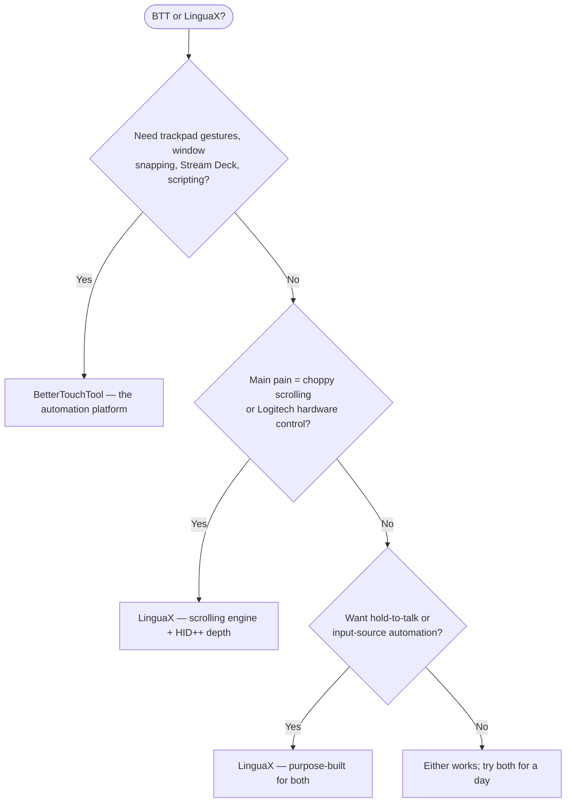

If you searched for a **BetterTouchTool alternative**, the honest answer depends on what you actually use. BetterTouchTool is a full automation platform for macOS — gestures, keyboards, Touch Bar, Stream Deck, window management, scripting. If you use even half of that, it is irreplaceable. But if you came for **one thing — making a third-party mouse feel right on a Mac** — LinguaX is the focused tool: a true smooth-scrolling engine, deep Logitech mouse hardware controls, and input-source automation, without learning a platform.

## What BetterTouchTool does well

BetterTouchTool is one of the most capable automation apps on macOS:

- gestures for trackpad and Magic Mouse, plus mouse buttons and scroll-wheel modifiers
- window snapping and management, keyboard shortcuts and Hyper Key, floating menus
- native Stream Deck support and 40+ macro-keyboard devices (Logitech, Loupedeck, Razer, and more)
- a Spotlight-style launcher, clipboard manager, screenshot tools, Touch Bar customization
- deep scripting: JavaScript, AppleScript, `btt://` URLs, a built-in web server, CLI
- 45-day free trial, no account required; Standard license $15 (2 years of updates), Lifetime $25; also available via Setapp

These are not guesses. They are the public feature set and pricing described on the [BetterTouchTool website](https://folivora.ai/). One license covers all your personal Macs.

## Where LinguaX is different

LinguaX overlaps with the mouse slice of BTT — button mapping, per-app behavior, scroll direction — and goes deeper exactly there, while skipping the platform overhead:

- **A smooth-scrolling engine**: BTT can invert scroll direction for regular mice, but it does not replace notch-by-notch wheel steps with a damped curve. LinguaX does (Min Step / Speed Gain / Duration), with per-app on/off.
- **Deep Logitech mouse hardware support**: hardware DPI, SmartShift, and battery readout on supported models (MX Master series and more), talking HID++ directly — no Logi Options+ needed.
- **Input-source automation**: switch the macOS input source by app or website domain. There is nothing comparable in BTT.
- **Purpose-built push-to-talk**: BTT can map a mouse button to a dictation hotkey; LinguaX's Modifier Hold is designed for hold-to-talk — hold a side button, speak, release.
- **Focus**: one small native app for mouse enhancement and input automation, instead of a platform with hundreds of settings pages.

Price comparison is honest but nuanced: LinguaX is $9.9 one-time for up to 3 Macs with lifetime updates; BTT Standard is $15 with 2 years of updates, or $25 Lifetime — covering all your personal Macs. If you will use BTT's breadth, it is arguably underpriced.

## BetterTouchTool vs LinguaX (for mouse users)

| Need | BetterTouchTool | LinguaX |
| --- | --- | --- |
| Scope | Full automation platform | Focused mouse + input-source utility |
| Mouse button mapping | Yes | Yes, with click / double-click / long-press / directional drag gestures |
| Trackpad / Magic Mouse gestures | Yes, a core strength | Targets third-party mice |
| Smooth scrolling (damped curve) | Scroll direction inversion | Yes, Min Step / Speed Gain / Duration, per-app |
| Logitech mouse DPI / SmartShift / battery | Not a stated focus | Yes, on supported models via HID++ |
| Push-to-talk from a mouse button | Via hotkey mapping | Purpose-built hold-to-talk (Modifier Hold) |
| Input-source switching by app / website | No | Yes |
| Window snapping / Stream Deck / Touch Bar | Yes | No |
| Learning curve | Platform-level | Pick a button, assign an action |
| Price model | 45-day trial; $15 Standard / $25 Lifetime, all personal Macs; also on Setapp | 30-day trial; $9.9 one-time Lifetime, up to 3 Macs |

## Quick decision

## Choose BetterTouchTool If

- you want trackpad / Magic Mouse gestures, window snapping, Stream Deck, or scripted automation
- you enjoy building complex custom workflows and want one platform for everything
- you are already on Setapp
- you want one license covering every Mac you own

## Choose LinguaX If

- your only goal is making a third-party mouse feel great — you do not want a platform
- choppy wheel scrolling is your main complaint — you want a real smoothing curve
- you use a Logitech mouse and want DPI, SmartShift, or battery visibility without Logi Options+
- you type in multiple languages and want the input source to follow apps or browser domains
- you want to be done in five minutes, not configure an automation system

## Test with your actual mouse

Both apps have free trials (45 days for BTT, 30 for LinguaX), so the reliable way to compare is one workday with your real setup:

1. Map the same side button in both apps.
2. Compare scrolling in a browser and a long document — the biggest functional difference.
3. If you use a Logitech mouse, check whether DPI / battery controls matter to you.
4. If you type in multiple languages, test input-source automation in LinguaX.

## FAQ

**Is LinguaX a drop-in replacement for BetterTouchTool?**
No — and it does not try to be. LinguaX replaces the mouse slice of BTT with more depth (scrolling engine, Logitech hardware controls, hold-to-talk) and adds input-source automation. For gestures, window management, Stream Deck, or scripting, BetterTouchTool is the only answer here.

**Which app is better for smooth scrolling?**
LinguaX, clearly. BTT offers scroll direction inversion for regular mice; LinguaX replaces the stepped wheel signal with a continuous damped curve, per app. If scrolling feel is your pain, that is the whole game.

**Which app is better for Logitech mice?**
For hardware-level features — DPI, SmartShift, battery readout — LinguaX, which talks HID++ directly to supported models. For triggering elaborate macros from mouse buttons, BTT's automation depth is unmatched.

**Is BetterTouchTool worth it if I only need mouse features?**
Honestly, probably not. BTT is priced for its breadth. If you will never touch gestures, Stream Deck, or scripting, a focused tool is cheaper and far easier to set up.

**Which app should I try first?**
Match the tool to the pain. "I want to automate my Mac" → BTT. "I want my mouse to feel right" → LinguaX.

## Get started

LinguaX is a free download with a **30-day trial** — no account, no telemetry. If it fits your workflow, it is a **$9.9 one-time Lifetime purchase covering up to 3 Macs**, no subscription.

**[Download LinguaX](/download)** and test it against your real mouse setup.

## Related guides

- [Mouse+ — Mouse Enhancement for macOS](/docs/mouse-plus/overview)
- [Smooth Scrolling](/docs/mouse-plus/fundamentals/smooth-scrolling)
- [Button Mapping](/docs/mouse-plus/fundamentals/button-mapping)
- [SteerMouse Alternative for Mac](/docs/comparisons/steermouse-alternative-mac)
- [USB Overdrive Alternative for Mac](/docs/comparisons/usb-overdrive-alternative-mac)
