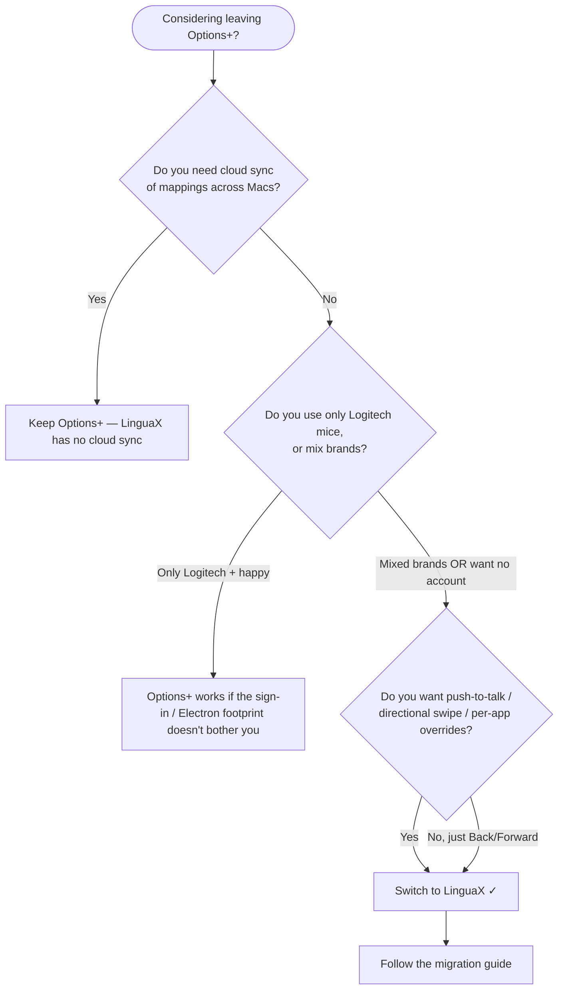

If you searched for a **Logi Options+ alternative on macOS**, you are probably tired of one of these: a heavy app that idles in the background, a sign-in screen before you can map a single button, or a tool that only works with Logitech hardware. LinguaX is a native, lightweight mouse utility that does the parts you actually use — **smooth scrolling and side-button mapping** — and works with **any mouse brand**.

## Why people replace Logi Options+

- **It is heavy.** Logi Options+ ships as an Electron app and runs hundreds of megabytes of background processes for what is, day to day, button mapping and scrolling.
- **It wants an account.** Many workflows are gated behind sign-in and online sync you never asked for.
- **It is Logitech-only.** If you own a mix of brands — or one non-Logitech mouse — it simply does not help.
- **It can drift after sleep/wake or macOS updates.** Scrolling or buttons stop responding until you toggle or reconnect.

If you only need reliable scrolling and a couple of mapped buttons, that is a lot of overhead.

## How LinguaX solves it

LinguaX is **mouse-first** and built natively for macOS:

- **~10MB, native — not Electron.** It does not spin up a browser runtime to remap a button.
- **No account, no telemetry.** Configure locally and get to work; nothing to sign into.
- **Any mouse brand.** It recognizes a wide range of models (including Logitech MX Master, MX Anywhere, G502 X, M720, M585, and generic mice) and also works with unrecognized devices.
- **Smooth scrolling with fine-grained controls** — Min Step, Speed Gain, and Duration — plus a per-app on/off toggle for smooth scrolling. It applies to the mouse wheel only and leaves the trackpad untouched.
- **Side-button and gesture mapping** — click, double-click, long-press, and directional swipe — with per-app overrides.
- **Reliable after sleep/wake.** Bluetooth devices recover automatically without manual reconnection, and critical services refresh on system wake.

## LinguaX vs Logi Options+

| | LinguaX | Logi Options+ |
| --- | --- | --- |
| App size | ~10MB | Hundreds of MB |
| Architecture | Native macOS | Electron |
| Account required | No | Often required |
| Mouse brand support | Any brand (broad model recognition) | Logitech only |
| Smooth scrolling | Yes — Min Step / Speed Gain / Duration, per-app on/off | Limited |
| Sleep/wake reliability | Auto-recovery on wake | Can require reconnect |
| Telemetry | None | Online account/sync |
| Price | $9.9 one-time (3 devices) | Free, Logitech-locked |

## Should you replace Logi Options+? Quick decision

:::tip Keeping Options+ for its hardware settings?
If you want LinguaX to own button mapping while Options+ still manages device-level DPI/SmartShift/backlight, you don't have to uninstall. Revoke Options+'s Input Monitoring permission instead — see [Resolve mouse-utility conflicts on macOS](../troubleshooting/conflicts-with-other-tools.md#mouse-utility-conflict).
:::

## The one-day test protocol

The fastest way to know if a Logi Options+ alternative will hold up is to run it through a deliberate day. Here is what to test and how to judge it.

1. **Long reading session (browser).** Scroll several long articles. Judge: does it glide, or stutter and overshoot? Adjust the scroll sliders (Min Step, Speed Gain, Duration) once and confirm the controls do distinct things.
2. **Editor + terminal switching.** Bounce between a code editor and a terminal for real work. Judge: does scrolling stay precise in the editor while staying smooth in the browser? If you can give each app its own behavior, per-app control is real.
3. **Two mapped side-button actions.** Map something high-frequency (Back/Forward) and something with a gesture (long-press → Mission Control, or swipe → switch Space). Judge: do both fire reliably for an hour of normal use, including right after switching apps?
4. **One sleep/wake cycle.** Let the Mac sleep, wake it, and immediately scroll and click a mapped button. Judge: does everything work without a relaunch? For Bluetooth mice, does it recover without a manual reconnect?

If a tool passes all four, it will hold up in daily use. Step 4 is where most vendor suites and lightweight utilities quietly fail.

## Get started

LinguaX is a free download with a **30-day trial** — no account needed. If it fits your workflow, it is a **$9.9 one-time purchase covering 3 devices** (no subscription).

**[Download LinguaX](/download)** and try it free for 30 days.

## Frequently asked questions

### Is there a Logi Options+ alternative that doesn't require an account?

Yes. LinguaX has no account and no telemetry — core features (smooth scrolling, button/gesture mapping) work the moment you launch it. Account requirements are one of the main reasons people leave Logi Options+, so an alternative should not reintroduce them.

### Will a non-Logitech mouse work, or only Logitech hardware?

Any USB or Bluetooth mouse works with no driver. Logitech models (MX Master 2S/3/3S, MX Anywhere 2/2S/3/3S, G502 X, M720, M585, and more) additionally get enhanced recognition and automatic side-button mapping. See [Device Compatibility](../mouse-plus/device-compatibility.md).

### Do mappings survive sleep/wake and Bluetooth reconnects?

Yes. Bluetooth devices recover automatically after sleep without a manual reconnect, and the app refreshes permissions and critical services on wake. This is exactly the failure mode the one-day test protocol's step 4 checks for.

### How is this different from BetterMouse, Mos, or LinearMouse?

Each tool has a different focus — some smooth scrolling only, some remap buttons only. For a direct tool-by-tool comparison see [Mos vs LinearMouse vs Mac Mouse Fix](./mos-vs-linearmouse-vs-mac-mouse-fix.md) and [BetterMouse Alternative for Mac](./bettermouse-alternative-mac.md).

### Can I set it up for an MX Master 3S / 4 without Logi Options+?

Yes — full gesture and button mapping over BLE HID++, no Logi Options+ needed. See [MX Master 3S Mac Setup Without Logi Options](./mx-master-3s-mac-setup-without-logi-options.md), and per-model setup pages for the [MX Master 4](/docs/mouse-plus/models/mx-master-4), [MX Master 3](/docs/mouse-plus/models/mx-master-3), [MX Anywhere 3S](/docs/mouse-plus/models/mx-anywhere-3s), [MX Anywhere 3](/docs/mouse-plus/models/mx-anywhere-3), [Logi Lift](/docs/mouse-plus/models/logitech-lift), and [MX Ergo](/docs/mouse-plus/models/mx-ergo).

### Does the G Pro X Superlight work on Mac without G HUB?

Yes — LinguaX maps the two side buttons on macOS with no G HUB and no driver, via the universal HID engine. See the per-model setup for [G Pro X Superlight](/docs/mouse-plus/models/logitech-g-pro-x-superlight) and [G Pro X Superlight 2](/docs/mouse-plus/models/logitech-g-pro-x-superlight-2).

### What does it cost?

LinguaX is a **$9.9 one-time purchase** covering 3 devices, with a **30-day free trial** — no subscription, no account.

## Related guides

- [Mouse Enhancement Basics](../mouse-plus/overview.md)
- [Device Compatibility](../mouse-plus/device-compatibility.md)
- [Fix Choppy Mouse Scrolling on macOS](/docs/mouse-plus/recipes/fix-choppy-mouse-scrolling-macos)
- [How to Map Mouse Side Buttons on macOS](/docs/mouse-plus/recipes/map-mouse-side-buttons-macos)
- [Pricing](/pricing)
