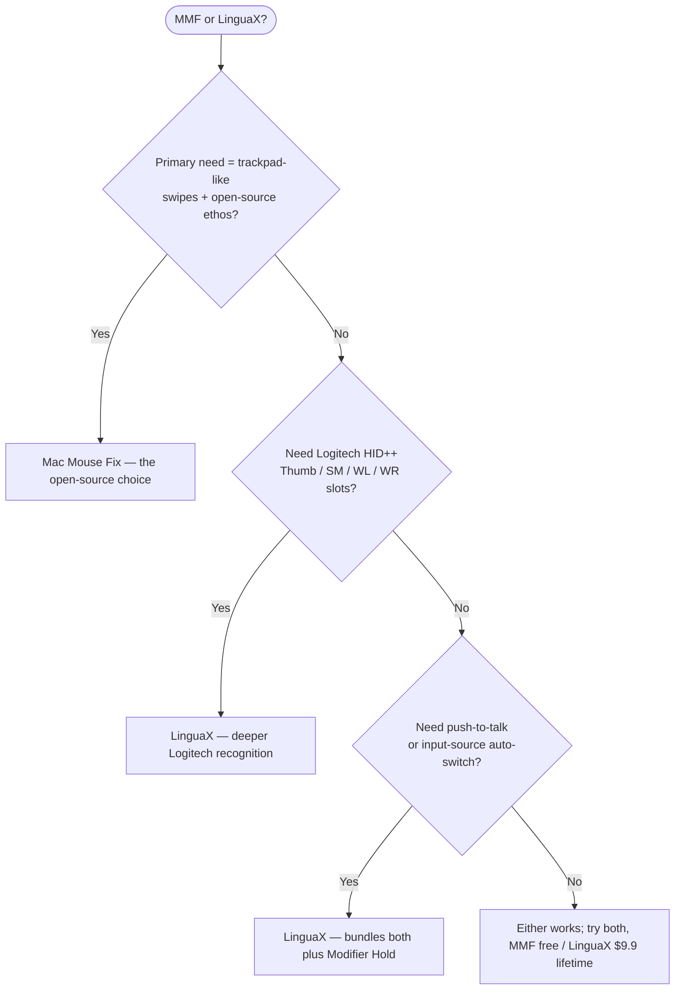

If you searched for a **Mac Mouse Fix alternative**, start with the honest answer: Mac Mouse Fix is a strong macOS mouse utility. It is affordable, open source, and especially good at bringing trackpad-style gestures to a regular mouse. LinguaX is the better fit when you want mouse enhancement **plus** app-specific behavior, push-to-talk voice input, Logitech device controls, and input-source automation in one native app.

## What Mac Mouse Fix Does Well

Mac Mouse Fix focuses on making a third-party mouse feel closer to an Apple trackpad:

- trackpad-style gestures such as Mission Control, App Exposé, moving between desktops, Smart Zoom, and Back / Forward
- smooth scrolling with different smoothness levels
- independent mouse scroll direction
- mouse actions and keyboard shortcut triggering
- 30-day free trial and low one-time pricing
- open-source code on GitHub

These are not guesses. They are the public positioning and feature set described on the [Mac Mouse Fix website](https://macmousefix.com/) and [GitHub repository](https://github.com/noah-nuebling/mac-mouse-fix).

## Where LinguaX Is Different

LinguaX overlaps on the basics — smooth scrolling, button mapping, gestures, and per-app mouse behavior — but it is designed around a broader daily workflow:

- **Mouse+ enhancement**: smooth scrolling, side-button mapping, click / double-click / long-press / directional drag gestures, pointer speed, and app-scoped overrides.
- **Push-to-talk voice input**: map a mouse side button to hold Fn / Globe, or trigger a voice app shortcut.
- **Logitech-specific controls** on supported devices: hardware DPI, SmartShift, and battery visibility without Logi Options+.
- **Input-source automation**: switch macOS input source by app or website domain.
- **One native app** for mouse behavior and input automation, instead of stacking separate utilities.

If you only need trackpad-style gestures on a basic 5-button mouse, Mac Mouse Fix may already cover your use case. If your workflow also involves Logitech hardware controls, voice input, per-app profiles, or multilingual typing, LinguaX covers more ground.

## Mac Mouse Fix vs LinguaX

| Need | Mac Mouse Fix | LinguaX |
| --- | --- | --- |
| Trackpad-style gestures from mouse buttons | Strong focus | Supported through mouse gestures and actions |
| Smooth scrolling | Yes | Yes, with Min Step / Speed Gain / Duration controls |
| Mouse scroll direction independent from trackpad | Yes | Yes, including horizontal / vertical direction choices |
| Keyboard shortcut from mouse button | Yes | Yes |
| Per-app mouse behavior | Yes | Yes, with app-scoped overrides |
| Logitech DPI / SmartShift controls | Not a stated focus | Yes, on supported Logitech models |
| Mouse battery display | Not a stated focus | Yes, where supported by BLE / Logitech integration |
| Push-to-talk voice input from a side button | Not a stated focus | Yes, via Fn / Globe Modifier Hold or shortcut mapping |
| Input-source switching by app / website | No | Yes |
| Open source | Yes | No |
| Price model | 30-day trial, low one-time purchase | 30-day trial, $9.9 one-time Lifetime for up to 3 Macs |

## Quick decision

## Choose Mac Mouse Fix If

- you mainly want trackpad-style gestures from mouse buttons
- you prefer open-source software
- you want the lowest-cost focused mouse utility
- your mouse buttons are recognized correctly by Mac Mouse Fix
- you do not need input-source automation, push-to-talk, or Logitech hardware controls

## Choose LinguaX If

- you want one app for mouse enhancement and input-source automation
- you use a Logitech mouse and want in-app DPI, SmartShift, or battery visibility where supported
- you want to map a side button to push-to-talk voice input
- you need per-app mouse behavior across different work contexts
- you type in multiple languages and want the input source to follow apps or browser domains

## Device Compatibility Notes

Mac Mouse Fix says some mice designed for proprietary driver software, such as Logitech Options, may have buttons it cannot recognize, and it does not currently support Apple Magic Mouse. LinguaX also cannot promise every advanced feature on every mouse: basic smooth scrolling and shortcut mapping are broad, while hardware features such as DPI, SmartShift, and battery depend on supported device paths.

The reliable way to compare is to test your actual mouse for one workday:

1. Map the same side button in both apps.
2. Test smooth scrolling in your browser, editor, and one app with unusual scrolling.
3. Sleep and wake your Mac, then confirm the mappings still work.
4. If you use voice input or multiple input sources, test those flows too.

## FAQ

**Is LinguaX a drop-in replacement for Mac Mouse Fix?**
For common needs such as smooth scrolling, side-button mapping, keyboard shortcuts, and app-specific behavior, it can be. For users who specifically want Mac Mouse Fix's exact trackpad-gesture model or open-source code, Mac Mouse Fix may still be the better fit.

**Which app is better for Logitech mice?**
LinguaX is stronger if you want supported Logitech hardware features such as DPI, SmartShift, or battery visibility. Mac Mouse Fix is still a good mouse utility, but Logitech hardware controls are not its stated focus.

**Which app is better for push-to-talk voice input?**
LinguaX. It includes Modifier Hold for Fn / Globe, which lets a side button act as a hold-to-talk trigger for compatible dictation workflows, plus normal keyboard shortcut mapping for apps that use custom hotkeys.

**Which app should I try first?**
Try the one that matches your main pain. If the pain is "I want trackpad-like gestures on my mouse," try Mac Mouse Fix. If the pain is "I want mouse enhancement plus voice and input automation in one app," try LinguaX.

## Get Started

LinguaX is a free download with a **30-day trial** — no account, no telemetry. If it fits your workflow, it is a **$9.9 one-time Lifetime purchase covering up to 3 Macs**, no subscription.

**[Download LinguaX](/download)** and test it against your real mouse setup.

## Related Guides

- [Mouse+ — Mouse Enhancement for macOS](../mouse-plus/overview.md)
- [Button Mapping](/docs/mouse-plus/fundamentals/button-mapping)
- [Gesture Mapping](/docs/mouse-plus/fundamentals/gesture-mapping)
- [How to Map Mouse Side Buttons on macOS](/docs/mouse-plus/recipes/map-mouse-side-buttons-macos)
- [BetterMouse Alternative for Mac](./bettermouse-alternative-mac.md)
- [Mos vs LinearMouse vs Mac Mouse Fix vs LinguaX](./mos-vs-linearmouse-vs-mac-mouse-fix.md)
- [Push-to-Talk Voice Typing with a Mouse Button](/docs/push-to-talk/push-to-talk-voice-typing-mac)
