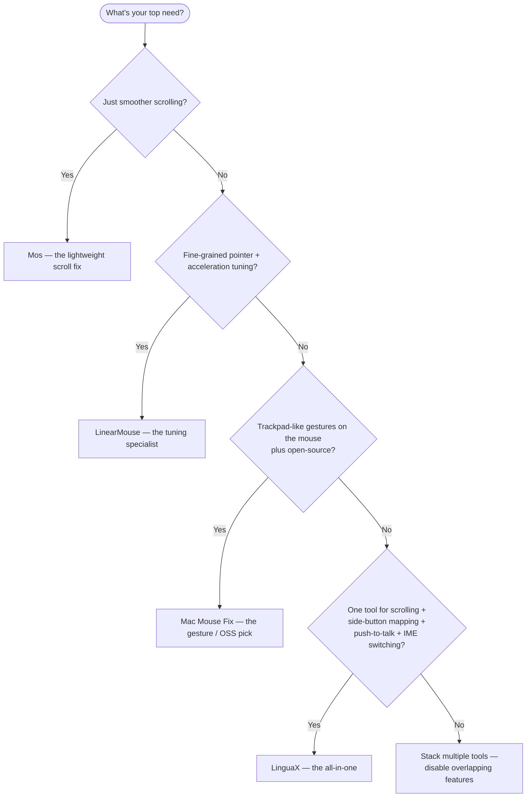

import Head from '@docusaurus/Head';

export const faqSchema = {
  '@context': 'https://schema.org',
  '@type': 'FAQPage',
  mainEntity: [
    {'@type': 'Question', name: 'Mos is free and its smooth scrolling is great — why would I switch to LinguaX?', acceptedAnswer: {'@type': 'Answer', text: "If you only need scrolling, don't switch — Mos is fine. Choose LinguaX when you also want gestures, hardware DPI, battery, per-app behavior, or push-to-talk / IME switching from a mouse side button. Mos does not cover those."}},
    {'@type': 'Question', name: 'If I install Mos + LinearMouse + Mac Mouse Fix together, will they conflict?', acceptedAnswer: {'@type': 'Answer', text: 'Probably yes. All three intercept mouse events; the same scroll tick may be handled three times or dropped mid-way, showing up as dropped frames, jitter, or occasional missed clicks. Keep one mouse enhancer, or replace them all with LinguaX.'}},
    {'@type': 'Question', name: 'Does LinguaX support Logitech MX Master 3S / 4 without Logi Options+?', acceptedAnswer: {'@type': 'Answer', text: 'Yes. Full gesture and button mapping over BLE HID++, no Logi Options+ needed.'}},
    {'@type': 'Question', name: 'Can non-Logitech mice use it?', acceptedAnswer: {'@type': 'Answer', text: 'Yes. Any USB or Bluetooth mouse works with no driver. Common Logitech models (MX Master, G502 X, M720, M585, etc.) additionally get optimized default mappings.'}},
    {'@type': 'Question', name: "What does LinguaX's input-source auto-switching actually do?", acceptedAnswer: {'@type': 'Answer', text: 'It automatically switches to a chosen input source / keyboard layout by app or by website domain — e.g., English in Xcode, Chinese in WeChat/Slack chats, a specific layout on a given Google Docs page. Rules are set in the app Input Source settings and persist across sessions.'}}
  ]
};

<Head>
  
</Head>

# Mos vs LinearMouse vs Mac Mouse Fix vs LinguaX

There are several good macOS mouse utilities, and they overlap in confusing ways. **Mos** is the classic free smooth-scroller. **LinearMouse** focuses on pointer acceleration and per-device settings. **Mac Mouse Fix** adds gestures and remapping. The catch is that many people end up running two or three of these at once — one for scrolling, one for acceleration, one for gestures — which is exactly the kind of stack that causes conflicts. This page compares all four honestly and shows where **LinguaX** fits as a single app.

## The tools at a glance

- **Mos** — free, open source. The classic smooth-scroller; recent 4.x releases (2026) added mouse-button binding and Logitech HID++ button handling. Still no gestures, DPI control, or input-source switching.
- **LinearMouse** — free, open source, focused on pointer speed/acceleration and per-device tuning, with some button remapping. Less about scroll smoothing and gestures.
- **Mac Mouse Fix** — affordable, strong on gestures and button remapping with good smooth scrolling. A capable all-rounder.
- **LinguaX** — native, ~10MB. Two core capabilities in one app: mouse enhancement (smooth scrolling, button/gesture mapping, pointer speed, per-app overrides) **and** automatic input-source switching.

## Comparison table

| | Mos | LinearMouse | Mac Mouse Fix | LinguaX |
| --- | --- | --- | --- | --- |
| Smooth scrolling | Yes (core) | Limited | Yes | Yes — Min Step / Speed Gain / Duration |
| Reverse scroll | Yes | Yes | Yes | Yes — per-axis |
| Pointer speed / acceleration | No | Yes (core) | Limited | Yes — per-device, persisted |
| Button / side-button mapping | Yes (4.x) | Some | Yes | Yes |
| Logitech HID++ buttons | Yes (4.x) | No | No | Yes |
| Gestures (swipe, long-press) | No | No | Yes | Yes |
| DPI adjustment (hardware) | No | No | No | Yes — Logitech HID++ |
| Battery display | No | No | No | Yes — BLE / Logitech HID++ |
| Per-app overrides | Limited | Some | Yes | Yes |
| Model recognition | Logi only (HID++) | Some | Some | Broad (MX Master, G502 X, M720, M585…) |
| Sleep/wake auto-recovery | Varies | Varies | Yes | Yes |
| Input-source automation | No | No | No | Yes (core capability) |
| Replaces a multi-tool stack | No | No | Mostly | Yes — one app |
| Price | Free | Free | Low one-time | $9.9 one-time (3 devices) |

## Pick-your-tool decision tree

## The real decision: one tool or three

If you only need smooth scrolling, **Mos** is a fine free choice. If you only need acceleration tuning, **LinearMouse** is excellent and free. The trouble starts when you need *all* of it — smoothing **and** acceleration **and** gestures **and** per-app behavior — because stacking Mos + LinearMouse + a remapper means three event taps fighting over the same input, which is a common source of jitter and dropped clicks.

**LinguaX** is built to be the single app in that slot:

- One event pipeline for scrolling, speed, buttons, and gestures — no inter-tool conflicts.
- Broad model recognition for accurate per-device setup.
- Per-app and per-axis control where the free tools are global-only.
- And a second core capability the others do not have at all: automatic input-source switching by app and by website.

Honest summary: keep Mos or LinearMouse if free scrolling plus basic button mapping is all you need. Choose LinguaX when you want gestures, hardware DPI, battery display, and broad per-device control in one native app — plus automatic input-source switching as a second core capability the others do not have at all.

## Frequently asked questions

### Mos is free and its smooth scrolling is great — why would I switch to LinguaX?

If you only need scrolling, don't switch — Mos is fine. Choose LinguaX when you also want gestures, hardware DPI, battery display, per-app behavior, or push-to-talk / IME switching from a mouse side button. Mos does not cover those.

### If I install Mos + LinearMouse + Mac Mouse Fix together, will they conflict?

Probably yes. All three intercept mouse events; the same scroll tick may be handled three times or dropped mid-way, showing up as dropped frames, jitter, or occasional missed clicks. Keep one mouse enhancer, or replace them all with LinguaX.

### Does LinguaX support Logitech MX Master 3S / 4 without Logi Options+?

Yes. Full gesture and button mapping over BLE HID++, no Logi Options+ needed. See per-model setup for [MX Master 4](/docs/mouse-plus/models/mx-master-4), [MX Master 3S](/docs/mouse-plus/models/mx-master-3s), [MX Anywhere 3S](/docs/mouse-plus/models/mx-anywhere-3s).

### Can non-Logitech mice use it?

Yes. Any USB or Bluetooth mouse works with no driver. Common Logitech models (MX Master, G502 X, M720, M585, etc.) additionally get optimized default mappings; other brands go through generic recognition.

### What does LinguaX's input-source auto-switching actually do?

It automatically switches to a chosen input source / keyboard layout by app or by website domain — e.g., English in Xcode, Chinese in WeChat/Slack chats, a specific layout on a given Google Docs page. Rules are set in the app's Input Source settings and persist across sessions.

## Get started

LinguaX is a free download with a **30-day trial** — no account, no telemetry. If it fits, it is a **$9.9 one-time purchase covering 3 devices** (no subscription).

**[Download LinguaX](/download)** and try the all-in-one setup free for 30 days.

## Related guides

- [Mouse+ — Mouse Enhancement for macOS](../mouse-plus/overview.md)
- [Smooth Scrolling](/docs/mouse-plus/fundamentals/smooth-scrolling)
- [Pointer Speed & Acceleration](/docs/mouse-plus/fundamentals/pointer-speed)
- [Fix Choppy Mouse Scrolling on macOS](/docs/mouse-plus/recipes/fix-choppy-mouse-scrolling-macos)
- [Mac Mouse Fix Alternative for macOS](./mac-mouse-fix-alternative-macos.md)
- [BetterMouse Alternative for Mac](./bettermouse-alternative-mac.md)
- [Logi Options+ Alternative for macOS](./logi-options-plus-alternative-macos.md)
