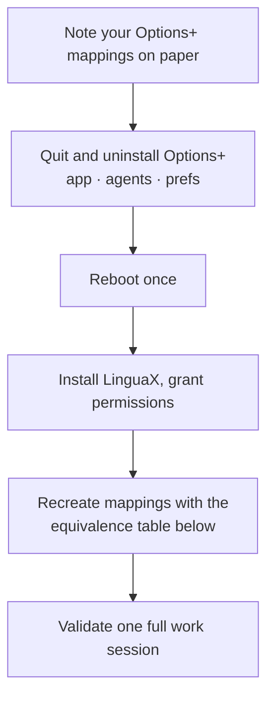

# MX Master 3S on Mac: Migrate from Logi Options+ to LinguaX

If you already have Logi Options+ installed for your MX Master 3S — and you're tired of the Electron footprint, the sign-in prompts, or the background agents — this guide walks you through moving cleanly to LinguaX. You'll keep every mapping that mattered, drop the parts that never worked well on macOS, and end up with a ~10 MB native tool that recovers reliably across sleep/wake.

:::tip Just bought a new MX Master 3S?
If you never installed Options+ and want the full setup from scratch, skip this page and read the [MX Master 3S on Mac complete guide](../mouse-plus/models/mx-master-3s) instead — it covers every button, three ready-to-copy recipes, and an in-browser Bolt pairing helper.
:::

## Why migrate off Logi Options+

The MX Master 3S is a fantastic mouse. The software Logitech ships for it on macOS is the weakest part of the experience:

- **Electron overhead.** Options+ ships as a full Electron app plus daemons — hundreds of megabytes on disk, always-running background processes.
- **Account gate.** Options+ frequently pushes you to sign in before you can configure anything, and cloud sync is on by default.
- **Sleep/wake churn.** Users report having to unplug the Bolt receiver or toggle Bluetooth after resume before the mouse behaves.
- **Mac-only gaps.** Options+ on macOS has never matched its Windows counterpart for gesture-fluency, per-app overrides, or long-press behaviour on the Thumb button.
- **Forced updates.** Options+ likes to update itself; a mapping tool that quietly changes under you is a mapping tool you cannot trust.

LinguaX is native, ~10 MB, no account, no cloud sync, no background telemetry. It replicates every MX Master 3S input Options+ handles, adds the ones Options+ never got right on macOS (push-to-talk long-press, four-directional swipe on the Thumb button, real per-app overrides), and works with your non-Logitech mice at the same time.

## Migration steps

Before you uninstall anything, write down the mappings you actually use — the muscle memory is what you're preserving, not the tool.



### 1. Export your Options+ mappings on paper

Options+ has no proper export. Open it, click **MX Master 3S → Buttons**, and jot down each button's current binding. Do the same for gestures on the Thumb button (Options+ calls it "Gesture button"). Two minutes here saves you an hour of "which button was Mission Control again?" later.

### 2. Quit and uninstall Options+

Quit Options+ from its menu bar item, then:

```
# Delete the app
sudo rm -rf "/Applications/logioptionsplus.app"

# Remove background agents
launchctl remove com.logi.optionsplus.updater 2>/dev/null || true
rm -f ~/Library/LaunchAgents/com.logi.optionsplus*.plist
sudo rm -f /Library/LaunchDaemons/com.logi.optionsplus*.plist

# Remove preferences and caches
rm -rf ~/Library/Application\ Support/logioptionsplus
rm -rf ~/Library/Caches/com.logi.optionsplus
rm -rf ~/Library/Logs/logioptionsplus
```

Reboot once — some Options+ agents only unload cleanly at logout.

### 3. Keep or drop your Bolt receiver

The Bolt receiver is protocol, not software — LinguaX supports it out of the box. If your MX Master 3S is paired to Bolt, leave it alone. If you were on Bluetooth and want to switch to Bolt (more reliable across sleep/wake), our [in-browser pairing tool](/tools/pair-logitech-receiver) can pair a Bolt receiver without any Logitech software installed.

### 4. Install LinguaX and re-apply your mappings

Download LinguaX from the [Installation guide](../getting-started/installation.md), grant Accessibility permission (and Input Monitoring if prompted), then open the Mouse+ panel. Your 3S appears immediately, recognised by VID:PID with proper HID++ 2.0 support.

For each button you wrote down in step 1, find the equivalent slot in the table below and re-apply the binding.

## Mapping equivalence: Options+ → LinguaX

| Logi Options+ name | LinguaX slot | Notes |
|---|---|---|
| Left / Right click | `Left` / `Right` | Handled by macOS directly; usually no need to remap |
| Wheel click (middle) | `Middle` | Same |
| Back / Forward (thumb-side) | `Side 1` / `Side 2` | Full gesture support (click / double / long-press / swipe) |
| Gesture button | `T` (Thumb) | LinguaX exposes long-press and four-directional swipe as first-class gestures — Options+ only fires on press |
| Wheel tilt left / right | `WL` / `WR` | LinguaX treats these as discrete buttons, not just horizontal-scroll events |
| MagSpeed toggle key | `SM` (Scroll Mode) | Can carry a second action while still toggling wheel mode |
| SmartShift auto-mode | LinguaX's smooth-scrolling profile | Not a 1:1 replacement; tune Min Step / Speed Gain / Duration instead |
| DPI stage buttons | Bind to `Change DPI` action on any button | Only relevant for G-series; MX Master 3S has fixed 8000 DPI |

## Common migration pitfalls

- **Both tools active at once.** If Options+ is still running when you first launch LinguaX, whichever loads later wins the mapping — behaviour becomes unpredictable. Fully uninstall Options+ before configuring LinguaX.
- **Sleep/wake state.** Right after removing Options+, macOS may take one sleep cycle to fully release the HID device. If the 3S looks stuck, put the Mac to sleep and wake it once.
- **Easy-Switch state.** The three Easy-Switch slots on the mouse (1/2/3) are stored on the mouse itself, not by any software — they survive migration.
- **Cloud-synced Options+ profiles.** If you had cloud sync on, deleting Options+ locally does not delete the profile from Logitech's servers. Sign in to Options+ on another device to purge those if you want a clean cloud slate.
- **Bolt receiver "orphaned".** If you unpair via Options+ but the pairing table gets confused, use LinguaX's [in-browser pairing tool](/tools/pair-logitech-receiver) to list and unpair devices on the receiver directly.

## After migration — build on top

Once you've reproduced your Options+ mappings, the migration is technically done. But the reason to move to LinguaX is what Options+ can't do:

- **Push-to-talk on the Thumb button.** Long-press T as a physical PTT switch for Superwhisper, Wispr Flow, Zoom, Discord, or macOS dictation.
- **Directional swipe.** Swipe the Thumb button left/right to switch macOS Spaces without lifting your hand.
- **App-scoped overrides.** Same button, different action per bundle ID (Zoom = mute, Terminal = tmux prefix).

The full walkthrough with copy-paste recipes lives in [MX Master 3S on Mac — Full Control with LinguaX](../mouse-plus/models/mx-master-3s).

## Related guides

- [MX Master 3S on Mac (complete setup guide)](../mouse-plus/models/mx-master-3s)
- [Compatible Mouse Models](../mouse-plus/device-compatibility.md)
- [Button & Side-Button Mapping](/docs/mouse-plus/fundamentals/button-mapping)
- [The Lightweight Logi Options+ Alternative for macOS](./logi-options-plus-alternative-macos.md)
