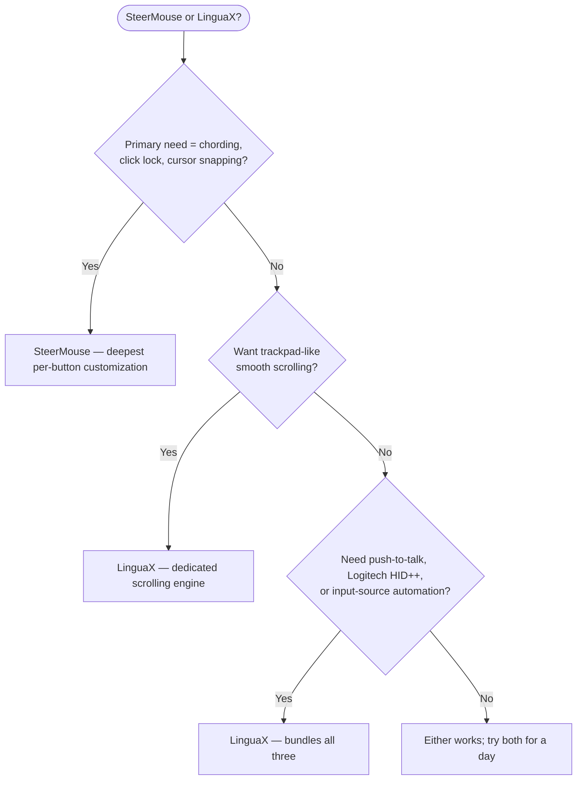

If you searched for a **SteerMouse alternative**, start with the honest answer: SteerMouse is one of the most mature mouse utilities on macOS — it has been maintained by Plentycom since 2005, and its button customization is among the deepest available. LinguaX is the better fit when you also want a true smooth-scrolling engine, push-to-talk voice input, Logitech hardware controls, and input-source automation in one native app — at a lower price.

## What SteerMouse does well

SteerMouse focuses on deep, driver-level customization for USB and Bluetooth mice:

- up to 24 functions assignable per button, including keyboard shortcuts, clicks (double-click, click lock), zoom, App Switcher, Mission Control, system and music controls, and opening files or URLs
- chording — button combinations with modifier keys, or with other mouse buttons
- cursor tuning beyond the macOS slider: tracking speed plus a separate sensitivity control, and cursor snapping
- scroll tuning (acceleration and sensitivity) and Auto Scroll
- per-application settings
- a "Recommended Settings" list that ranks configurations other users have shared
- lifetime license per major version — no subscription

These are not guesses. They are the public feature set described on the [SteerMouse website](https://plentycom.jp/en/steermouse/). SteerMouse does not support the Apple Magic Mouse or Magic Trackpad, and it may not support some special buttons — the same class of devices LinguaX is built for.

## Where LinguaX is different

LinguaX overlaps on button mapping, keyboard shortcuts, and per-app behavior — but it is designed around a broader daily workflow:

- **A smooth-scrolling engine**: SteerMouse tunes the speed and acceleration of native scroll events, while LinguaX replaces notch-by-notch wheel steps with a damped, trackpad-like curve (Min Step / Speed Gain / Duration controls), with per-app on/off.
- **Push-to-talk voice input**: hold a side button for macOS Dictation, Wispr Flow, or superwhisper via Fn / Globe hold or shortcut mapping.
- **Logitech hardware controls** on supported models: hardware DPI, SmartShift, and battery visibility without Logi Options+.
- **Input-source automation**: switch the macOS input source by app or website domain — outside SteerMouse's scope entirely.
- **Price and upgrades**: SteerMouse 5 is $19.99, and major-version upgrades are paid ($12.99 from version 4). LinguaX is a $9.9 one-time Lifetime purchase for up to 3 Macs, updates included.

If your main need is the deepest possible per-button customization — chording, click lock, cursor snapping — SteerMouse may already be the right tool. If your workflow also involves smooth scrolling, voice input, Logitech hardware features, or multilingual typing, LinguaX covers more ground.

## SteerMouse vs LinguaX

| Need | SteerMouse | LinguaX |
| --- | --- | --- |
| Button customization depth | Up to 24 functions per button | Click / double-click / long-press / directional drag gestures |
| Chording (button + button combos) | Yes | Not a stated focus |
| Cursor speed / sensitivity tuning | Yes, plus cursor snapping | Yes, per-device pointer speed |
| Smooth scrolling (damped curve) | Scroll acceleration / sensitivity tuning | Yes, Min Step / Speed Gain / Duration, per-app |
| Mouse scroll direction independent from trackpad | Via scroll settings | Yes, per-axis (vertical / horizontal) |
| Per-app settings | Yes | Yes, app-scoped overrides |
| Logitech DPI / SmartShift / battery | Not a stated focus | Yes, on supported Logitech models |
| Push-to-talk voice input | No | Yes |
| Input-source switching by app / website | No | Yes |
| Magic Mouse / Magic Trackpad support | No | Targets third-party mice |
| Price model | 30-day trial, $19.99 per major version (upgrades paid) | 30-day trial, $9.9 one-time Lifetime for up to 3 Macs |

## Quick decision

## Choose SteerMouse If

- you rely on chording (button + button or button + modifier combinations)
- you want click lock, cursor snapping, or up to 24 functions on a single button
- you prefer a utility with a 20-year maintenance track record
- you do not need smooth scrolling, push-to-talk, or input-source automation

## Choose LinguaX If

- choppy wheel scrolling is your main complaint — you want a real smoothing curve, not just faster notches
- you use a Logitech mouse and want DPI, SmartShift, or battery visibility without Logi Options+
- you want a side button as a push-to-talk trigger for dictation apps
- you type in multiple languages and want the input source to follow apps or browser domains
- you want lifetime updates without paid major-version upgrades

## Test with your actual mouse

Both apps offer a 30-day free trial, so the reliable way to compare is one workday with your real setup:

1. Map the same side button in both apps.
2. Compare scrolling in a browser and a long document — this is where the two philosophies differ most.
3. Sleep and wake your Mac, then confirm the mappings still work.
4. If you use voice input or multiple input sources, test those flows in LinguaX.

## FAQ

**Is LinguaX a drop-in replacement for SteerMouse?**
For common needs — button mapping, keyboard shortcuts, per-app behavior, scroll tuning — it can be. If you specifically depend on SteerMouse's chording, click lock, or cursor snapping, SteerMouse is still the only one that offers them.

**Which app is better for smooth scrolling?**
LinguaX. SteerMouse adjusts scroll acceleration and sensitivity, which changes how fast the native stepped scrolling feels. LinguaX replaces the steps with a continuous damped curve, closer to a trackpad. If "jumpy scrolling" is your pain, that difference is the whole game.

**Which app is better for Logitech mice?**
LinguaX, if you want supported hardware features such as DPI, SmartShift, or battery visibility. SteerMouse works with Logitech mice at the generic HID level and its button customization is excellent, but Logitech-specific hardware controls are not its stated focus.

**Is SteerMouse still maintained?**
Yes — version 5 is the current release line and its licenses are lifetime per major version, with paid upgrades between major versions. It has been continuously maintained since 2005.

**Which app should I try first?**
Try the one that matches your main pain. If the pain is "I need exotic button combos," try SteerMouse. If the pain is "scrolling feels terrible and I want one app for mouse, voice, and input automation," try LinguaX.

## Get started

LinguaX is a free download with a **30-day trial** — no account, no telemetry. If it fits your workflow, it is a **$9.9 one-time Lifetime purchase covering up to 3 Macs**, no subscription.

**[Download LinguaX](/download)** and test it against your real mouse setup.

## Related guides

- [Mouse+ — Mouse Enhancement for macOS](/docs/mouse-plus/overview)
- [Smooth Scrolling](/docs/mouse-plus/fundamentals/smooth-scrolling)
- [Button Mapping](/docs/mouse-plus/fundamentals/button-mapping)
- [Mos vs LinearMouse vs Mac Mouse Fix](/docs/comparisons/mos-vs-linearmouse-vs-mac-mouse-fix)
- [Logi Options+ Alternative](/docs/comparisons/logi-options-plus-alternative-macos)
- [USB Overdrive Alternative for Mac](/docs/comparisons/usb-overdrive-alternative-mac)
