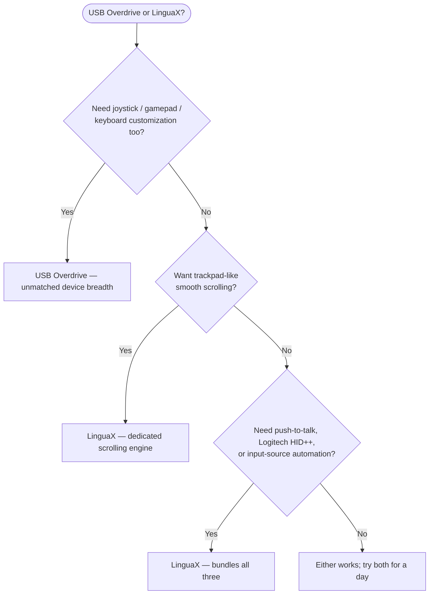

If you searched for a **USB Overdrive alternative**, start with the honest answer: USB Overdrive is a veteran macOS utility — it has been around since the Mac OS 9 era, and its device coverage is unmatched: mice, keyboards, trackballs, joysticks, and gamepads from almost any vendor. LinguaX is the better fit when your focus is specifically **mice**, and you want a true smooth-scrolling engine, push-to-talk voice input, Logitech hardware controls, and input-source automation in one native app — at half the price.

## What USB Overdrive does well

USB Overdrive focuses on universal, driver-level input customization:

- works with USB and Bluetooth mice, keyboards, trackballs, joysticks, and gamepads from almost any vendor — game-controller support is genuinely rare in this category
- per-device, per-application button and axis assignments
- mouse acceleration and scroll-speed customization
- per-axis scroll reversing and modifier-based axis swapping (added in version 5.3)
- long macOS compatibility track record — version 5.3.1 supports everything from macOS 12 Monterey to macOS 26 Tahoe, with older builds available going back decades
- shareware model: the trial never expires; a 10-second reminder at login and when opening settings is what the $20 registration removes

These are not guesses. They are the public feature set described on the [USB Overdrive website](https://www.usboverdrive.com/). Like LinguaX, it deliberately does not handle Apple mice, trackpads, or keyboards — both apps exist for third-party hardware.

## Where LinguaX is different

LinguaX overlaps on button mapping and per-app behavior for mice — but it is designed around a broader daily workflow:

- **A smooth-scrolling engine**: USB Overdrive tunes scroll speed and acceleration of native stepped scrolling. LinguaX replaces notch-by-notch wheel steps with a damped, trackpad-like curve (Min Step / Speed Gain / Duration controls), with per-app on/off.
- **Push-to-talk voice input**: hold a mouse side button for macOS Dictation, Wispr Flow, or superwhisper.
- **Logitech hardware controls** on supported models: hardware DPI, SmartShift, and battery visibility without Logi Options+.
- **Input-source automation**: switch the macOS input source by app or website domain — outside USB Overdrive's scope.
- **Price and trial style**: USB Overdrive is $20 with a never-expiring, nag-reminded trial. LinguaX is a $9.9 one-time Lifetime purchase for up to 3 Macs after a clean 30-day full-feature trial, updates included.

If you need to customize a joystick, gamepad, or a keyboard alongside your mouse, USB Overdrive's device breadth is something LinguaX does not try to match. If your world is specifically the mouse — and you also want smooth scrolling, voice input, Logitech hardware features, or multilingual typing — LinguaX covers more ground.

## USB Overdrive vs LinguaX

| Need | USB Overdrive | LinguaX |
| --- | --- | --- |
| Mice, keyboards, trackballs | Yes | Mice (any USB or Bluetooth brand) |
| Joysticks / gamepads | Yes | No |
| Button customization | Per-device, per-app assignments | Click / double-click / long-press / directional drag gestures, app-scoped |
| Smooth scrolling (damped curve) | Scroll speed / acceleration tuning | Yes, Min Step / Speed Gain / Duration, per-app |
| Mouse scroll direction independent from trackpad | Per-axis reversing (v5.3+) | Yes, per-axis (vertical / horizontal) |
| Per-app settings | Yes | Yes, app-scoped overrides |
| Logitech DPI / SmartShift / battery | Not a stated focus | Yes, on supported Logitech models |
| Push-to-talk voice input | No | Yes |
| Input-source switching by app / website | No | Yes |
| Apple mice / trackpads / keyboards | Not supported (by design) | Targets third-party mice |
| Price model | $20 shareware; unlimited trial with reminders | 30-day trial, $9.9 one-time Lifetime for up to 3 Macs |

## Quick decision

## Choose USB Overdrive If

- you need to customize joysticks, gamepads, trackballs, or keyboards — not just mice
- you like the never-expiring shareware trial and don't mind the reminder windows
- you value a compatibility track record that stretches back to classic Mac OS
- you do not need smooth scrolling, push-to-talk, or input-source automation

## Choose LinguaX If

- choppy wheel scrolling is your main complaint — you want a real smoothing curve, not just faster notches
- you use a Logitech mouse and want DPI, SmartShift, or battery visibility without Logi Options+
- you want a side button as a push-to-talk trigger for dictation apps
- you type in multiple languages and want the input source to follow apps or browser domains
- you want a clean 30-day trial and lifetime updates at half the price

## Test with your actual mouse

Both apps can be tried for free, so the reliable way to compare is one workday with your real setup:

1. Map the same side button in both apps.
2. Compare scrolling in a browser and a long document — this is where the two philosophies differ most.
3. Sleep and wake your Mac, then confirm the mappings still work.
4. If you use voice input or multiple input sources, test those flows in LinguaX.

## FAQ

**Is LinguaX a drop-in replacement for USB Overdrive?**
For mice, in most cases yes — button mapping, per-app settings, and scroll behavior are all covered, usually with more depth. For keyboards, trackballs, joysticks, or gamepads, no: USB Overdrive's device breadth is unmatched and LinguaX does not try to replace that.

**Which app is better for smooth scrolling?**
LinguaX. USB Overdrive adjusts scroll speed and acceleration, which changes how fast the native stepped scrolling feels. LinguaX replaces the steps with a continuous damped curve, closer to a trackpad. If "jumpy scrolling" is your pain, that difference is the whole game.

**Which app is better for Logitech mice?**
LinguaX, if you want supported hardware features such as DPI, SmartShift, or battery visibility. USB Overdrive handles Logitech mice at the generic HID level, but Logitech-specific hardware controls are not its stated focus.

**Is USB Overdrive still maintained?**
Yes — version 5.3.1 supports current macOS releases up to macOS 26 Tahoe, and the 5.3 update added per-axis scroll reversing. It has been continuously maintained since the classic Mac OS era.

**Which app should I try first?**
Try the one that matches your main pain. If the pain is "I need to tame several kinds of input devices," try USB Overdrive. If the pain is "scrolling feels terrible and I want one app for mouse, voice, and input automation," try LinguaX.

## Get started

LinguaX is a free download with a **30-day trial** — no account, no telemetry. If it fits your workflow, it is a **$9.9 one-time Lifetime purchase covering up to 3 Macs**, no subscription.

**[Download LinguaX](/download)** and test it against your real mouse setup.

## Related guides

- [Mouse+ — Mouse Enhancement for macOS](/docs/mouse-plus/overview)
- [Smooth Scrolling](/docs/mouse-plus/fundamentals/smooth-scrolling)
- [Button Mapping](/docs/mouse-plus/fundamentals/button-mapping)
- [SteerMouse Alternative for Mac](/docs/comparisons/steermouse-alternative-mac)
- [Logi Options+ Alternative](/docs/comparisons/logi-options-plus-alternative-macos)
