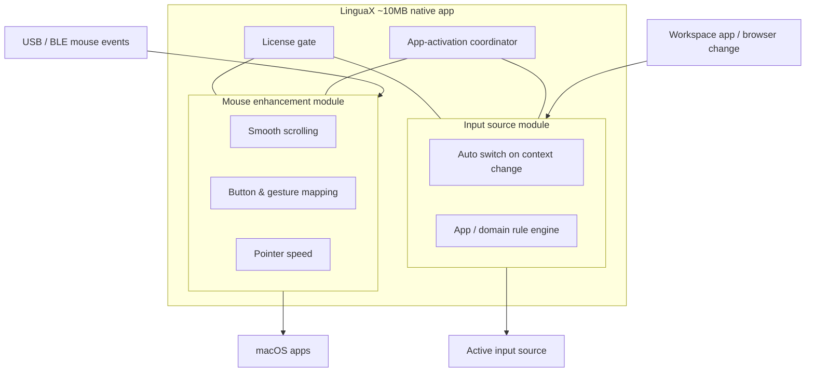

# How LinguaX Works

LinguaX is a native macOS tool built around **two co-equal core modules** — mouse enhancement and automatic input source switching. Both run natively in the background. They are independent at the mechanism level, sharing only the license gate and an app-activation coordinator, so each works on its own and disabling one never affects the other.

## Runtime Model

LinguaX has two core capabilities. Marketing leads with the mouse, but mechanically the two modules sit side by side — neither is built on top of the other.

### Mouse enhancement

This module makes any third-party mouse feel native:

- **Smooth scrolling** replaces jumpy, notch-by-notch wheel input with a tunable curve.
- **Button and gesture mapping** binds side buttons, wheel tilt, and gestures to real actions.
- **Pointer speed** is applied instantly through a low-level system path.

It is configured on its own and keeps working regardless of which app is in front.

### Input source switching

The other core module switches your input source automatically based on context. It is fully independent of mouse enhancement — you can run LinguaX purely for one, the other, or both.

When enabled, it reacts to context changes:

1. Detect the active app.
2. If the app is a browser, detect the active domain.
3. Match configured app and domain rules.
4. Apply the target input source.
5. Re-check on each context change.

Input source switching can also be triggered manually by binding the `switchInputSource` action to a keyboard shortcut or a mouse gesture.

## Why This Model Is Lightweight and Reliable

- **Native and local.** A ~10MB macOS app — no Electron, no kernel driver, no account.
- **No telemetry.** Configuration stays on your Mac.
- **Fast, predictable decisions** made locally on each context change.
- **Incremental setup.** Enable either core module independently and add rules only when you need them.

## Related Docs

- [Rules and Priority](./rules-and-priority.md)
- [Mouse+ Overview](../mouse-plus/overview.md)
