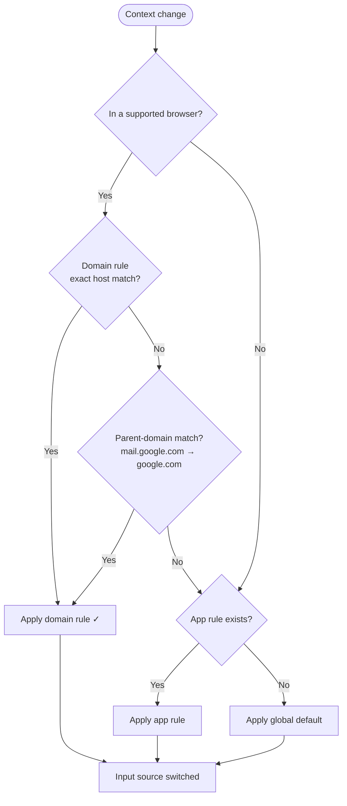

# Rules and Priority

As your LinguaX setup grows, grouping rules and applying clear priority keep behavior predictable across every context.

## Grouping Rules (Profiles)

Different workflows often need different rule sets:

- coding-heavy sessions
- design-heavy sessions
- multilingual communication sessions

Profiles let you group rules by workflow intent instead of mixing everything into one flat list. A practical strategy:

1. Keep one baseline profile for daily default behavior.
2. Add a second profile only when requirements clearly diverge.
3. Use explicit names such as `Dev Daily`, `Design Review`, or `CN Communication`.

## Priority Principles

LinguaX resolves matches from most specific to most general — **website domain rule > app rule > global default**. Apply these consistently:

- **Domain rule beats app rule.** Inside a browser, a matching domain rule always takes priority over the broad browser app rule — so docs, chat, and admin tabs each get the right input source.
- **App rules are per-foreground-app.** For non-browser apps, the matching app rule applies directly. Two app rules never compete, because only one app is in the foreground at a time.
- **Global default is the fallback.** When neither a domain rule nor an app rule matches, LinguaX applies your global default input source.
- **Domain matching falls back to the parent domain.** A rule is matched exactly first, then by parent domain (`mail.google.com` → `google.com`), with the leading `www.` stripped — so a single rule can cover subdomains.
- **Specific context beats broad context.** Narrow targets win over wide ones.

## Conflict Prevention

- Keep one clear owner rule per context.
- Avoid duplicate or overlapping fallback rules for the same app or domain.
- Test each new rule before adding the next one.

## Maintenance Checklist

- Review active rules monthly.
- Remove stale apps and domains.
- Keep only rules you have validated.

## Related Docs

- [App & Website Rules](../input-source/app-and-website-rules.md)
- [How LinguaX Works](./how-linguax-works.md)
