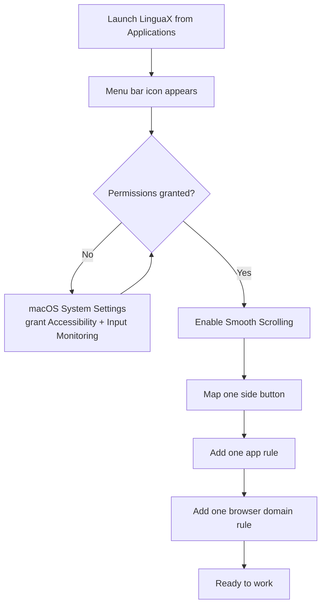

After installation, this setup gets LinguaX working in a few minutes without over-configuring.

## The first-run flow at a glance

The next five sections walk each step in detail.

## Step 1: Launch

1. Open LinguaX from **Applications**.
2. Confirm the menu bar icon is visible.

`[screenshot: LinguaX menu bar icon in the macOS menu bar]`

## Step 2: Grant Permissions

1. Follow in-app prompts.
2. In macOS **System Settings**, grant requested permissions.
3. Return to LinguaX and confirm status is healthy.

Permissions are required for reliable app/domain detection and automation.

`[screenshot: macOS System Settings > Privacy & Security > Accessibility with LinguaX toggled on]`

## Step 3: Start with One Mouse+ Win

1. Enable smooth scrolling.
2. Map one mouse action you will actually use.
3. Confirm pointer and scrolling feel stable in your main app.

`[screenshot: Mouse+ tab with Smooth Scrolling enabled and one Side 1 mapping shown]`

## Step 4: Verify

1. Add one app rule for your main editor.
2. Add one browser domain rule.
3. Switch between contexts and confirm input behavior is correct.

`[screenshot: Input Source rules panel with one app rule + one domain rule]`

## Step 5: Optional Feature Checks

- Add a second mouse mapping if helpful.
- If using script actions, run one template and approve Automation permission prompts when shown.

## Next Reading

- [Quick Tour](./quick-tour.md)
- [Mouse+ Overview](../mouse-plus/overview.md)
- [App & Website Rules](../input-source/app-and-website-rules.md)
- [Common Issues](../troubleshooting/common-issues.md)
