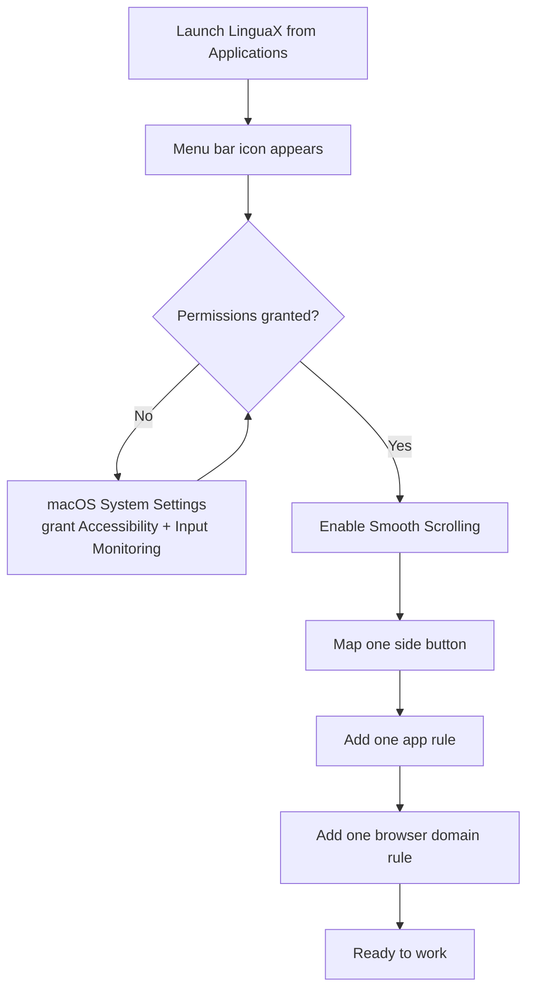

import ThemedImage from '@theme/ThemedImage';
import useBaseUrl from '@docusaurus/useBaseUrl';

After installation, this setup gets LinguaX working in a few minutes without over-configuring.

## The first-run flow at a glance

The next five sections walk each step in detail.

## Step 1: Launch

1. Open LinguaX from **Applications**.
2. Confirm the menu bar icon is visible.

<ThemedImage
  alt={"Schematic of the macOS menu bar showing where the LinguaX mouse icon appears, next to battery, Wi-Fi, Control Center, and the clock"}
  sources={{
    light: useBaseUrl('/img/linguax-menubar-icon.svg'),
    dark: useBaseUrl('/img/linguax-menubar-icon-dark.svg'),
  }}
  width="720"
/>

## Step 2: Grant permissions

1. Open LinguaX **Settings** and tick **Permission: Accessibility** and **Permission: Input Monitoring**.
2. macOS opens the matching System Settings pane automatically — toggle LinguaX on there.
3. Return to LinguaX; both rows stay checked.

Permissions are required for reliable app/domain detection and automation.

<ThemedImage
  alt={"LinguaX Settings tab with Permission: Accessibility and Permission: Input Monitoring both checked — ticking each opens the corresponding macOS System Settings pane"}
  sources={{
    light: useBaseUrl('/img/linguax-mouse-permission.png'),
    dark: useBaseUrl('/img/linguax-mouse-permission-dark.png'),
  }}
  width="420"
/>

## Step 3: Start with one Mouse+ win

1. Enable smooth scrolling.
2. Map one mouse action you will actually use.
3. Confirm pointer and scrolling feel stable in your main app.

<ThemedImage
  alt={"LinguaX Mouse+ tab showing the current device and clickable button map"}
  sources={{
    light: useBaseUrl('/img/linguax-mouse-gesture-mapping.png'),
    dark: useBaseUrl('/img/linguax-mouse-gesture-mapping-dark.png'),
  }}
  width="420"
/>

## Step 4: Verify

1. Add one app rule for your main editor.
2. Add one browser domain rule.
3. Switch between contexts and confirm input behavior is correct.

<ThemedImage
  alt={"LinguaX input-source rules panel with app-scoped rules"}
  sources={{
    light: useBaseUrl('/img/linguax-input-method-app-mapping.png'),
    dark: useBaseUrl('/img/linguax-input-method-app-mapping-dark.png'),
  }}
  width="420"
/>

## Step 5: Optional feature checks

- Add a second mouse mapping if helpful.
- If using script actions, run one template and approve Automation permission prompts when shown.

## Next reading

- [Quick Tour](./quick-tour.md)
- [Mouse+ Overview](../mouse-plus/overview.md)
- [App & Website Rules](../input-source/app-and-website-rules.md)
- [Common Issues](../troubleshooting/common-issues.md)
