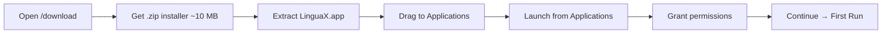

This guide covers the standard LinguaX installation flow. LinguaX is a ~10MB native macOS app — no drivers, no installer wizard, no background services. You drag it into **Applications** and it works with any mouse.

## Requirements

- macOS 13.0 (Ventura) or later
- Apple Silicon or Intel Mac
- network access for download
- no drivers or kernel extensions required

## Install from the official website

1. Open [Download](/download).
2. Select **Download Free**.
3. Wait for the `.zip` installer to finish downloading.
4. Open the downloaded `.zip` file to extract `LinguaX.app` (~10MB).
5. Drag `LinguaX.app` to **Applications** — no installer, no driver setup.

## First launch

1. Open LinguaX from **Applications**.
2. Confirm the menu bar icon appears.
3. Grant required macOS permissions.
4. Continue with [First Run](./first-run.md).

## Update method

- Download the latest installer from [Download](/download).
- Install over the existing app.
- Existing rules/settings are normally preserved.

## If installation fails

- re-download installer and retry
- check macOS security prompts
- restart Mac if installer state appears stuck

Then check [Common Issues](../troubleshooting/common-issues.md).
