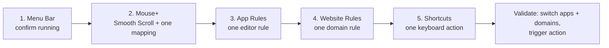

This tour helps you validate LinguaX in about 5 minutes.

## 1) Menu bar

- Open LinguaX from the menu bar icon.
- Confirm background running state.

## 2) Mouse+ (start here)

- Enable Smooth Scroll and tune Min Step, Speed Gain, and Duration once.
- Test one side or middle button mapping that you will use daily.

## 3) App rules

- Add one app rule for your main coding or writing app.
- Keep one clear default per high-frequency app.

## 4) Website rules

- Add one domain rule for your highest-frequency website.
- Use exact domains and verify by switching tabs.

## 5) Shortcuts and actions

- Create one keyboard shortcut action.
- Optionally test a script or system action.

## Quick validation

1. Switch between two configured apps.
2. Switch between two configured domains.
3. Trigger your mapped mouse/keyboard action once.
4. Confirm expected input behavior each time.

## Where to go next

- [Mouse+ Overview](../mouse-plus/overview.md)
- [Input Source Auto Switch](../input-source/auto-switch.md)
- [App & Website Rules](../input-source/app-and-website-rules.md)
- [Permissions on macOS](../troubleshooting/permissions-on-macos.md)
