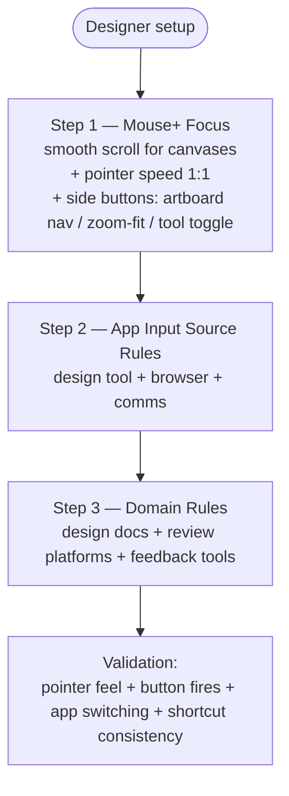

This setup focuses on creative workflows that need predictable pointer behavior and stable shortcuts. Mouse+ comes first: precise scrolling and pointer control matter more than language rules when you work in a design tool all day.

## Step 1: Mouse+ focus

Start with the high-impact pointer controls.

1. Enable smooth scrolling for canvases, layer lists, and long boards.
2. Tune pointer speed and disable acceleration if you want consistent, predictable tracking.
3. Map mouse buttons to frequent design actions, for example:
   - back/forward between artboards or screens
   - zoom-to-fit or a repeated tool toggle
   - switch Space between design app and reference material

On mice with a tilting wheel, the wheel-tilt slots (`WL`/`WR`) can also be mapped.

## Step 2: App input source rules

Once the pointer feels right, add app rules for:

- your main design tool
- browser
- communication/review tool

Keep defaults simple, then refine.

## Step 3: Domain rules to add first

- design documentation
- internal review tools
- feedback platforms

## Validation checklist

1. Verify pointer and scrolling feel stable in the design app.
2. Trigger your mapped mouse buttons and confirm they fire.
3. Switch between design app and browser.
4. Verify input behavior is correct in both, and shortcut consistency holds.

## Related docs

- [Mouse+ Overview](../mouse-plus/overview.md)
- [Pointer Speed](/docs/mouse-plus/fundamentals/pointer-speed)
- [App & Website Rules](../input-source/app-and-website-rules.md)
- [Common Issues](../troubleshooting/common-issues.md)
