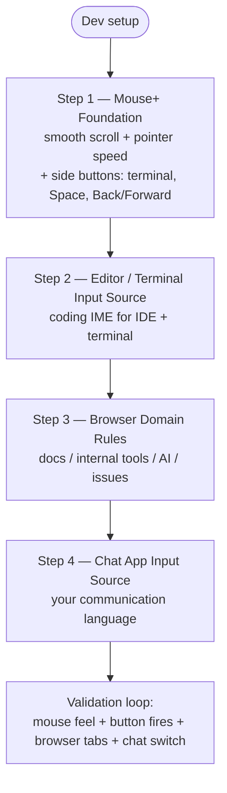

This setup targets development workflows that switch between editor, terminal, browser, and chat. Mouse+ comes first: most of your day is spent navigating and scrolling, so a stable pointer and a few high-value button mappings pay off before any language rules.

## Step 1: Mouse+ Foundation

Configure the mouse before anything else.

1. Enable smooth scrolling so code and long documents scroll predictably.
2. Set a comfortable pointer speed and disable acceleration if you prefer 1:1 tracking.
3. Map side buttons to your most repeated developer actions, for example:
   - open or focus the terminal
   - switch Space (left/right desktop)
   - back/forward in the browser or editor history

Newer versions include extended mouse tilt button support (`MR/ML`) you can map to Space switching.

## Step 2: Editor / Terminal Input Source

After the mouse feels right, add input-source rules for the apps you live in.

1. Editor/IDE -> coding input source (usually plain ASCII).
2. Terminal -> coding input source.

This keeps typing predictable the moment those apps gain focus.

## Step 3: Browser Domain Rules

Refine the browser by domain for docs and tools.

Start with domains you visit many times per day:

- documentation sites
- internal tools
- AI assistants
- issue tracking or review systems

## Step 4: Chat App Input Source

Map your chat app to your communication language input source.

## Validation Loop

1. Confirm mouse behavior feels stable in IDE, terminal, and browser.
2. Trigger your mapped side-button actions and confirm they fire.
3. Switch the browser between two mapped domains.
4. Switch between browser and chat app and confirm input is correct.

## Maintenance Guidance

- avoid duplicate overlapping rules
- keep domain rules explicit
- clean stale rules regularly

## Related Docs

- [Mouse+ Overview](../mouse-plus/overview.md)
- [App & Website Rules](../input-source/app-and-website-rules.md)
- [Multilingual Workflow](../input-source/multilingual-workflow.md)
- [Common Issues](../troubleshooting/common-issues.md)
