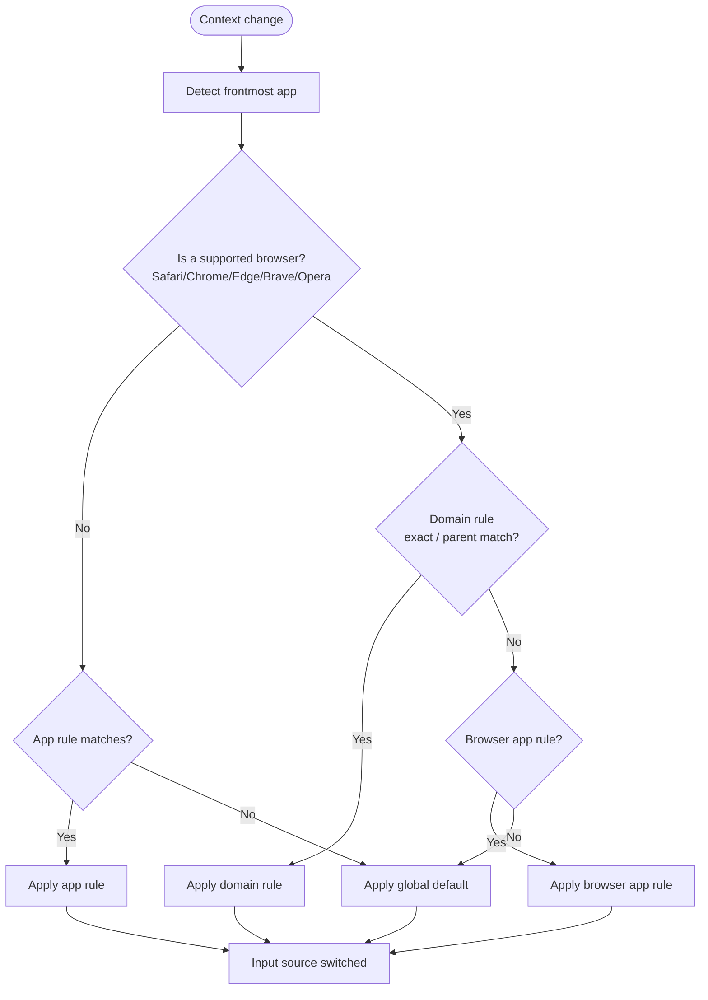

# App & Website Rules

LinguaX drives automatic input source switching with two rule types. Input source switching is one of LinguaX's two core modules; mouse enhancement is the other, configured separately and running independently alongside it.

## The two rule types

**App Rule** — applies when a specific app is in the foreground. Use it for IDEs and editors, terminals, design tools, and chat apps.

- `Cursor` → English
- `WeChat` → Chinese

**Website / Domain Rule** — applies to a domain inside a browser. Use it for documentation sites, internal dashboards, AI chat tools, and region-specific websites.

- `docs.example.com` → English
- `chat.example.cn` → Chinese

A single browser usually holds mixed contexts at once: docs, chat, admin tools, local platforms. Domain rules prevent one broad browser default from breaking every tab.

## Priority model

Priority runs from most specific to most general: **website domain rule > app rule > global default**.

1. LinguaX detects the active app.
2. For non-browser apps, the matching app rule applies.
3. For browsers, a matching domain rule takes priority over the browser app default.
4. If nothing matches, LinguaX falls back to your global default input source.

Domain matching is exact first, then falls back to the parent domain (`mail.google.com` → `google.com`), with the leading `www.` stripped.

### Permissions and browser support

- **App rules need no Accessibility permission.**
- **Domain rules require the Accessibility permission**, because LinguaX reads the active tab's URL.
- Supported browsers: **Safari, Chrome, Edge, Brave, Opera**. **Firefox is not supported** for domain rules, because its URL cannot be read.

## Configure an App Rule

1. Open the app rules list.
2. Add the target app.
3. Set its input source.
4. Save and enable.

Start with your top 3 daily apps.

## Configure a Domain Rule

1. Confirm the browser app rule baseline works first.
2. Open the website / domain rules list.
3. Select the browser, add the domain, and set the target input source.
4. Save and enable.

### Exact matching tips

- Use exact domains like `docs.example.com`.
- Avoid duplicate rules for the same domain.
- Keep rules narrow before introducing broad patterns.
- Keep the browser app default simple and let domain rules refine it.

## Verify & troubleshoot

1. Open two configured domains in separate tabs and switch between them.
2. Leave the browser and confirm non-browser app rules still work.

If a rule does not trigger:

- check domain spelling and rule enabled state
- remove overlapping broad rules
- restart the browser and LinguaX

If it still fails, see [Common Issues](../troubleshooting/common-issues.md).

## Related docs

- [Rules and Priority](/docs/concepts/rules-and-priority)
- [Multilingual Workflow](./multilingual-workflow.md)
