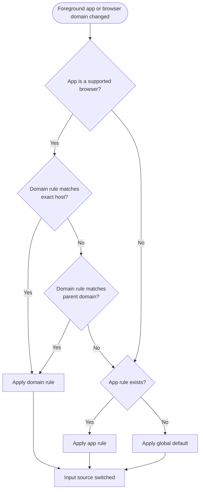

# Automatic Input Source Switching

Automatic input source switching is **one of LinguaX's two core capabilities** — the other half alongside mouse enhancement, and a key differentiator. The two modules are independent: you can run either on its own.

When you move between apps or websites, LinguaX switches the active input source for you. You stop interrupting your flow to fix the keyboard layout by hand.

## What you gain

- Input source follows the foreground app automatically.
- Input source follows the active browser domain automatically.
- No manual toggling when you jump between coding, chat, and browsing.

## What triggers it

- The foreground app changes.
- The active browser domain changes.

## Recommended first setup

1. Add one rule for your main editor or IDE.
2. Add one rule for your main communication app.
3. Add one high-frequency domain rule.
4. Run one full work session before adding more rules.

## Behavior summary

- App rules set the default input source per app.
- Domain rules refine behavior inside browsers.
- Priority runs from most specific to most general: **website domain rule > app rule > global default**.
- Domain matching is exact first, then falls back to the parent domain (`mail.google.com` → `google.com`), with the leading `www.` stripped.
- If no rule matches, LinguaX falls back to your default input source.

## How LinguaX picks the input source

`[screenshot: LinguaX rule list showing 1 app rule and 1 domain rule with priorities indicated]`

## Permissions and browser support

- **Per-app switching needs no Accessibility permission.**
- **Per-domain switching requires the Accessibility permission**, because LinguaX reads the active tab's URL.
- Domain switching works in **Safari, Chrome, Edge, Brave, and Opera**. **Firefox is not supported** for domain switching, because its URL cannot be read.

## Validation

1. Switch between two configured non-browser apps and confirm each uses the expected input source.
2. Switch between two configured browser domains and confirm domain-specific behavior.

## Related docs

- [App & Website Rules](./app-and-website-rules.md)
- [Auto Switch Input Source by App and Domain](/docs/input-source/auto-switch-input-source-app-domain-mac)
