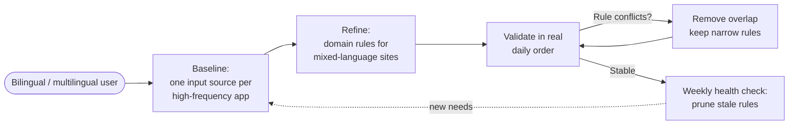

# Multilingual Workflow

This guide builds a stable bilingual or multilingual setup using LinguaX's input source switching — one of its two core modules, working independently alongside mouse enhancement. Multilingual input automation is a key differentiator that keeps the right language ready as you move through your day.

## Baseline setup

1. Define one default input behavior per high-frequency app.
2. Add domain rules for websites that need a different language.
3. Validate switching in your real daily order, not a synthetic test.

## Practical mapping pattern

- IDE and terminal: coding language / input source
- chat apps: communication language
- docs, search, and admin sites: domain-specific language behavior

## Scale safely

- Add one rule at a time.
- Verify after each change.
- Remove rules that no longer match real usage.

## Typical mistakes

- too many overlapping rules
- broad browser defaults without domain refinement
- skipping validation after changes

## Weekly health check

1. Review your top 10 active rules.
2. Remove stale domains.
3. Re-test two app transitions and two domain transitions.

## Related docs

- [App & Website Rules](./app-and-website-rules.md)
- [Automatic Input Source Switching](./auto-switch.md)
