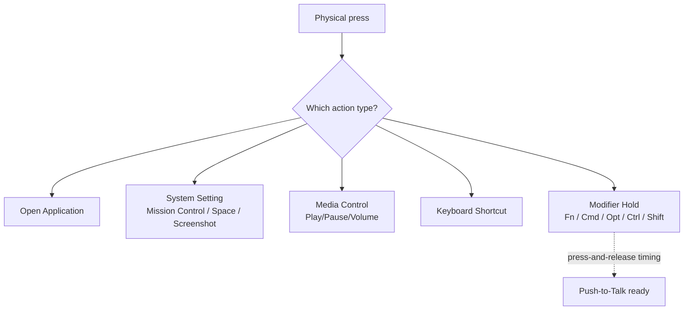

# Button & Side-Button Mapping

macOS treats most extra mouse buttons as dead weight. Mouse+ turns side buttons, wheel tilt, and thumb buttons into real actions — back/forward, app launches, window controls, media keys, or any shortcut you record.

## Mappable buttons

Depending on your device, Mouse+ exposes named button slots:

- `Left`, `Right`, `Middle`
- `Side 1`–`Side 4` (side buttons)
- `Wheel Tilt Left` / `Wheel Tilt Right` — tilting the wheel left or right, used for horizontal scrolling
- `Scroll Mode` slot on MX Master and MX Anywhere models (toggles the MagSpeed wheel)
- `Thumb` slot on MX Master models (behind the thumb rest) — MX Anywhere models don't have this button
- `Thumb` slot on Logi Lift, POP Mouse, MX Master 4 (each maps to a different physical button — see the per-model guides for placement)

For recognized mice, side buttons are mapped automatically after detection, so there is less manual setup.

## Action types

Each mouse button (and gesture) can trigger one of:

- **Open Application** — open a specific application.
- **System Setting** — window controls, Mission Control, Switch Space Left/Right, Control Center, Notification Center, screenshots, Finder actions, and developer workflows.
- **Media Control** — playback and volume, grouped under a dedicated Media Control category.
- **Keyboard Shortcut** — record any key combination, including plain single keys and system-reserved keys, with the built-in shortcut recorder.
- **Modifier Hold** — hold a modifier while the button is pressed (see below).

`[screenshot: Mouse+ action-type picker showing the five categories with a keyboard shortcut being recorded]`

For AppleScript-based custom actions, see [Shortcuts & Hotkeys](/docs/concepts/shortcut-and-hotkeys).

## Modifier-hold

A button can hold the **Fn (Globe)** modifier for as long as you press it, releasing the instant you let go. This is the foundation for push-to-talk: holding the button injects the Fn/Globe key to start macOS Dictation, and releasing stops it. See [Push-to-Talk Voice Typing with a Mouse Button](/docs/push-to-talk/push-to-talk-voice-typing-mac).

## Related docs

- [How to Map Mouse Side Buttons on macOS](/docs/mouse-plus/recipes/map-mouse-side-buttons-macos)
- [Gesture Mapping](./gesture-mapping.md)
