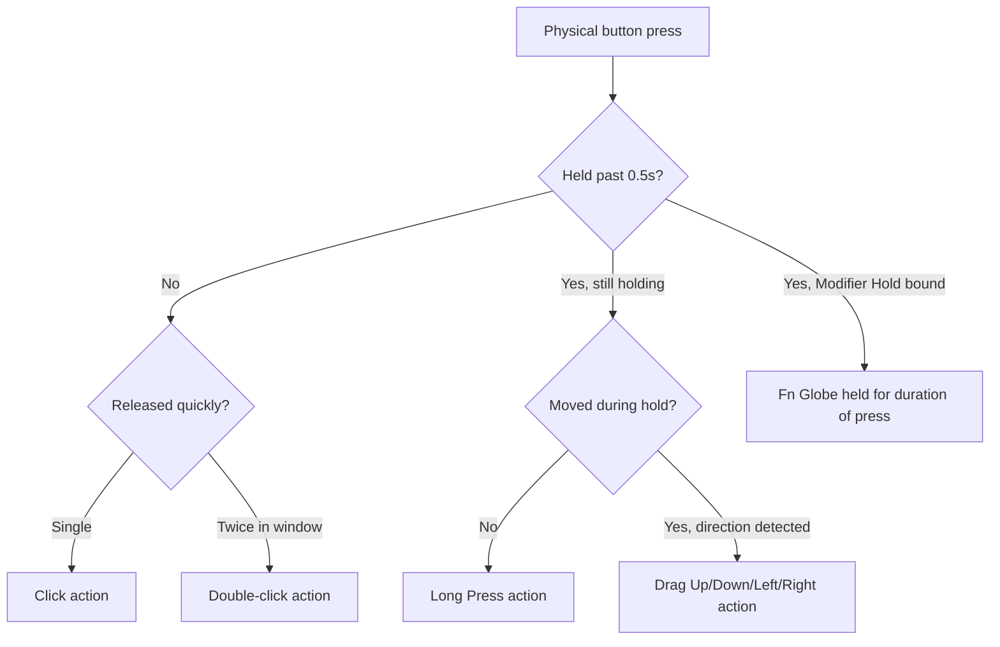

# Gesture Mapping

A single button can do more than one thing. Mouse+ recognizes distinct gestures on the same button and binds each to its own action, so one side button can cover several workflows.

## Gesture types

- **Click** — a single press.
- **Double-Click** — detection windows are tuned to match system settings for natural timing.
- **Long Press** — hold the button past a threshold (0.5s) to trigger a separate action. On the `Thumb` slot, long-press is available only on Logitech HID++ devices.
- **Drag Up / Drag Down / Drag Left / Drag Right** — hold and drag the button in a direction; each of the four directions maps independently.
- **Modifier Hold** — hold the Fn (Globe) modifier while the button is pressed (see below).

`[screenshot: gesture mapping panel showing one button with click, double-click, long-press, and drag-left/right actions all bound]`

Directional drags (swipe gestures) fire by one of three modes — **Release**, **Threshold**, or **Interval** — with an on-screen mode indicator while the gesture is active. All side-button, long-press, and gesture semantics run through one unified runtime, so behavior stays consistent across devices. The wheel-tilt slots support Click only.

## Binding actions

Each gesture maps to the mouse action set: Open Application, System Setting, Media Control, Keyboard Shortcut, and Modifier Hold. Mix gesture types on one button — for example, click for back, long-press for Mission Control, drag left/right to switch Spaces.

## Modifier-hold gesture

A gesture can hold the **Fn (Globe)** modifier while you keep the button pressed and release it the moment you let go. This drives push-to-talk voice input and other hold-to-activate tools, where the action must stop instantly on release.

## Related Docs

- [Button & Side-Button Mapping](./button-mapping.md)
- [Shortcuts & Hotkeys](/docs/concepts/shortcut-and-hotkeys)
