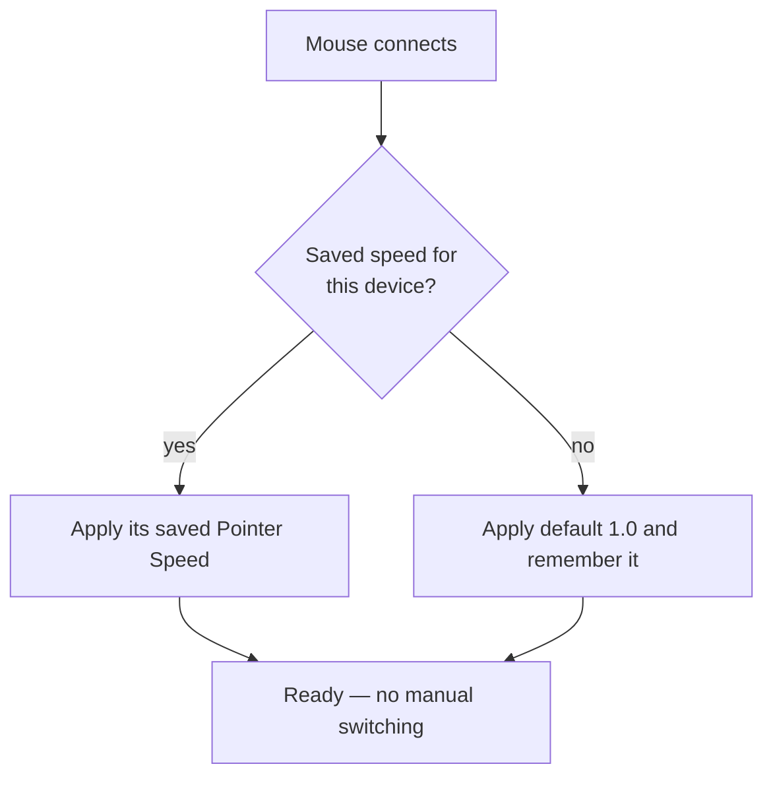

# Pointer Speed & Acceleration

macOS offers limited pointer control for third-party mice — one slider, shared across every device. Mouse+ gives you finer control through a dedicated **Feel Adjustment** section.

## Pointer Speed

The Feel Adjustment section has a single **Pointer Speed** slider (range 0.1–5.0, default 1.0) that sets tracking response beyond the range macOS exposes. Changes apply immediately through a low-level system path, with no app restart, so you can dial in the right feel while moving the pointer. Lower values give a slower, steadier pointer that precision and gaming users often prefer. See [Disable Mouse Acceleration on Mac](/docs/mouse-plus/recipes/disable-mouse-acceleration-mac).

## Per-device persistence

Each mouse keeps its own Pointer Speed value, persisted per device. A fast desktop mouse and a slower travel mouse can each remember their own setting — Mouse+ applies the right profile automatically when a device connects, with no manual switching. Note that two units of the same model cannot be told apart, so they share one profile.

## Related docs

- [Smooth Scrolling](./smooth-scrolling.md)
- [Device Compatibility](/docs/mouse-plus/device-compatibility)
