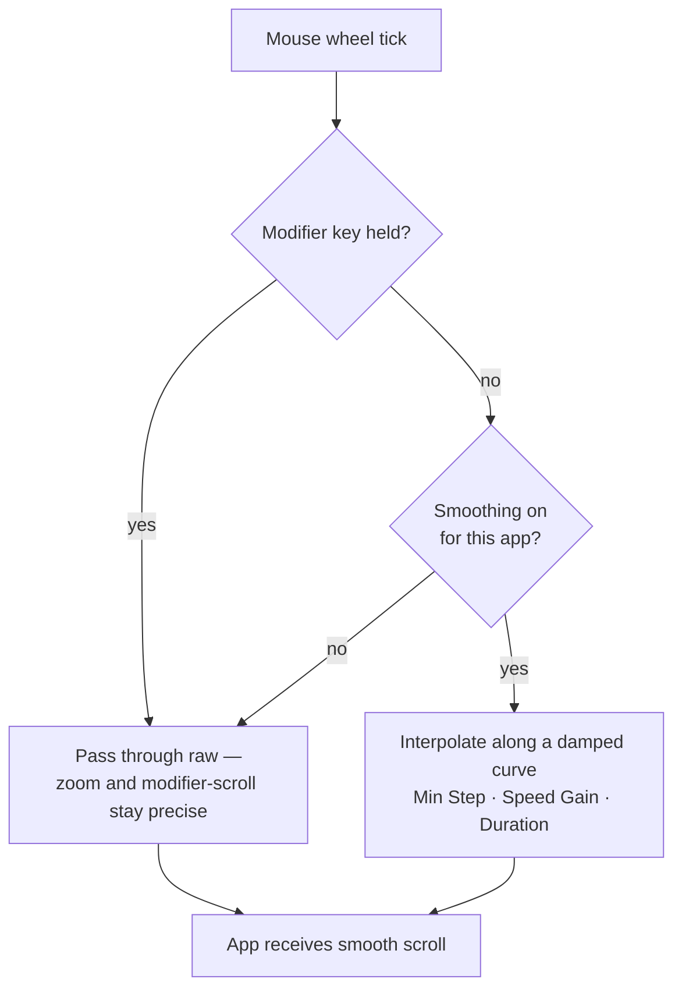

import ThemedImage from '@theme/ThemedImage';
import useBaseUrl from '@docusaurus/useBaseUrl';

# Smooth Scrolling

Most third-party mice scroll in coarse notches on macOS — content jumps line by line instead of gliding. Mouse+ intercepts those scroll events and replays them along a smooth curve, so long pages and code feel as fluid as a trackpad.

## How it works

Mouse+ captures the raw scroll signal from your mouse and reshapes it before it reaches the app. Instead of passing through discrete wheel ticks, it interpolates motion across a damped curve. When smoothing is disabled or bypassed, the original scroll distance is preserved, so you never lose travel range.

<ThemedImage
  alt={"LinguaX Smooth Scroll panel: Min Step / Speed Gain / Duration sliders, plus a note that holding ⌘⌥⌃⇧ or Fn pauses smooth scroll"}
  sources={{
    light: useBaseUrl('/img/linguax-smooth-scroll.png'),
    dark: useBaseUrl('/img/linguax-smooth-scroll-dark.png'),
  }}
  width="420"
/>

## Settings

Three global sliders control the feel:

- **Min Step** — the smallest scroll step applied per event (range 1.0–100.0, default 33.6). Lower it for finer, more granular movement; raise it for larger jumps.
- **Speed Gain** — scales how far each scroll gesture travels (range 1.0–10.0, default 2.70). Raise it for faster page movement, lower it for tighter control.
- **Duration** — controls the length of the inertia/coast curve (range 1.0–5.0, default 4.35). Higher values feel more glide-and-coast; lower values settle more quickly.

These three parameters are global — they apply the same way across every app.

Smoothing acts only on the mouse wheel. Trackpad scrolling is passed through untouched, so continuous trackpad gestures keep their native behavior. Holding any modifier key (`⌘`, `⌥`, `⌃`, `⇧`, or `fn`) temporarily pauses smoothing, so zoom and other modifier-scroll interactions stay precise.

Tuning advice: change one value at a time and test for a couple of minutes in your most-used apps before adjusting again. A balanced Speed Gain with a moderate Duration suits most reading and coding.

## Per-app overrides

A browser and a code editor often want different scrolling. You can turn smooth scrolling on or off per app instead of forcing one global state. The three feel parameters (Min Step, Speed Gain, Duration) and the reverse-direction switches remain global. See [App-Scoped Overrides](./app-scoped-overrides.md).

## Reverse scroll direction

Mouse+ can reverse scroll direction for the mouse independently of the trackpad, with two separate global switches — **Reverse Vertical Scroll** and **Reverse Horizontal Scroll** — so each axis is configured on its own. See [Reverse Scroll Direction for the Mouse Only](/docs/mouse-plus/recipes/reverse-scroll-direction-mouse-only-mac).

## Related docs

- [Fix Choppy Mouse Scrolling on macOS](/docs/mouse-plus/recipes/fix-choppy-mouse-scrolling-macos)
- [App-Scoped Overrides](./app-scoped-overrides.md)
