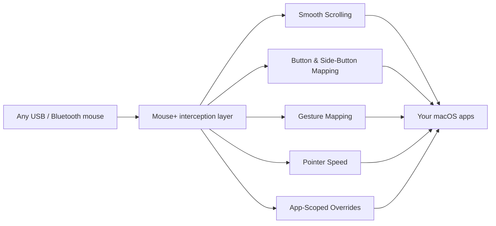

# Mouse+ — Mouse Enhancement for macOS

Mouse+ gives any third-party mouse native-grade feel on macOS. It smooths scrolling, maps side buttons and gestures to real actions, and lets each app behave differently — all from a single, lightweight app that needs no driver.

It is a ~10MB native macOS app. There is no Electron runtime, no account, no telemetry, and nothing to install at the kernel level. Plug in a USB or Bluetooth mouse and Mouse+ enhances it in place.

`[screenshot: LinguaX Mouse+ tab with device list on the left and configuration panel on the right]`

## What Mouse+ does

- **[Smooth scrolling](/docs/mouse-plus/fundamentals/smooth-scrolling)** — replace the jumpy, notch-by-notch scrolling of third-party mice with a tunable smooth curve.
- **[Button & side-button mapping](/docs/mouse-plus/fundamentals/button-mapping)** — map side buttons, wheel tilt, and thumb buttons to launches, system controls, media, and shortcuts.
- **[Gesture mapping](/docs/mouse-plus/fundamentals/gesture-mapping)** — bind click, double-click, long-press, directional drag, and swipe gestures to actions.
- **[Pointer speed & acceleration](/docs/mouse-plus/fundamentals/pointer-speed)** — fine-tune pointer speed and acceleration, applied instantly through a low-level system path.
- **[App-scoped overrides](/docs/mouse-plus/fundamentals/app-scoped-overrides)** — give Xcode, Figma, or your browser their own smooth-scroll and gesture behavior.
- **[Device compatibility](./device-compatibility.md)** — works with any USB or Bluetooth mouse, with enhanced recognition for about 20 models (primarily Logitech) like MX Master, G502, and M720.

## Why native & lightweight

- **~10MB, fully native.** No Electron, no bundled browser engine, no background bloat.
- **No account, no telemetry.** Configuration stays on your Mac; nothing is sent anywhere.
- **Reliable across sleep/wake.** Bluetooth devices recover automatically after sleep, and critical services refresh on system wake.
- **Driverless.** Nothing installs at the system level; uninstalling is just deleting the app.

## Related docs

- [First Run](../getting-started/first-run.md)
- [How to Map Mouse Side Buttons on macOS](/docs/mouse-plus/recipes/map-mouse-side-buttons-macos)
- [Logi Options+ Alternative for macOS](/docs/comparisons/logi-options-plus-alternative-macos)
- [BetterMouse Alternative for Mac](/docs/comparisons/bettermouse-alternative-mac)
- [Mos vs LinearMouse vs Mac Mouse Fix — comparison](/docs/comparisons/mos-vs-linearmouse-vs-mac-mouse-fix)
