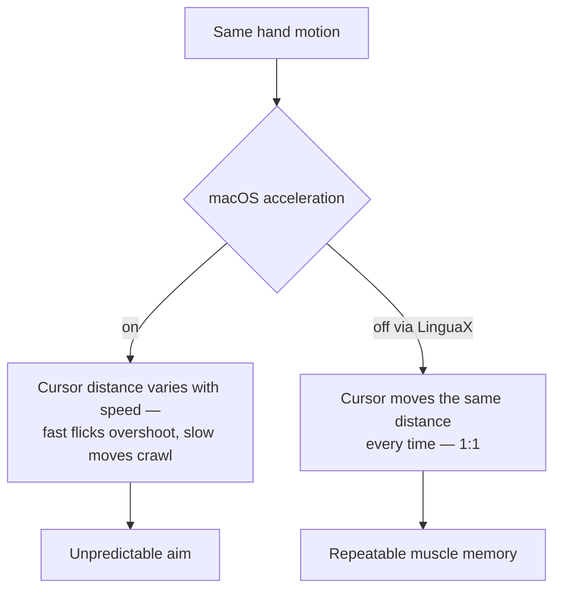

# How to Disable Mouse Acceleration on macOS

By default, macOS applies **pointer acceleration**: move your mouse fast and the cursor jumps further than the same physical motion does when you move slowly. It feels fine for everyday clicking, but it makes the pointer unpredictable for anything that needs muscle memory — design work, photo editing, and especially gaming. If you have ever overshot a target because the cursor "ran ahead" of you, that is acceleration. This guide explains why you might turn it off and how to do it cleanly on macOS.

## Why disable acceleration

- **Consistency.** With acceleration off, a given hand movement always moves the cursor the same distance, so aim becomes repeatable.
- **Precision tasks.** Pixel-level work in editors and design tools is easier without the speed curve.
- **Gaming.** Most players prefer a 1:1 (raw) relationship between hand and cursor.

## What macOS offers (and its limits)

The System Settings "Tracking speed" slider only changes overall sensitivity — it does **not** turn acceleration off. The often-quoted `defaults write … com.apple.mouse.scaling -1` Terminal trick can disable acceleration, but it has real limitations:

- It is **global**, so every mouse is forced to the same setting.
- It often **does not survive reboots, reconnects, or macOS updates**, so you re-apply it repeatedly.
- It gives you no per-device control, and no live feedback while tuning.

For a setting you want to "set once and forget," that is fragile.

## The LinguaX way: Pointer Speed, persisted per device

LinguaX is a native, ~10MB utility that controls pointer behavior through a lower-level system path (it writes a per-device pointer-acceleration value), so changes apply immediately without an app restart and stick across sessions:

- **Feel Adjustment with a Pointer Speed slider** — dial in a consistent, predictable cursor response per device. (LinguaX does not change DPI; it adjusts the system pointer-speed/acceleration value.)
- **Per-device pointer speed persistence** — each mouse keeps its own speed profile, so your precise editing mouse and your fast travel mouse do not overwrite each other.
- **Survives reconnects and wake.** Critical state refreshes on app activation and system wake, so you are not re-running Terminal commands after every update.

### Steps

1. Install LinguaX and grant **Accessibility** permission (and Input Monitoring if prompted).
2. Open **Mouse+** and select your device.
3. Under **Feel Adjustment**, set the **Pointer Speed** slider to the response you like.
4. Move the cursor across the screen at different hand speeds to confirm it tracks consistently.
5. If you use more than one mouse, switch devices and set each one — each profile is remembered separately.

## macOS defaults vs LinguaX

| | `defaults write` trick | LinguaX |
| --- | --- | --- |
| Controls pointer acceleration | Yes (on/off only) | Yes (per-device Pointer Speed) |
| Per-device profiles | No (global) | Yes |
| Survives reboot / update | Often no | Yes |
| Applies without restart | Needs re-login | Immediate |
| Live tuning UI | No | Yes |
| Cost | Free | Free 30-day trial, then $9.9 (3 devices) |

## Get started

LinguaX is a free download with a **30-day trial** — no account, no telemetry. If it fits, it is a **$9.9 one-time purchase covering 3 devices** (no subscription).

**[Download LinguaX](/download)** and get a consistent cursor free for 30 days.

## Related guides

- [Pointer Speed & Acceleration](/docs/mouse-plus/fundamentals/pointer-speed)
- [Mouse+ — Mouse Enhancement for macOS](/docs/mouse-plus/overview)
- [Device Compatibility](/docs/mouse-plus/device-compatibility)
