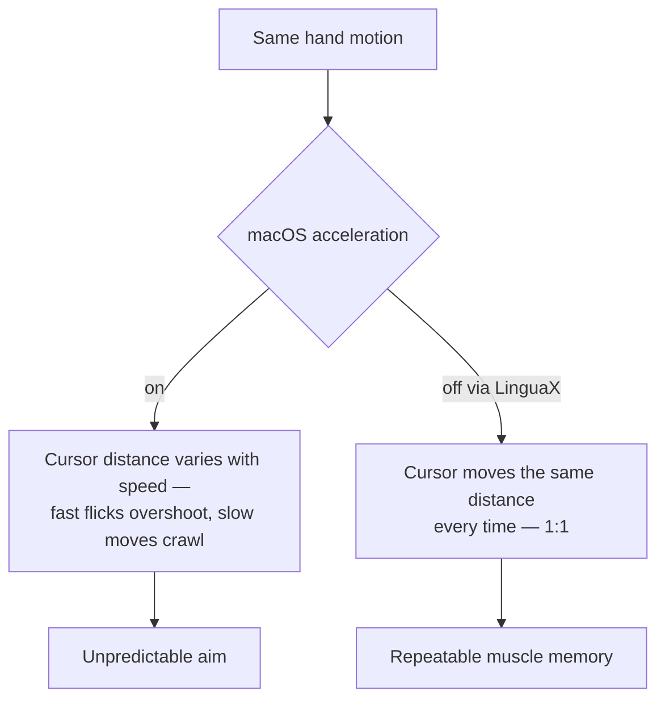

import Head from '@docusaurus/Head';
import ThemedImage from '@theme/ThemedImage';
import useBaseUrl from '@docusaurus/useBaseUrl';

export const faqSchema = {
  '@context': 'https://schema.org',
  '@type': 'FAQPage',
  mainEntity: [
    {'@type': 'Question', name: 'How do I turn off mouse acceleration on Mac?', acceptedAnswer: {'@type': 'Answer', text: 'There is no switch in System Settings — the Tracking speed slider only changes sensitivity. You can try the Terminal command "defaults write -g com.apple.mouse.scaling -1" followed by a re-login, but it is global and often resets after reboots or macOS updates. A mouse utility like LinguaX (or the free LinearMouse) gives you a persistent, per-device setting.'}},
    {'@type': 'Question', name: 'What is pointer acceleration, exactly?', acceptedAnswer: {'@type': 'Answer', text: 'Pointer acceleration is a speed curve macOS applies to your mouse: the faster you move your hand, the further the cursor travels for the same physical distance. It helps casual use on small desks but makes cursor movement non-linear, so precise aim is impossible to learn by muscle memory.'}},
    {'@type': 'Question', name: 'Does the Tracking speed slider in System Settings disable acceleration?', acceptedAnswer: {'@type': 'Answer', text: 'No. Tracking speed only scales overall sensitivity — the acceleration curve stays active underneath at every slider position.'}},
    {'@type': 'Question', name: 'Does "defaults write com.apple.mouse.scaling -1" really work?', acceptedAnswer: {'@type': 'Answer', text: 'Partially. On many macOS versions it disables acceleration until the next reboot, mouse reconnect, or system update — then you have to re-apply it and log out again. It is also global, so every connected mouse is forced to the same behavior. Treat it as a temporary test, not a permanent fix.'}},
    {'@type': 'Question', name: 'Can I disable acceleration for one mouse but keep it for another?', acceptedAnswer: {'@type': 'Answer', text: 'Not with macOS alone — its setting is global. LinguaX stores pointer behavior per device, so your gaming mouse can run flat 1:1 tracking while your travel mouse keeps the macOS default feel.'}},
    {'@type': 'Question', name: 'Why does mouse acceleration come back after a reboot or macOS update?', acceptedAnswer: {'@type': 'Answer', text: 'macOS re-applies its default pointer parameters when devices re-enumerate and after system updates, overwriting values set via defaults write. Utilities that re-assert the setting on wake and reconnect (as LinguaX does) survive this; one-shot Terminal commands do not.'}}
  ]
};

<Head>
  <script type="application/ld+json">{JSON.stringify(faqSchema)}</script>
</Head>

# How to Disable Mouse Acceleration on Mac (Turn It Off for Good)

**Quick answer:** macOS has no "off" switch for mouse acceleration — the Tracking speed slider only changes sensitivity. The `defaults write -g com.apple.mouse.scaling -1` Terminal trick works temporarily but is global and rarely survives reboots or updates. For a fix that sticks, use a mouse utility with a persistent per-device setting: **LinguaX** (per-device Pointer Speed, auto-reapplied after wake/reconnect) or the free, open-source **LinearMouse**. Details and steps below.

## What is pointer acceleration, and why disable it

By default, macOS applies **pointer acceleration**: move your mouse fast and the cursor jumps further than the same physical motion does when you move slowly. It feels fine for everyday clicking, but it makes the pointer unpredictable for anything that needs muscle memory — design work, photo editing, and especially gaming. If you have ever overshot a target because the cursor "ran ahead" of you, that is acceleration.

- **Consistency.** With acceleration off, a given hand movement always moves the cursor the same distance, so aim becomes repeatable.
- **Precision tasks.** Pixel-level work in editors and design tools is easier without the speed curve.
- **Gaming.** Most players prefer a 1:1 (raw) relationship between hand and cursor.

## What macOS offers (and its limits)

The System Settings "Tracking speed" slider only changes overall sensitivity — it does **not** turn acceleration off. The often-quoted Terminal trick can disable acceleration:

```bash
defaults write -g com.apple.mouse.scaling -1
```

Then log out and back in. It has real limitations, though:

- It is **global**, so every mouse is forced to the same setting.
- It often **does not survive reboots, reconnects, or macOS updates**, so you re-apply it repeatedly.
- It gives you no per-device control, and no live feedback while tuning.

For a setting you want to "set once and forget," that is fragile.

## Free alternative: LinearMouse

If you only want acceleration gone and prefer open source, **LinearMouse** is the standard free answer — it can disable pointer acceleration per device and is genuinely good at it. Where it stops: no Logitech hardware features (DPI, battery), no gesture mapping, no input-source automation. If you need those alongside pointer control, one app beats a stack — see [Mos vs LinearMouse vs Mac Mouse Fix vs LinguaX](/docs/comparisons/mos-vs-linearmouse-vs-mac-mouse-fix).

## The LinguaX way: Pointer Speed, persisted per device

LinguaX is a native, ~10MB utility that controls pointer behavior through a lower-level system path (it writes a per-device pointer-acceleration value), so changes apply immediately without an app restart and stick across sessions:

- **Feel Adjustment with a Pointer Speed slider** — dial in a consistent, predictable cursor response per device. (LinguaX does not change DPI; it adjusts the system pointer-speed/acceleration value.)
- **Per-device pointer speed persistence** — each mouse keeps its own speed profile, so your precise editing mouse and your fast travel mouse do not overwrite each other.
- **Survives reconnects and wake.** Critical state refreshes on app activation and system wake, so you are not re-running Terminal commands after every update.

### Steps

1. Install LinguaX and grant **Accessibility** permission (and Input Monitoring if prompted).
2. Open **Mouse+** and select your device.
3. Under **Feel Adjustment**, set the **Pointer Speed** slider to the response you like.
4. Move the cursor across the screen at different hand speeds to confirm it tracks consistently.
5. If you use more than one mouse, switch devices and set each one — each profile is remembered separately.


```mermaid
flowchart TD
    A[Same hand motion] --> B{macOS acceleration}
    B -- on --> C[Cursor distance varies with speed —<br/>fast flicks overshoot, slow moves crawl]
    B -- off via LinguaX --> D[Cursor moves the same distance<br/>every time — 1:1]
    C --> E[Unpredictable aim]
    D --> F[Repeatable muscle memory]
```

<ThemedImage
  alt={"LinguaX Feel Adjustment section — per-device Pointer Speed slider that overrides macOS pointer acceleration and persists across reboots"}
  sources={{
    light: useBaseUrl('/img/linguax-pointerspeed-dpi-reverse-scroll.png'),
    dark: useBaseUrl('/img/linguax-pointerspeed-dpi-reverse-scroll-dark.png'),
  }}
  width="420"
/>

## macOS defaults vs LinguaX

| | `defaults write` trick | LinguaX |
| --- | --- | --- |
| Controls pointer acceleration | Yes (on/off only) | Yes (per-device Pointer Speed) |
| Per-device profiles | No (global) | Yes |
| Survives reboot / update | Often no | Yes |
| Applies without restart | Needs re-login | Immediate |
| Live tuning UI | No | Yes |
| Cost | Free | Free 30-day trial, then $9.9 (3 devices) |

## FAQ

**How do I turn off mouse acceleration on Mac?**
There is no switch in System Settings — the Tracking speed slider only changes sensitivity. You can try the Terminal command `defaults write -g com.apple.mouse.scaling -1` followed by a re-login, but it is global and often resets after reboots or macOS updates. A mouse utility like LinguaX (or the free LinearMouse) gives you a persistent, per-device setting.

**What is pointer acceleration, exactly?**
Pointer acceleration is a speed curve macOS applies to your mouse: the faster you move your hand, the further the cursor travels for the same physical distance. It helps casual use on small desks but makes cursor movement non-linear, so precise aim is impossible to learn by muscle memory.

**Does the Tracking speed slider in System Settings disable acceleration?**
No. Tracking speed only scales overall sensitivity — the acceleration curve stays active underneath at every slider position.

**Does `defaults write com.apple.mouse.scaling -1` really work?**
Partially. On many macOS versions it disables acceleration until the next reboot, mouse reconnect, or system update — then you have to re-apply it and log out again. It is also global, so every connected mouse is forced to the same behavior. Treat it as a temporary test, not a permanent fix.

**Can I disable acceleration for one mouse but keep it for another?**
Not with macOS alone — its setting is global. LinguaX stores pointer behavior per device, so your gaming mouse can run flat 1:1 tracking while your travel mouse keeps the macOS default feel.

**Why does mouse acceleration come back after a reboot or macOS update?**
macOS re-applies its default pointer parameters when devices re-enumerate and after system updates, overwriting values set via `defaults write`. Utilities that re-assert the setting on wake and reconnect (as LinguaX does) survive this; one-shot Terminal commands do not.

## Get started

LinguaX is a free download with a **30-day trial** — no account, no telemetry. If it fits, it is a **$9.9 one-time purchase covering 3 devices** (no subscription).

**[Download LinguaX](/download)** and get a consistent cursor free for 30 days.

## Related guides

- [Pointer Speed & Acceleration](/docs/mouse-plus/fundamentals/pointer-speed)
- [Mouse+ — Mouse Enhancement for macOS](/docs/mouse-plus/overview)
- [Device Compatibility](/docs/mouse-plus/device-compatibility)
- [Mos vs LinearMouse vs Mac Mouse Fix vs LinguaX](/docs/comparisons/mos-vs-linearmouse-vs-mac-mouse-fix)
- [Reverse Mouse Scroll Direction (Mouse Only)](/docs/mouse-plus/recipes/reverse-scroll-direction-mouse-only-mac)
