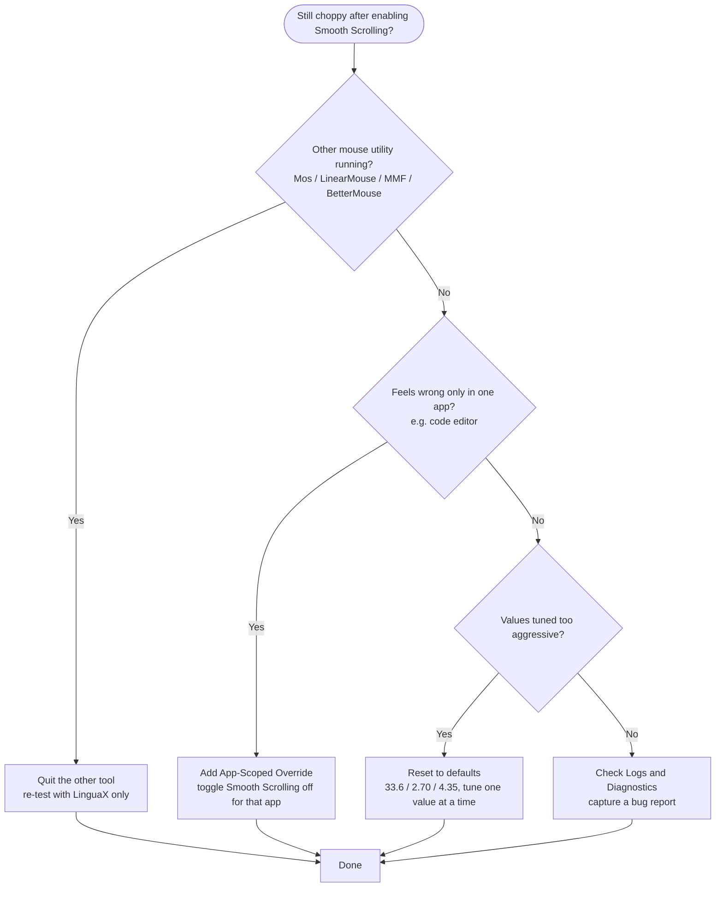

If your mouse scrolling feels jumpy, notchy, or uneven on macOS, you are not imagining it. macOS reserves its smoothest, pixel-by-pixel scrolling for Apple's own trackpad and Magic Mouse. Plug in almost any third-party wheel mouse and scrolling jumps in coarse "line" steps — tiring on long pages and inconsistent between apps.

## Why It Happens

- macOS treats third-party wheel input as discrete notches, not continuous motion.
- Without smoothing, each notch jumps several lines at once.
- Behavior changes per app, so the same wheel feels different in your browser, editor, and PDF viewer.

macOS has no built-in setting to fix this for third-party mice. A lightweight utility that intercepts scroll events and re-renders them smoothly is the practical fix.

## The LinguaX Fix: Smooth Scrolling

LinguaX is a native, ~10MB mouse utility that adds true smooth scrolling for any wheel mouse, with three fine-grained controls:

- **Min Step** — the minimum distance each scroll moves (default 33.6).
- **Speed Gain** — how much the motion accelerates per notch (default 2.70).
- **Duration** — how long the eased, continuous motion lasts (default 4.35).

It applies to the mouse wheel only — the trackpad is left to scroll naturally — and you can turn smooth scrolling **on or off per app**, so a fast-flick browser and a precise code editor can each behave the way you want. (The three sliders are global; only the on/off toggle is per-app.)

## Setup Steps

1. Install LinguaX and grant **Accessibility** permission.
2. Open **Mouse+** and enable **smooth scrolling** before changing anything else.
3. Test in your browser, code editor, and a document viewer.
4. Tune **one** value at a time — start with **Min Step**, then **Speed Gain**, then **Duration** — testing 2-3 minutes after each change. Keep only what clearly feels better.

## If Scrolling Still Feels Off

- **Check for tool conflicts.** Quit other mouse utilities and re-test with only LinguaX active, so one tool is the source of truth for scrolling.
- **Add per-app overrides only where needed.** Keep a clean global baseline and override just the apps that need different behavior.

## Suggested Baseline for Most Users

- smooth scrolling enabled
- the default Min Step / Speed Gain / Duration values (33.6 / 2.70 / 4.35), adjusted only if needed
- minimal per-app on/off overrides

LinguaX also recovers smooth scrolling automatically after sleep/wake, so you should not need to toggle it back on through the day.

## Get Started

LinguaX is a free download with a **30-day trial** — no account, no telemetry. If it fits, it is a **$9.9 one-time purchase covering 3 devices**.

**[Download LinguaX](/download)** and try smooth scrolling free for 30 days.

## Related Guides

- [Smooth Scrolling](/docs/mouse-plus/fundamentals/smooth-scrolling)
- [Mouse Enhancement Basics](/docs/mouse-plus/overview)
- [Conflicts with Other Tools](/docs/troubleshooting/conflicts-with-other-tools)
- [Logs and Diagnostics](/docs/troubleshooting/logs-and-diagnostics)
