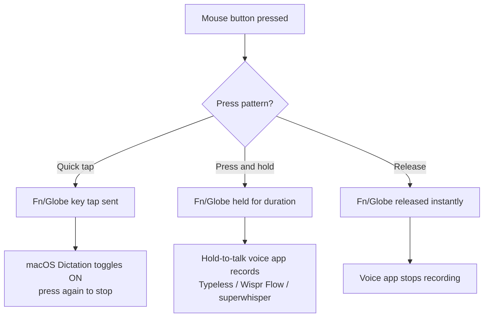

macOS Dictation is triggered by the **Globe (Fn)** key, but reaching that key mid-task is awkward. With LinguaX you can map a **mouse button** to the Globe key, so a single side-button press starts dictation — and the same button can push-to-talk in hold-to-talk voice apps.

## How the Mouse Button Maps to Dictation

LinguaX's **Modifier Hold** gesture makes a mouse button behave like the **Fn (Globe)** key:

- A quick **press** sends a Globe key tap → this is what macOS Dictation listens for.
- **Press and hold** keeps Globe held down → this is what hold-to-talk voice apps use to record.

So one mouse button covers both the built-in Dictation and third-party voice typing.

`[screenshot: System Settings > Keyboard > Dictation with the Globe shortcut selected, alongside LinguaX Modifier Hold binding]`

## Set Up the Mouse Button

1. Open LinguaX and go to **Mouse+** settings.
2. Pick a side button you do not use for clicking or scrolling.
3. Choose the **Modifier Hold** gesture and set the modifier to **Fn**.
4. Save.

> Modifier Hold uses the button exclusively. Saving it replaces any other gesture on that button.

## Configure macOS Dictation

1. Open **System Settings → Keyboard → Dictation** and turn Dictation on.
2. Set the **Shortcut** to a Globe (🌐) based option.
3. Click into any text field and press your mapped mouse button to start dictation; press again to stop.

> Note: built-in Dictation is **toggle-based** (press to start, press to stop). The exact shortcut options vary by macOS version — pick the Globe/Fn one. If you want true **hold-to-talk** (record only while held, stop on release), use a hold-to-talk app as below.

## For True Push-to-Talk (Hold-to-Talk Apps)

If you prefer holding to talk, use a voice app that supports a press-and-hold hotkey (for example Typeless, Wispr Flow, or superwhisper), set its hotkey to **Fn/Globe**, and hold the mouse button while you speak. See [Push-to-Talk Voice Typing with a Mouse Button](/docs/push-to-talk/push-to-talk-voice-typing-mac) for the full setup.

For tools that use their own shortcuts instead of Fn/Globe, follow the [Wispr Flow and superwhisper hotkey setup](/docs/push-to-talk/wispr-flow-superwhisper-hotkey-mac) and map the app shortcut to a mouse button.

## Common Mistakes

- Mapping a button you also need for clicking — pick a spare side button.
- Forgetting **Accessibility** permission for LinguaX, so it cannot hold the modifier.
- Expecting hold-to-talk from built-in Dictation — that is the toggle model; use a hold-to-talk app for press-and-hold.
- Leaving another utility mapped to the same button.

## Troubleshooting Quick Checks

- Confirm Accessibility permission is granted to LinguaX.
- Verify the Dictation shortcut is set to a Globe/Fn option.
- Test in a plain text field first.
- Re-save the Modifier Hold gesture if the button had a previous mapping.

## Get Started

LinguaX is a free download with a **30-day trial** — no account, no telemetry. If it fits your workflow, it is a **$9.9 one-time purchase covering 3 devices**.

**[Download LinguaX](/download)** and trigger dictation from your mouse free for 30 days.

## Related Guides

- [Button Mapping](/docs/mouse-plus/fundamentals/button-mapping)
- [Push-to-Talk Voice Typing with a Mouse Button](/docs/push-to-talk/push-to-talk-voice-typing-mac)
- [Best Push-to-Talk Apps for Mac](/docs/push-to-talk/best-push-to-talk-app-mac)
- [Set Up Wispr Flow and superwhisper Hotkeys on Mac](/docs/push-to-talk/wispr-flow-superwhisper-hotkey-mac)
- [Map Mouse Side Buttons on macOS](./map-mouse-side-buttons-macos.md)
- [Mouse Enhancement Basics](/docs/mouse-plus/overview)
- [Shortcuts and Hotkeys](/docs/concepts/shortcut-and-hotkeys)
