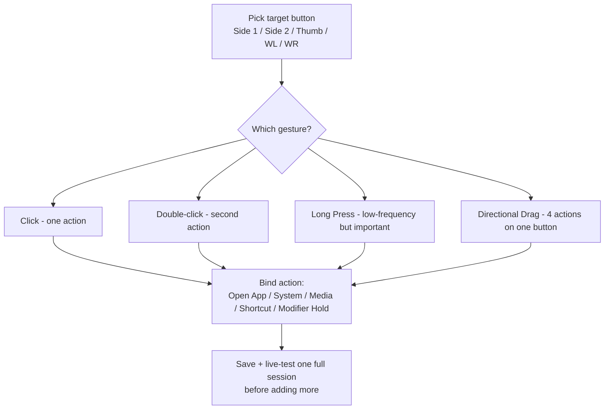

If your mouse's side buttons do nothing on macOS — or fire a fixed action you cannot change — this guide walks through **how to remap mouse buttons on Mac** for any brand, without a kernel driver or vendor account. Bind side buttons, the thumb button, and wheel tilt to browser back/forward, Mission Control, media controls, or any keyboard shortcut, with per-app overrides so behavior can differ between the browser and your editor. LinguaX is a native, ~10MB mouse utility that recognizes common models (MX Master, MX Anywhere, G502 X, M720, M585, and more) and still works with unrecognized mice.

## What you can map in LinguaX

- the **Side** buttons (Side 1–4) and the **Thumb** button on supported models
- **wheel tilt** left/right (the `WL` / `WR` slots) where the device supports it — these trigger horizontal scroll and only support a click action
- per-button **gestures**: click, double-click, long-press, and **directional drag/swipe** (up/down/left/right)
- a focused action set you can bind to a mouse button: **System Setting** presets (Mission Control, Switch Space, and more), **Media Control**, **Keyboard Shortcut**, **Modifier Hold**, and **Open Application**

LinguaX recognizes many models automatically (MX Master, MX Anywhere, G502 X, M720, M585, and more) and applies sensible default mappings, while still working with unrecognized mice. Note: **long-press on the thumb button is only available on Logitech models reached over the HID++ path**; click/double-click/drag gestures work more broadly.

## Setup steps

1. Install LinguaX and grant **Accessibility** permission.
2. Open **Mouse+** and select the button you want to map.
3. Pick a **gesture** (start with a simple click) and assign an action.
4. Save, then use it for a full work session before adding more.

`[screenshot: Mouse+ button mapping panel with Side 1 selected and gesture / action pickers visible]`

## Recommended setup order

1. Pick one high-value action first (back, Mission Control, or an app shortcut).
2. Map it to one side button and live with it for a session.
3. Add a second mapping only once the first feels natural.

Side-button swipe is powerful: one button can hold up to four directional actions, with an on-screen mode indicator while you drag.

## Keep mappings stable

- avoid piling too many actions onto one button
- avoid overlapping mappings across multiple tools
- use **per-app overrides** only where global behavior is not enough

Each connected mouse keeps fully isolated button state, so a second mouse will not inherit or conflict with the first one's mappings.

## Good first mappings

- Browser Back / Forward
- Mission Control or Switch Space
- Open launcher / quick command
- A repeated shortcut for your editor or design tool

## Troubleshooting quick checks

- confirm **Accessibility** permission is granted
- verify no duplicate mapping in another utility
- test one button with one gesture first

## Frequently asked questions

### Can I remap mouse side buttons on any mouse on macOS?

Yes. LinguaX works with any USB or Bluetooth mouse — no driver required. Recognized Logitech models (MX Master series, MX Anywhere, G502 X, M720, M585, and more) additionally get automatic default mappings; unrecognized mice can be mapped manually button-by-button.

### Why don't my mouse side buttons work by default on macOS?

macOS ships no built-in UI for extra mouse buttons beyond left/right click and scroll. Vendor apps (Logi Options+, Razer Synapse) fill that gap for their own brand but often need an account or ship a heavy background agent. A native tool like LinguaX handles the mapping at the system-input level without either.

### Do I need Logi Options+ to remap MX Master side buttons?

No. LinguaX communicates with MX Master 2S/3/3S over BLE HID++ directly and can map every button, including the thumb button and gestures like long-press or directional swipe. See [MX Master 3S Mac Setup Without Logi Options](/docs/comparisons/mx-master-3s-mac-setup-without-logi-options).

### Can I long-press a mouse button on Mac?

Yes for the side buttons across most mice; the **thumb button long-press** is available specifically on Logitech models reached over the HID++ path. Click, double-click, and directional drag gestures work more broadly.

### Do the mappings survive sleep/wake and Bluetooth reconnects?

Yes. Bluetooth devices recover automatically after sleep without a manual reconnect, and critical input services refresh on system wake, so mappings continue working without a relaunch.

## Get started

LinguaX is a free download with a **30-day trial** — no account, no telemetry. If it fits, it is a **$9.9 one-time purchase covering 3 devices**.

**[Download LinguaX](/download)** and try button mapping free for 30 days.

## Related guides

- [Button Mapping](/docs/mouse-plus/fundamentals/button-mapping)
- [Gesture Mapping](/docs/mouse-plus/fundamentals/gesture-mapping)
- [Mouse Enhancement Basics](/docs/mouse-plus/overview)
- [Push-to-Talk Voice Typing with a Mouse Button](/docs/push-to-talk/push-to-talk-voice-typing-mac)
- [Set Up Wispr Flow and superwhisper Hotkeys on Mac](/docs/push-to-talk/wispr-flow-superwhisper-hotkey-mac)
- [Mac Mouse Fix Alternative for macOS](/docs/comparisons/mac-mouse-fix-alternative-macos)
- [Setup for Developers](/docs/getting-started/setup-for-developers)
- [Setup for Designers](/docs/getting-started/setup-for-designers)
