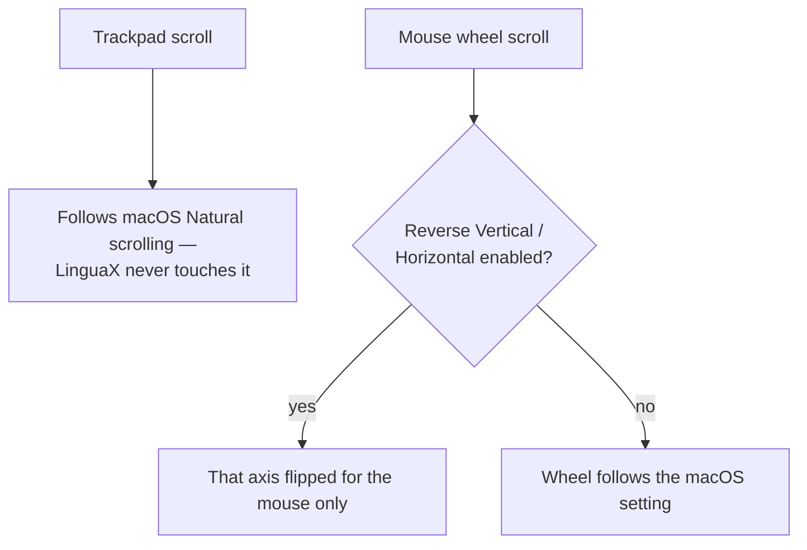

import ThemedImage from '@theme/ThemedImage';
import useBaseUrl from '@docusaurus/useBaseUrl';

# Reverse Scroll Direction for Mouse Only on Mac

This is one of the oldest macOS annoyances: you want **natural scrolling on the trackpad** (push content up to read down) but **traditional scrolling on the mouse wheel** (roll down to read down). macOS only gives you **one global "Natural scrolling" switch** — flip it and *both* the trackpad and the mouse change direction together. There is no built-in way to set them separately. This guide shows how to get an independent scroll direction for the mouse alone.

## Why the system setting falls short

- The "Natural scrolling" checkbox in System Settings is **shared** between trackpad and mouse.
- Turn it off for a sane mouse wheel, and your trackpad now scrolls "backwards" too.
- Turn it on for a natural trackpad, and your mouse wheel feels inverted.

The classic workaround was a separate utility just to flip the mouse, which then collided with whatever else was managing scrolling. You end up running an extra tool for one toggle.

## The LinguaX way: independent reverse scroll for the mouse

LinguaX intercepts scroll events for your mouse specifically, so you can keep macOS "Natural scrolling" set for the trackpad and reverse the **mouse** on its own:

- **Two independent toggles** — **Reverse Vertical Scroll** and **Reverse Horizontal Scroll** are separate switches, so you can flip just the vertical wheel, just the horizontal tilt, or both.
- **Mouse-only scope** — these toggles act on the mouse wheel only; the trackpad is passed through and keeps its natural direction.
- **Pairs with smooth scrolling** — reverse the direction *and* get continuous, smooth motion in the same app.

### Steps

1. In macOS System Settings, set **Natural scrolling** the way you want it for the **trackpad** (most people leave it on).
2. Install LinguaX and grant **Accessibility** permission (and Input Monitoring if prompted).
3. Open **Mouse+** and turn on **Reverse Vertical Scroll** to flip the mouse wheel's vertical direction.
4. Optionally turn on **Reverse Horizontal Scroll** too, independently of the vertical toggle.
5. Test: scroll with the mouse wheel and then swipe the trackpad to confirm each behaves the way you want.

<ThemedImage
  alt={"LinguaX mouse scroll settings: Reverse Vertical Scroll and Reverse Horizontal Scroll toggles — reverses only mouse scrolling, trackpad unchanged"}
  sources={{
    light: useBaseUrl('/img/linguax-pointerspeed-dpi-reverse-scroll.png'),
    dark: useBaseUrl('/img/linguax-pointerspeed-dpi-reverse-scroll-dark.png'),
  }}
  width="420"
/>

After sleep/wake, the mouse scroll settings recover automatically, so the direction stays correct through the day.

## macOS setting vs LinguaX

| | macOS Natural scrolling | LinguaX |
| --- | --- | --- |
| Affects mouse only | No (global) | Yes |
| Keeps trackpad independent | No | Yes |
| Per-axis (vertical / horizontal) | No | Yes |
| Combined with smooth scrolling | No | Yes |
| Survives sleep/wake | Yes | Yes (auto-recovery) |
| Cost | Free | Free 30-day trial, then $9.9 (3 devices) |

## Get started

LinguaX is a free download with a **30-day trial** — no account, no telemetry. If it fits, it is a **$9.9 one-time purchase covering 3 devices** (no subscription).

**[Download LinguaX](/download)** and split your scroll directions free for 30 days.

## Related guides

- [Smooth Scrolling](/docs/mouse-plus/fundamentals/smooth-scrolling)
- [Mouse+ — Mouse Enhancement for macOS](/docs/mouse-plus/overview)
- [Fix Choppy Mouse Scrolling on macOS](./fix-choppy-mouse-scrolling-macos.md)
