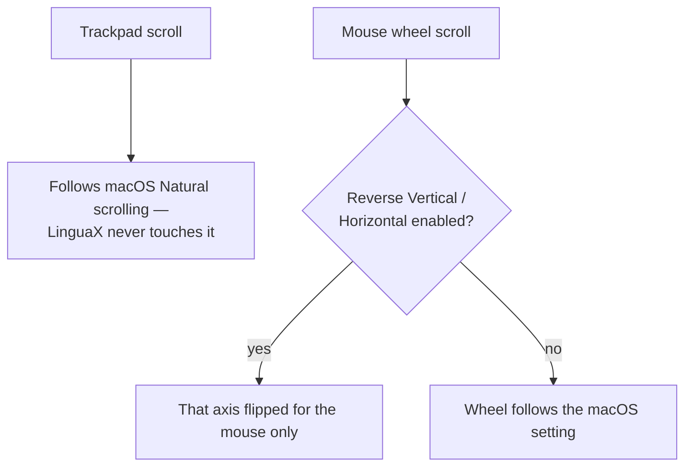

import Head from '@docusaurus/Head';
import ThemedImage from '@theme/ThemedImage';
import useBaseUrl from '@docusaurus/useBaseUrl';

export const faqSchema = {
  '@context': 'https://schema.org',
  '@type': 'FAQPage',
  mainEntity: [
    {'@type': 'Question', name: 'How do I reverse the scroll direction for my mouse only on Mac?', acceptedAnswer: {'@type': 'Answer', text: 'macOS has only one global "Natural scrolling" switch that flips the trackpad and the mouse together, so there is no built-in mouse-only option. You need a mouse utility with a per-device reverse toggle — LinguaX, or a free single-purpose tool like Scroll Reverser.'}},
    {'@type': 'Question', name: 'Can I keep natural scrolling on the trackpad but traditional scrolling on the mouse wheel?', acceptedAnswer: {'@type': 'Answer', text: 'Yes. Leave "Natural scrolling" on in System Settings for the trackpad, then reverse the mouse wheel independently in your mouse utility. In LinguaX, enable Reverse Vertical Scroll — it applies to the mouse only and never touches the trackpad.'}},
    {'@type': 'Question', name: 'Does reversing the mouse wheel also change horizontal scrolling?', acceptedAnswer: {'@type': 'Answer', text: 'Not necessarily. LinguaX has separate Reverse Vertical Scroll and Reverse Horizontal Scroll toggles, so you can flip just the vertical wheel, just horizontal tilt, or both.'}},
    {'@type': 'Question', name: 'Is Scroll Reverser enough, or do I need a paid app?', acceptedAnswer: {'@type': 'Answer', text: 'If flipping the mouse direction is the only thing you need, Scroll Reverser is free and does it well. It becomes limiting when you also want smooth scrolling, button mapping, or pointer tuning — stacking multiple mouse utilities at once is a common source of scroll conflicts. LinguaX covers all of that in one app.'}},
    {'@type': 'Question', name: 'Why did my mouse scroll direction suddenly invert after sleep or reconnecting the mouse?', acceptedAnswer: {'@type': 'Answer', text: 'macOS re-applies its global scroll setting when devices re-enumerate, and some utilities lose their override at that moment. LinguaX re-applies mouse scroll settings automatically after sleep/wake and device reconnects, so the direction stays correct.'}}
  ]
};

<Head>
  
</Head>

# How to Reverse Mouse Scroll Direction on Mac (Without Changing the Trackpad)

**Quick answer:** macOS offers only one global "Natural scrolling" switch — flipping it reverses the trackpad *and* the mouse together. To invert the **mouse wheel only**, you need a mouse utility with a per-device reverse toggle. In LinguaX, turn on **Reverse Vertical Scroll** under Mouse+ and the mouse wheel flips while the trackpad keeps its natural direction. If you want a free, single-purpose fix, **Scroll Reverser** also works — see the [comparison below](#free-alternatives).

## Why the system setting falls short

This is one of the oldest macOS annoyances: you want **natural scrolling on the trackpad** (push content up to read down) but **traditional scrolling on the mouse wheel** (roll down to read down).

- The "Natural scrolling" checkbox in System Settings is **shared** between trackpad and mouse.
- Turn it off for a sane mouse wheel, and your trackpad now scrolls "backwards" too.
- Turn it on for a natural trackpad, and your mouse wheel feels inverted.

There is no built-in way to set them separately — the toggle lives in one place and applies to every pointing device at once.

## The LinguaX way: independent reverse scroll for the mouse

LinguaX intercepts scroll events for your mouse specifically, so you can keep macOS "Natural scrolling" set for the trackpad and reverse the **mouse** on its own:

- **Two independent toggles** — **Reverse Vertical Scroll** and **Reverse Horizontal Scroll** are separate switches, so you can flip just the vertical wheel, just the horizontal tilt, or both.
- **Mouse-only scope** — these toggles act on the mouse wheel only; the trackpad is passed through and keeps its natural direction.
- **Pairs with smooth scrolling** — reverse the direction *and* get continuous, smooth motion in the same app.

### Steps

1. In macOS System Settings, set **Natural scrolling** the way you want it for the **trackpad** (most people leave it on).
2. Install LinguaX and grant **Accessibility** permission (and Input Monitoring if prompted).
3. Open **Mouse+** and turn on **Reverse Vertical Scroll** to flip the mouse wheel's vertical direction.
4. Optionally turn on **Reverse Horizontal Scroll** too, independently of the vertical toggle.
5. Test: scroll with the mouse wheel and then swipe the trackpad to confirm each behaves the way you want.

```mermaid
flowchart TD
    TP[Trackpad scroll] --> MS[Follows macOS Natural scrolling —<br/>LinguaX never touches it]
    W[Mouse wheel scroll] --> RV{Reverse Vertical /<br/>Horizontal enabled?}
    RV -- yes --> OUT[That axis flipped for the mouse only]
    RV -- no --> MS2[Wheel follows the macOS setting]
```

<ThemedImage
  alt={"LinguaX mouse scroll settings: Reverse Vertical Scroll and Reverse Horizontal Scroll toggles — reverses only mouse scrolling, trackpad unchanged"}
  sources={{
    light: useBaseUrl('/img/linguax-pointerspeed-dpi-reverse-scroll.png'),
    dark: useBaseUrl('/img/linguax-pointerspeed-dpi-reverse-scroll-dark.png'),
  }}
  width="420"
/>

After sleep/wake, the mouse scroll settings recover automatically, so the direction stays correct through the day.

## Free alternatives: Scroll Reverser, LinearMouse, Mac Mouse Fix {#free-alternatives}

If flipping the mouse direction is the *only* thing you need, a free tool can be enough. An honest rundown:

| | Scroll Reverser | LinearMouse | Mac Mouse Fix | LinguaX |
| --- | --- | --- | --- | --- |
| Reverse mouse scroll only | Yes | Yes | Yes | Yes — per-axis |
| Separate vertical / horizontal | Yes | Yes | Yes | Yes |
| Smooth scrolling | No | Limited | Yes | Yes — Min Step / Speed Gain / Duration |
| Pointer speed / acceleration control | No | Yes (core) | Limited | Yes — per-device |
| Button / gesture mapping | No | Some | Yes | Yes |
| Input-source automation | No | No | No | Yes |
| Price | Free, open source | Free, open source | One-time purchase | Free 30-day trial, then $9.9 (3 devices) |

Two practical notes:

- **Scroll Reverser** is the classic single-purpose answer — free, open source, and it does per-device, per-axis reversal well. If that is your whole problem, take it and stop reading.
- **Stacking mouse tools is the usual failure mode.** Scroll Reverser plus a smooth-scrolling app plus a button mapper all hook the same event stream, which is how people end up with doubled scrolls, jitter, or direction flips after sleep. If you need more than one feature, use one app — see [Conflicts with Other Tools](/docs/troubleshooting/conflicts-with-other-tools).

## macOS setting vs LinguaX

| | macOS Natural scrolling | LinguaX |
| --- | --- | --- |
| Affects mouse only | No (global) | Yes |
| Keeps trackpad independent | No | Yes |
| Per-axis (vertical / horizontal) | No | Yes |
| Combined with smooth scrolling | No | Yes |
| Survives sleep/wake | Yes | Yes (auto-recovery) |
| Cost | Free | Free 30-day trial, then $9.9 (3 devices) |

## FAQ

**How do I reverse the scroll direction for my mouse only on Mac?**
macOS has only one global "Natural scrolling" switch that flips the trackpad and the mouse together, so there is no built-in mouse-only option. You need a mouse utility with a per-device reverse toggle — LinguaX, or a free single-purpose tool like Scroll Reverser.

**Can I keep natural scrolling on the trackpad but traditional scrolling on the mouse wheel?**
Yes. Leave "Natural scrolling" on in System Settings for the trackpad, then reverse the mouse wheel independently in your mouse utility. In LinguaX, enable **Reverse Vertical Scroll** — it applies to the mouse only and never touches the trackpad.

**Does reversing the mouse wheel also change horizontal scrolling?**
Not necessarily. LinguaX has separate **Reverse Vertical Scroll** and **Reverse Horizontal Scroll** toggles, so you can flip just the vertical wheel, just horizontal tilt, or both.

**Is Scroll Reverser enough, or do I need a paid app?**
If flipping the mouse direction is the only thing you need, Scroll Reverser is free and does it well. It becomes limiting when you also want smooth scrolling, button mapping, or pointer tuning — stacking multiple mouse utilities at once is a common source of scroll conflicts. LinguaX covers all of that in one app.

**Why did my mouse scroll direction suddenly invert after sleep or reconnecting the mouse?**
macOS re-applies its global scroll setting when devices re-enumerate, and some utilities lose their override at that moment. LinguaX re-applies mouse scroll settings automatically after sleep/wake and device reconnects, so the direction stays correct.

## Get started

LinguaX is a free download with a **30-day trial** — no account, no telemetry. If it fits, it is a **$9.9 one-time purchase covering 3 devices** (no subscription).

**[Download LinguaX](/download)** and split your scroll directions free for 30 days.

## Related guides

- [Smooth Scrolling](/docs/mouse-plus/fundamentals/smooth-scrolling)
- [Mouse+ — Mouse Enhancement for macOS](/docs/mouse-plus/overview)
- [Fix Choppy Mouse Scrolling on macOS](/docs/mouse-plus/recipes/fix-choppy-mouse-scrolling-macos)
- [Mos vs LinearMouse vs Mac Mouse Fix vs LinguaX](/docs/comparisons/mos-vs-linearmouse-vs-mac-mouse-fix)
- [Conflicts with Other Tools](/docs/troubleshooting/conflicts-with-other-tools)
