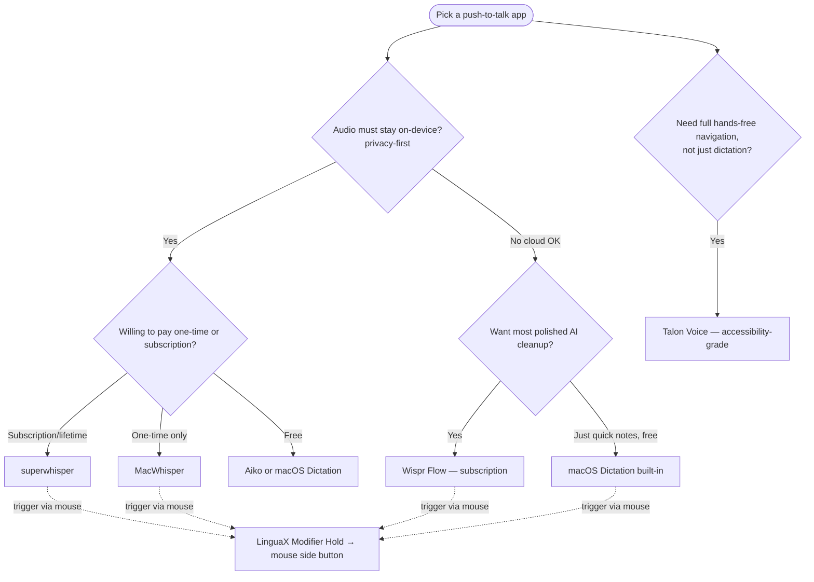

The **best push-to-talk app on Mac** is the one whose trigger you can reach without breaking your flow. Every voice typing tool — from the built-in macOS Dictation to AI apps like Wispr Flow and superwhisper — starts the same way: you press or hold a hotkey, speak, and the text appears. This guide compares the main options by how they trigger, what they cost, and how private they are — then shows how to put that trigger on a **mouse side button** so your hand never leaves the mouse.

## Which PTT app fits you — quick decision

## What makes a good push-to-talk app on Mac

- **Trigger style.** *Hold-to-talk* (record only while held, stop on release) feels the most natural for short bursts; *toggle* (press to start, press to stop) is fine for longer dictation.
- **A reachable hotkey.** Most apps let you bind the trigger to the **Globe (Fn)** key or a custom shortcut. The easier it is to reach, the more you'll actually use it.
- **Accuracy and formatting.** Built-in Dictation is fast and free; AI tools add punctuation, cleanup, and custom vocabulary.
- **Privacy.** On-device transcription keeps audio on your Mac; cloud tools send it to a server.
- **Price model.** Free, subscription, or one-time — pick what matches how often you dictate.

## The best push-to-talk apps for Mac

### 1. macOS Dictation — free, built-in
Apple's built-in dictation is triggered by the **Globe (Fn)** key and needs no install. It's toggle-based by default and good enough for quick notes and replies. No AI cleanup, but it's free and on-device. See [Trigger macOS Dictation with a Mouse Button](/docs/mouse-plus/recipes/macos-dictation-mouse-button) for the exact setup.

### 2. Wispr Flow — AI dictation, hold-to-talk
A polished **hold-to-talk** AI app: hold the hotkey, speak, release, and you get clean, formatted text with punctuation. It's cloud-based (audio leaves your Mac) and runs on a free Basic tier plus a paid subscription. Best if you want the most hands-off formatting and don't mind the cloud.

### 3. superwhisper — privacy-first, on-device
Runs Whisper models **on-device**, so audio never leaves your Mac. Hold-to-talk with deep customization (modes, model choice, custom words). Offered as a subscription or a one-time lifetime license. The strongest pick when privacy matters.

### 4. MacWhisper — one-time purchase, local
A local Whisper transcription app with a dictation mode you can bind to a shortcut — including holding the **Globe key** to push-to-talk anywhere. A one-time purchase with no subscription. Leans more toward file transcription, but the dictation hotkey works system-wide.

### 5. Talon Voice — full hands-free control
Far beyond dictation: full voice-driven navigation, scripting, and coding. The gold standard for accessibility and RSI users. Overkill if you only want push-to-talk, but unmatched for hands-free computing. Free, with optional paid beta perks.

> Also worth a look: **Aiko** (free, on-device) for occasional use, and **BetterDictation** / **Sotto** for one-time-purchase push-to-talk.

## Comparison at a glance

| App | Transcription | Trigger style | Privacy | Price model |
| --- | --- | --- | --- | --- |
| macOS Dictation | Apple (on-device) | Toggle (Globe) | On-device | Free, built-in |
| Wispr Flow | Cloud AI | Hold-to-talk | Cloud | Free tier + subscription |
| superwhisper | Whisper (on-device) | Hold-to-talk | On-device | Subscription or lifetime |
| MacWhisper | Whisper (on-device) | Shortcut / Globe hold | On-device | One-time purchase |
| Talon Voice | Voice control engine | Continuous / commands | On-device | Free (paid perks) |

## Put the trigger on a mouse button

Whichever app you choose, the trigger is still a key you have to reach. **LinguaX** lets a **mouse side button** be that trigger, so push-to-talk is one thumb press away:

- **Hold-to-talk via the Globe key** — for macOS Dictation, MacWhisper, or any app that uses the **Globe (Fn)** key: set a side button to LinguaX's **Modifier Hold** gesture with the modifier set to **Fn**. Hold the button to hold Globe, release to stop. This is genuine hold-to-talk from the mouse.
- **Toggle via a shortcut** — for apps whose start/stop is a single keypress: map the side button to that app's **keyboard shortcut**, so one click toggles recording.

> One caveat to be honest about: LinguaX's hold gesture only injects the **Globe (Fn)** key. AI apps like Wispr Flow and superwhisper use their own hotkeys, so true *hold*-to-talk from the mouse works with them only if the app lets you set its trigger to Globe; otherwise use the toggle-via-shortcut route.

Either way, your hand stays on the mouse. Full walkthrough in the [Push-to-Talk Voice Typing pillar guide](./push-to-talk-voice-typing-mac.md) and [Map Mouse Side Buttons on macOS](/docs/mouse-plus/recipes/map-mouse-side-buttons-macos).

For a tool-specific setup, see [Set Up Wispr Flow and superwhisper Hotkeys on Mac](./wispr-flow-superwhisper-hotkey-mac.md).

## Common mistakes

- **Picking a toggle app when you want hold-to-talk.** If you dictate in short bursts, choose a hold-to-talk app (or use Modifier Hold) so recording stops the moment you release.
- **Binding the trigger to an awkward key.** The whole point of push-to-talk is a reachable trigger — a side button beats a far-off function key.
- **Ignoring privacy.** If your dictation includes sensitive text, prefer an on-device app (macOS Dictation, superwhisper, MacWhisper).

## FAQ

**What is the best free push-to-talk app for Mac?**
The built-in **macOS Dictation** is the best free option and works system-wide via the Globe key. For free on-device AI transcription, **Aiko** is a common pick.

**Which push-to-talk app is most private?**
On-device apps like **superwhisper**, **MacWhisper**, and macOS Dictation keep audio on your Mac. Cloud apps like Wispr Flow send audio to a server.

**Can I push-to-talk with a mouse button on Mac?**
Yes. **LinguaX** maps a mouse side button to hold the Globe (Fn) key (Modifier Hold) or to any keyboard shortcut, turning the button into a push-to-talk trigger for macOS Dictation and hold-to-talk voice apps.

**Hold-to-talk vs toggle — which is better?**
Hold-to-talk is better for short, frequent dictation because recording stops on release. Toggle is more comfortable for long passages where you don't want to keep a button held.

## Get Started

LinguaX is a free download with a **30-day trial** — no account, no telemetry. If it fits your workflow, it is a **$9.9 one-time Lifetime purchase covering 3 devices**, no subscription.

**[Download LinguaX](/download)** and put push-to-talk on your mouse free for 30 days.

## Related Guides

- [Push-to-Talk Voice Typing with a Mouse Button](./push-to-talk-voice-typing-mac.md)
- [Trigger macOS Dictation with a Mouse Button](/docs/mouse-plus/recipes/macos-dictation-mouse-button)
- [Set Up Wispr Flow and superwhisper Hotkeys on Mac](./wispr-flow-superwhisper-hotkey-mac.md)
- [Map Mouse Side Buttons on macOS](/docs/mouse-plus/recipes/map-mouse-side-buttons-macos)
- [Button Mapping](/docs/mouse-plus/fundamentals/button-mapping)
- [Mouse Enhancement Basics](../mouse-plus/overview.md)
- Related blog: [Push-to-Talk on Mac With a Mouse Button — the 30-second setup](/blog/push-to-talk-on-mac-with-a-mouse)
