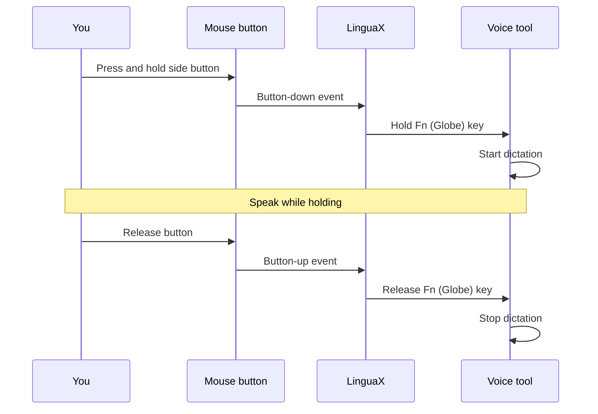

import ThemedImage from '@theme/ThemedImage';
import useBaseUrl from '@docusaurus/useBaseUrl';

Voice typing is fastest when you can **press and hold to talk, then release to stop** — no toggling, no double-tapping. On macOS, many dictation and voice-input tools trigger on the **Fn (Globe) key**. LinguaX lets you bind that hold to a **mouse button**, so push-to-talk becomes a single thumb press.

## Why use a mouse button for push-to-talk

- Your hand is already on the mouse while reading, browsing, or reviewing.
- A side button is faster to reach than a keyboard key mid-task.
- Hold-to-talk feels more natural than press-once-to-start, press-again-to-stop.
- It keeps your keyboard hand free for quick edits between dictations.

## How it works in LinguaX

LinguaX includes a **Modifier Hold** gesture. When assigned to a mouse button, the button behaves like physically holding a modifier key:

- **Press and hold** the mouse button → the **Fn (Globe)** modifier is held down.
- **Release** the button → the modifier is released.

Because the action runs only while the button is held and stops the instant you let go, it maps perfectly to hold-to-talk voice tools — the same gesture LinguaX built specifically for push-to-talk apps like Typeless.

## Setup steps

1. Open LinguaX and go to **Mouse+** settings.
2. Select the mouse button you want to use (a side button works well).
3. Choose the **Modifier Hold** gesture and set the modifier to **Fn**.
4. Save. The button now holds Fn for as long as you hold it.

<ThemedImage
  alt={"LinguaX Mouse+ side-2 binding: Gesture = Modifier Hold, Action = Fn, with Cancel and Save buttons"}
  sources={{
    light: useBaseUrl('/img/linguax-push-to-voice-fn-mapping.png'),
    dark: useBaseUrl('/img/linguax-push-to-voice-fn-mapping-dark.png'),
  }}
  width="420"
/>

> Modifier Hold uses the button exclusively. Saving it will replace any other gestures previously mapped to that button.

## Configure your voice tool to match

Point your dictation tool's push-to-talk shortcut at the **Fn (Globe)** key:

- **macOS Dictation** — set the dictation shortcut to the Globe/Fn key in **System Settings → Keyboard → Dictation**.
- **Hold-to-talk voice typing apps** — in apps that support a press-and-hold hotkey (for example Typeless, Wispr Flow, or superwhisper), set the talk hotkey to Fn/Globe.

Once both sides use Fn, holding the mouse button starts dictation and releasing it stops.

If your voice app uses its own shortcut instead of Fn/Globe, use the [Wispr Flow and superwhisper hotkey setup](./wispr-flow-superwhisper-hotkey-mac.md) to choose between Modifier Hold and normal keyboard shortcut mapping.

## Tips for a reliable setup

- Use a button you do not need for clicking or scrolling, so push-to-talk never conflicts with normal use.
- Grant LinguaX **Accessibility** permission so it can hold the modifier system-wide.
- If a voice tool offers both "toggle" and "hold" modes, pick **hold** to match this gesture.
- Test in a plain text field first to confirm dictation starts and stops cleanly.

## Troubleshooting quick checks

- Confirm Accessibility permission is granted to LinguaX.
- Make sure no other utility maps the same button to a different action.
- Verify the voice tool's hotkey is set to Fn/Globe (not a different key).
- Re-save the Modifier Hold gesture if the button previously had another mapping.

## Get started

LinguaX is a free download with a **30-day trial** — no account, no telemetry. If it fits your workflow, it is a **$9.9 one-time purchase covering 3 devices**.

**[Download LinguaX](/download)** and set up hands-free push-to-talk free for 30 days.

## Related guides

- [Button Mapping](/docs/mouse-plus/fundamentals/button-mapping)
- [Trigger macOS Dictation with a Mouse Button](/docs/mouse-plus/recipes/macos-dictation-mouse-button)
- [Best Push-to-Talk Apps for Mac](./best-push-to-talk-app-mac.md)
- [Set Up Wispr Flow and superwhisper Hotkeys on Mac](./wispr-flow-superwhisper-hotkey-mac.md)
- [Map Mouse Side Buttons on macOS](/docs/mouse-plus/recipes/map-mouse-side-buttons-macos)
- [Mouse Enhancement Basics](../mouse-plus/overview.md)
- [Shortcuts and Hotkeys](/docs/concepts/shortcut-and-hotkeys)
- Related blog: [Push-to-Talk on Mac With a Mouse Button — the 30-second setup](/blog/push-to-talk-on-mac-with-a-mouse)
