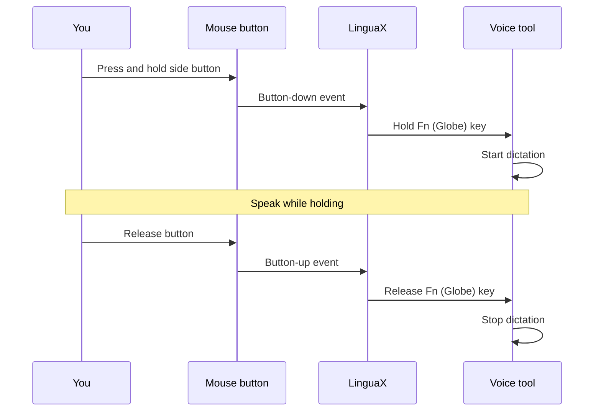

import ThemedImage from '@theme/ThemedImage';
import useBaseUrl from '@docusaurus/useBaseUrl';
import Head from '@docusaurus/Head';

export const faqSchema = {
  '@context': 'https://schema.org',
  '@type': 'FAQPage',
  mainEntity: [
    {'@type': 'Question', name: 'Does this work with any voice app besides macOS Dictation?', acceptedAnswer: {'@type': 'Answer', text: 'Yes. Any voice tool that triggers on the Fn/Globe key works out of the box — macOS Dictation, Wispr Flow, superwhisper, Typeless. For voice tools with their own hotkey, use LinguaX regular Keyboard Shortcut mapping instead of Modifier Hold.'}},
    {'@type': 'Question', name: 'Do I need a Logitech mouse?', acceptedAnswer: {'@type': 'Answer', text: 'No. Any USB or Bluetooth mouse with a spare side button works. Recognized Logitech models (MX Master 2S/3/3S/4, MX Anywhere, G502 X, M720, M585, and more) get extra default mapping optimization, but push-to-talk itself does not depend on Logitech hardware.'}},
    {'@type': 'Question', name: 'Do the mappings survive sleep/wake?', acceptedAnswer: {'@type': 'Answer', text: 'Yes. Bluetooth mice reconnect automatically after sleep and LinguaX refreshes input services on wake, so the mouse-to-Fn mapping keeps working without a relaunch.'}},
    {'@type': 'Question', name: 'Is LinguaX free?', acceptedAnswer: {'@type': 'Answer', text: 'There is a 30-day full-feature free trial with no account required. After that it is a $9.9 one-time purchase covering 3 devices, no subscription.'}},
    {'@type': 'Question', name: 'What if my voice app uses a different hotkey than Fn/Globe?', acceptedAnswer: {'@type': 'Answer', text: 'Use LinguaX regular Keyboard Shortcut gesture on the mouse button to send that app specific shortcut. The push-and-hold behavior still works because the mouse button is held down — so hold-to-talk voice apps get their hotkey held while you press the mouse.'}}
  ]
};

export const howToSchema = {
  '@context': 'https://schema.org',
  '@type': 'HowTo',
  name: 'How to set up push-to-talk voice typing with a mouse button on macOS',
  description: 'Bind a mouse side button to Fn/Globe with LinguaX Modifier Hold, then set your voice tool hotkey to Fn - press and hold the mouse button to talk, release to stop. Works with macOS Dictation, Wispr Flow, superwhisper.',
  totalTime: 'PT2M',
  step: [
    {'@type': 'HowToStep', name: 'Open LinguaX Mouse+ settings', text: 'Launch LinguaX and open the Mouse+ settings panel.'},
    {'@type': 'HowToStep', name: 'Pick a spare side button', text: 'Choose a side button you do not use for clicking or scrolling so push-to-talk never conflicts with normal use.'},
    {'@type': 'HowToStep', name: 'Set Modifier Hold with Fn', text: 'Select the Modifier Hold gesture and set the modifier to Fn. Save.'},
    {'@type': 'HowToStep', name: 'Set voice tool hotkey to Fn/Globe', text: 'In macOS System Settings > Keyboard > Dictation set the shortcut to Globe/Fn. Or in your voice app (Wispr Flow, superwhisper, Typeless) set the push-to-talk hotkey to Fn.'},
    {'@type': 'HowToStep', name: 'Test in a plain text field', text: 'Click into a text field, press and hold the mouse button to talk, release to stop. For toggle-style Dictation, a quick press starts and a second press stops.'}
  ]
};

<Head>
  
  
</Head>

**Push-to-talk voice typing on macOS** works best when you hold to speak and release to stop — no toggle, no double-tap. Most Mac dictation and voice-input tools bind to the **Fn (Globe) key**; LinguaX lets you bind that same hold to a **mouse side button**, turning any push-to-talk voice tool on Mac into a thumb press.

## Why use a mouse button for push-to-talk

- Your hand is already on the mouse while reading, browsing, or reviewing.
- A side button is faster to reach than a keyboard key mid-task.
- Hold-to-talk feels more natural than press-once-to-start, press-again-to-stop.
- It keeps your keyboard hand free for quick edits between dictations.

## How it works in LinguaX

LinguaX includes a **Modifier Hold** gesture. When assigned to a mouse button, the button behaves like physically holding a modifier key:

- **Press and hold** the mouse button → the **Fn (Globe)** modifier is held down.
- **Release** the button → the modifier is released.

Because the action runs only while the button is held and stops the instant you let go, it maps perfectly to hold-to-talk voice tools — the same gesture LinguaX built specifically for push-to-talk apps like Typeless.

```mermaid
sequenceDiagram
    participant U as You
    participant M as Mouse button
    participant L as LinguaX
    participant V as Voice tool
    U->>M: Press and hold side button
    M->>L: Button-down event
    L->>V: Hold Fn (Globe) key
    V->>V: Start dictation
    Note over U,V: Speak while holding
    U->>M: Release button
    M->>L: Button-up event
    L->>V: Release Fn (Globe) key
    V->>V: Stop dictation
```

## Setup steps

1. Open LinguaX and go to **Mouse+** settings.
2. Select the mouse button you want to use (a side button works well).
3. Choose the **Modifier Hold** gesture and set the modifier to **Fn**.
4. Save. The button now holds Fn for as long as you hold it.

<ThemedImage
  alt={"LinguaX Mouse+ side-2 binding: Gesture = Modifier Hold, Action = Fn, with Cancel and Save buttons"}
  sources={{
    light: useBaseUrl('/img/linguax-push-to-voice-fn-mapping.png'),
    dark: useBaseUrl('/img/linguax-push-to-voice-fn-mapping-dark.png'),
  }}
  width="420"
/>

> Modifier Hold uses the button exclusively. Saving it will replace any other gestures previously mapped to that button.

## Configure your voice tool to match

Point your dictation tool's push-to-talk shortcut at the **Fn (Globe)** key:

- **macOS Dictation** — set the dictation shortcut to the Globe/Fn key in **System Settings → Keyboard → Dictation**.
- **Hold-to-talk voice typing apps** — in apps that support a press-and-hold hotkey (for example Typeless, Wispr Flow, or superwhisper), set the talk hotkey to Fn/Globe.

Once both sides use Fn, holding the mouse button starts dictation and releasing it stops.

If your voice app uses its own shortcut instead of Fn/Globe, use the [Wispr Flow and superwhisper hotkey setup](./wispr-flow-superwhisper-hotkey-mac.md) to choose between Modifier Hold and normal keyboard shortcut mapping.

## Tips for a reliable setup

- Use a button you do not need for clicking or scrolling, so push-to-talk never conflicts with normal use.
- Grant LinguaX **Accessibility** permission so it can hold the modifier system-wide.
- If a voice tool offers both "toggle" and "hold" modes, pick **hold** to match this gesture.
- Test in a plain text field first to confirm dictation starts and stops cleanly.

## Troubleshooting quick checks

- Confirm Accessibility permission is granted to LinguaX.
- Make sure no other utility maps the same button to a different action.
- Verify the voice tool's hotkey is set to Fn/Globe (not a different key).
- Re-save the Modifier Hold gesture if the button previously had another mapping.

## Frequently asked questions

### Does this work with any voice app besides macOS Dictation?

Yes. Any voice tool that triggers on the Fn/Globe key works out of the box — macOS Dictation, Wispr Flow, superwhisper, Typeless. For voice tools with their own hotkey, use LinguaX's regular Keyboard Shortcut mapping instead of Modifier Hold.

### Do I need a Logitech mouse?

No. Any USB or Bluetooth mouse with a spare side button works. Recognized Logitech models (MX Master 2S/3/3S/4, MX Anywhere, G502 X, M720, M585, and more) get extra default mapping optimization, but push-to-talk itself does not depend on Logitech hardware.

### Do the mappings survive sleep/wake?

Yes. Bluetooth mice reconnect automatically after sleep and LinguaX refreshes input services on wake, so the mouse-to-Fn mapping keeps working without a relaunch.

### Is LinguaX free?

There is a 30-day full-feature free trial with no account required. After that it is a **$9.9 one-time purchase covering 3 devices**, no subscription.

### What if my voice app uses a different hotkey than Fn/Globe?

Use LinguaX's regular Keyboard Shortcut gesture on the mouse button to send that app's specific shortcut. The push-and-hold behavior still works because the mouse button is held down — so hold-to-talk voice apps get their hotkey held while you press the mouse.

## Get started

LinguaX is a free download with a **30-day trial** — no account, no telemetry. If it fits your workflow, it is a **$9.9 one-time purchase covering 3 devices**.

**[Download LinguaX](/download)** and set up hands-free push-to-talk free for 30 days.

## Related guides

- [Button Mapping](/docs/mouse-plus/fundamentals/button-mapping)
- [Trigger macOS Dictation with a Mouse Button](/docs/mouse-plus/recipes/macos-dictation-mouse-button)
- [Best Push-to-Talk Apps for Mac](/docs/push-to-talk/best-push-to-talk-app-mac)
- [Set Up Wispr Flow and superwhisper Hotkeys on Mac](/docs/push-to-talk/wispr-flow-superwhisper-hotkey-mac)
- [Map Mouse Side Buttons on macOS](/docs/mouse-plus/recipes/map-mouse-side-buttons-macos)
- [Mouse Enhancement Basics](../mouse-plus/overview.md)
- [Shortcuts and Hotkeys](/docs/concepts/shortcut-and-hotkeys)
- Related blog: [Push-to-Talk on Mac With a Mouse Button — the 30-second setup](/blog/push-to-talk-on-mac-with-a-mouse)
