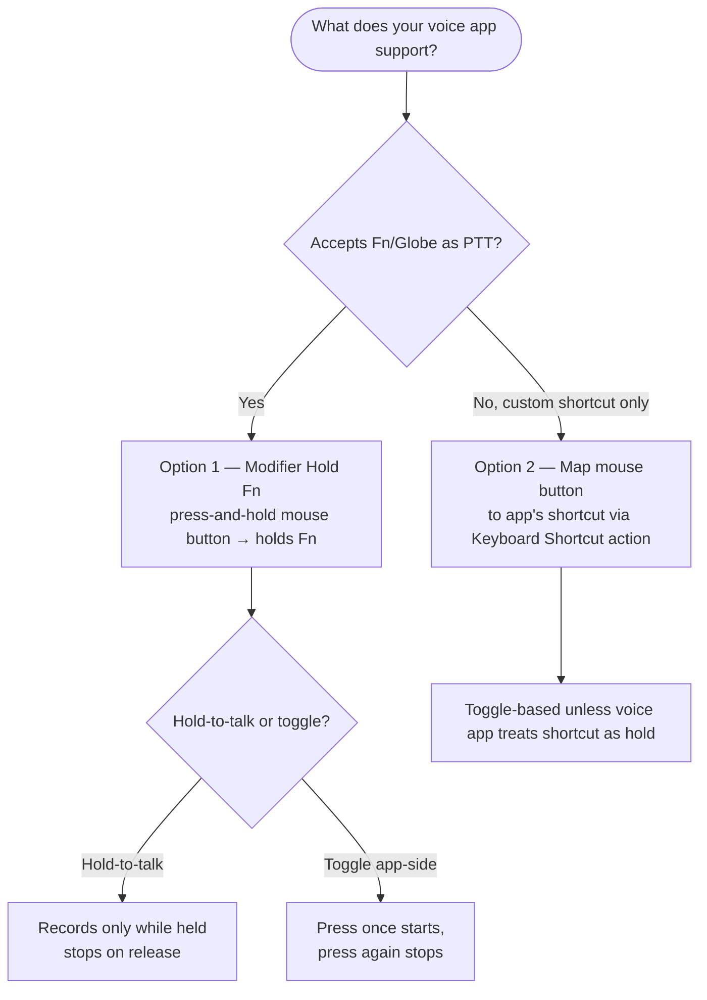

The best **push-to-talk hotkey on Mac** is the one you can reach without thinking. Wispr Flow, superwhisper, MacWhisper, Typeless, and other voice typing tools all depend on a trigger: hold a key, press a shortcut, or toggle recording. LinguaX lets you move that trigger to a **mouse side button**, so voice input starts from the hand already on your mouse.

## Pick the Right Trigger Model

Most Mac voice typing apps use one of two trigger styles:

- **Hold-to-talk** — recording runs only while the hotkey is held, then stops when you release.
- **Toggle** — one shortcut starts recording, another press stops it.

Hold-to-talk is best for short bursts: commit messages, search queries, quick replies, and note fragments. Toggle is better for long passages where holding a button would be tiring.

## Option 1: Use Fn / Globe for Hold-to-Talk

LinguaX has a **Modifier Hold** gesture that can hold the **Fn (Globe)** key for as long as you hold a mouse button. This is the cleanest setup when your voice tool can use Fn/Globe as its push-to-talk hotkey.

1. Open your voice typing app's hotkey settings.
2. Set the push-to-talk or hold-to-talk trigger to **Fn / Globe**, if the app allows it.
3. Open LinguaX and go to **Mouse+**.
4. Select a spare side button.
5. Choose **Modifier Hold** and set the modifier to **Fn**.
6. Save, then hold the mouse button while speaking.

This path works especially well for workflows that already use the Globe key, including macOS Dictation-style setups and any app that accepts Fn/Globe as a hold trigger.

> Modifier Hold uses the button exclusively. Saving it replaces other gestures on that same button.

## Option 2: Map the App's Shortcut to a Mouse Button

Some apps, including AI dictation tools, may prefer their own custom shortcut instead of Fn/Globe. In that case, map the mouse button to the same keyboard shortcut.

1. In Wispr Flow, superwhisper, or your chosen app, pick a shortcut that does not conflict with system shortcuts.
2. In LinguaX, open **Mouse+** and select a side button.
3. Choose a normal click gesture.
4. Set the action to **Keyboard Shortcut**.
5. Record the same shortcut your voice tool uses.
6. Save, then press the mouse button to trigger recording.

This setup is usually toggle-based unless the voice app treats that shortcut as a hold action. It is still useful because the trigger moves from the keyboard to a reachable mouse button.

## Wispr Flow Setup Notes

Wispr Flow is built around quick dictation and cleanup. A practical setup is:

- Use Wispr Flow's default hotkey first, so you know the app works before adding LinguaX.
- If Wispr Flow lets you assign Fn/Globe as a hold trigger, use **Modifier Hold** in LinguaX.
- If it uses a custom shortcut, map that shortcut to a mouse button with LinguaX's **Keyboard Shortcut** action.

For privacy-sensitive work, remember that cloud AI dictation sends audio to a service. Use it where the formatting and speed are worth that trade-off.

## superwhisper Setup Notes

superwhisper is strongest when you want local transcription and custom modes. A reliable setup is:

- Create or choose a dictation mode first.
- Assign a simple, memorable hotkey to that mode.
- If superwhisper accepts Fn/Globe for hold-to-talk, pair it with LinguaX **Modifier Hold**.
- Otherwise, map the mode's shortcut to a LinguaX mouse button.

Because superwhisper can run transcription locally, it is a better fit for sensitive notes, private writing, and workflows where audio should stay on the Mac.

## Good Hotkey Choices

- Prefer a side button you do not use for browser Back / Forward.
- Avoid common system shortcuts like `Command+Space`, `Command+Tab`, or screenshot shortcuts.
- Use a hotkey that works in every app where you dictate.
- Test in a plain text editor before relying on it in a browser, IDE, or chat app.

## Common Mistakes

- Expecting every app to support Fn/Globe hold-to-talk. If it does not, use keyboard shortcut mapping instead.
- Mapping the same mouse button in two tools at once.
- Using a shortcut already captured by macOS or another utility.
- Forgetting LinguaX **Accessibility** permission, which is required for system-wide input actions.

## FAQ

**Can LinguaX trigger Wispr Flow from a mouse button?**
Yes. If Wispr Flow uses a keyboard shortcut, map that shortcut to a mouse button in LinguaX. If it supports Fn/Globe as a hold trigger, use LinguaX's Modifier Hold gesture.

**Can LinguaX trigger superwhisper from a mouse button?**
Yes. Set a superwhisper dictation hotkey, then map that hotkey to a mouse button. If your superwhisper setup accepts Fn/Globe for hold-to-talk, Modifier Hold gives you press-and-hold behavior.

**Is Modifier Hold the same as a keyboard shortcut?**
No. Modifier Hold keeps Fn/Globe held only while the mouse button is held. Keyboard Shortcut sends a recorded shortcut when the gesture fires. Use Modifier Hold for true hold-to-talk, and Keyboard Shortcut for toggle or custom app shortcuts.

**Which setup should I start with?**
Start with the app's normal keyboard hotkey to confirm dictation works. Then move that trigger to a mouse side button with LinguaX.

## Get Started

LinguaX is a free download with a **30-day trial** — no account, no telemetry. If it fits your workflow, it is a **$9.9 one-time Lifetime purchase covering 3 devices**, no subscription.

**[Download LinguaX](/download)** and put your voice typing hotkey on a mouse button.

## Related Guides

- [Push-to-Talk Voice Typing with a Mouse Button](./push-to-talk-voice-typing-mac.md)
- [Best Push-to-Talk Apps for Mac](./best-push-to-talk-app-mac.md)
- [Trigger macOS Dictation with a Mouse Button](/docs/mouse-plus/recipes/macos-dictation-mouse-button)
- [Map Mouse Side Buttons on macOS](/docs/mouse-plus/recipes/map-mouse-side-buttons-macos)
- [Button Mapping](/docs/mouse-plus/fundamentals/button-mapping)
- [Shortcuts and Hotkeys](/docs/concepts/shortcut-and-hotkeys)
