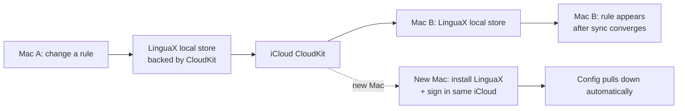

LinguaX keeps your configuration safe through **automatic iCloud sync** (CloudKit). There is no manual export/import step: your setup is continuously synced to your iCloud account and restored automatically on every Mac signed in to that account. This covers your mouse button mappings, scrolling and pointer preferences, app and website input-source rules, and shortcut action mappings.

## How Sync Works

- LinguaX stores its runtime configuration in local storage that is backed by **iCloud (CloudKit)**.
- Changes you make on one Mac are uploaded to iCloud and pulled down automatically on your other Macs.
- This includes app rules, website (domain) rules, action mappings, and per-device mouse metadata.
- There are no backup files to manage, and no manual import/export.

## Moving to a New Mac

1. Sign in to the **same iCloud account** on the new Mac.
2. Install and open LinguaX.
3. Wait for iCloud to sync your configuration down (this can take a moment after first launch).
4. Confirm rules and mappings appear automatically.

## Validation After Sync

1. Test two app rules.
2. Test one browser domain rule.
3. Test one shortcut action if used.
4. Confirm menu bar startup behavior.

## Notes

- Sync requires being signed in to iCloud with iCloud Drive available for the app.
- If configuration does not appear on a second Mac, confirm both Macs use the same iCloud account and have network access, then relaunch LinguaX.
- Sync may take time to converge after a fresh install or after a large change.

## Related Docs

- [Installation](../getting-started/installation.md)
- [First Run](../getting-started/first-run.md)
- [Shortcut and Hotkeys](/docs/concepts/shortcut-and-hotkeys)
- [Common Issues](../troubleshooting/common-issues.md)
