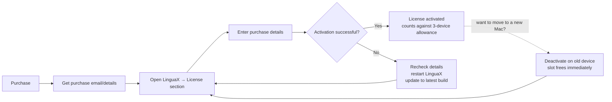

Use this guide to activate the paid LinguaX plan after purchase.

## Before activation

- Update LinguaX to the latest version.
- Confirm network is available.
- Prepare the purchase email/account used at checkout.

## Activation steps

1. Open LinguaX.
2. Go to the upgrade/license section.
3. Select the activation option shown in app (for example, **Activate** / **Upgrade**).
4. Enter your purchase details.
5. Confirm activation and wait for success state.

## Verify activation

1. Confirm account/license state shows activated/paid.
2. Validate one paid-plan workflow, such as domain rules or shortcut action mapping.

## Device allowance (3 devices)

One Lifetime license can be activated on **up to 3 devices** at the same time. There is no subscription, and the allowance stays with your purchase permanently.

### Activate on a 2nd or 3rd device

1. Install and open LinguaX on the new Mac.
2. Go to the upgrade/license section.
3. Enter the **same purchase details** used on your first device.
4. Confirm activation. The new device counts against your 3-device allowance.

### Release a device (free up an activation)

If you reach the 3-device limit (for example, after replacing or selling a Mac), free up a slot before activating a new one:

1. On the device you no longer use, open LinguaX and **deactivate / sign out** of the license in the license section.
2. The released slot becomes available immediately for a new device.
3. If the old device is no longer accessible (lost or wiped), contact support with your purchase details to release the slot manually.

## If activation fails

1. Recheck purchase details and email/account.
2. Restart LinguaX and retry once.
3. Update to the latest build and retry.

If still failing, prepare:

- app version
- macOS version
- exact error message
- activation timestamp

Then contact support.

## Related pages

- [Trial vs Lifetime](./trial-vs-lifetime.md)
- [Refunds and Invoice](./refunds-and-invoice.md)
