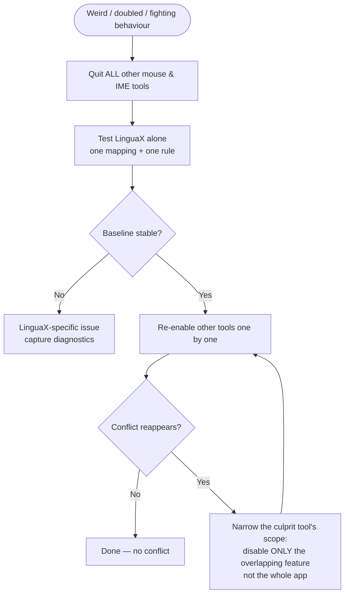

Running LinguaX alongside other mouse utilities or input automation tools can cause conflicting behavior. Because several tools can all intercept the same low-level mouse and keyboard events, only one should own each responsibility.

## Mouse tool conflicts

Tools like **Logi Options+**, **Mos**, **LinearMouse**, **BetterMouse**, and **Mac Mouse Fix** also hook into scrolling, button mapping, and pointer behavior. Running them at the same time as LinguaX can produce:

- scrolling that double-smooths, stutters, or feels inverted
- side-button or gesture actions firing twice, or one tool overriding the other
- pointer speed that fights between two tools
- a button that works in one app but not another, because another tool claims it first

### Isolation test (mouse)

1. Quit other mouse utilities (including ones running only in the menu bar or as login items).
2. Keep only LinguaX running.
3. Test smooth scrolling, one side-button mapping, and one gesture.

If behavior stabilizes, a mouse-tool conflict is likely.

### Mitigation (mouse)

- Choose one tool as the source of truth for each responsibility:
  - smooth scrolling owned by one tool only
  - button/gesture mapping owned by one tool only
  - pointer speed owned by one tool only
- In the other tool, disable the overlapping feature rather than the whole app, if you still need its other features.
- Avoid mapping the same button to actions in two tools at once.

## Input method tool conflicts

Running multiple input automation tools (other IME switchers or input automation utilities) can cause:

- input source flips unexpectedly
- rules feel delayed or inconsistent
- behavior differs by app without clear logic

### Isolation test (input)

1. Quit other IME/automation tools.
2. Keep only LinguaX running.
3. Test one app rule and one browser domain rule.

If behavior stabilizes, an input-tool conflict is likely.

### Mitigation (input)

- Choose one tool as the source of truth for input switching.
- Disable overlapping automation in other tools.
- Avoid duplicate rules across tools.

## Recovery sequence

This order works for both mouse and input conflicts:

1. Simplify LinguaX to a minimal baseline (one mapping, or one app/domain rule).
2. Confirm the baseline is stable on its own.
3. Re-enable other tools one by one.
4. Stop when the conflict reappears, and narrow that tool's scope (disable just the overlapping feature).

## Related docs

- [Mouse Issues](./mouse-issues.md)
- [Common Issues](./common-issues.md)
- [Permissions on macOS](./permissions-on-macos.md)
- [Logs and Diagnostics](./logs-and-diagnostics.md)
