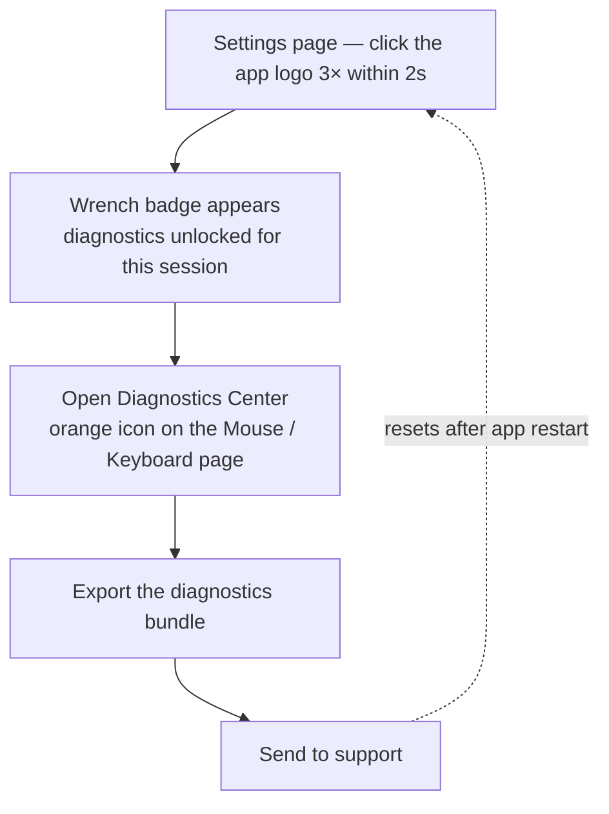

Good diagnostics significantly reduce support turnaround time.

## How to enable diagnostics in release build

### Session unlock from settings

1. Open LinguaX and go to the `Settings` page.
2. Click the app logo at least **3 times within 2 seconds**.
3. When the wrench badge appears on the logo, diagnostics is enabled for the current session.
4. Go to the mouse or keyboard page, click the orange finger icon (`Diagnostics Center`), export diagnostics, and send it to support.

Notes:

- This session unlock is **temporary** and resets after app restart.
- No terminal command is required.
- The old terminal toggle method is deprecated and may not work reliably on newer macOS environments.

<!-- Comparison image placeholders -->

## What to collect

- LinguaX version
- macOS version
- affected app/browser name
- affected domain (if website rule related)
- issue timestamp
- exact expected behavior vs actual behavior
- concise reproduction steps

## Reproduction template

1. Open `<app or website>`.
2. Switch from `<context A>` to `<context B>`.
3. Actual: `<what happened>`.
4. Expected: `<what should happen>`.

## Rule snapshot checklist

Before escalation, record:

- the app rule expected to trigger
- the domain rule expected to trigger (if any)
- any broad or overlapping rules

## Evidence to attach

- screenshot of relevant rule settings
- short screen recording
- exact in-app error text

Avoid sharing sensitive personal data.

## Minimal validation before contacting support

1. Restart LinguaX.
2. Test one simplified rule.
3. Re-test original scenario.

If issue persists, send the collected diagnostics.

## Feedback reward policy

If your feedback is accepted and shipped, LinguaX will grant a 1-year license.

## Related docs

- [Mouse Issues](./mouse-issues.md)
- [Common Issues](./common-issues.md)
- [Permissions on macOS](./permissions-on-macos.md)
- [Conflicts with Other Tools](./conflicts-with-other-tools.md)
