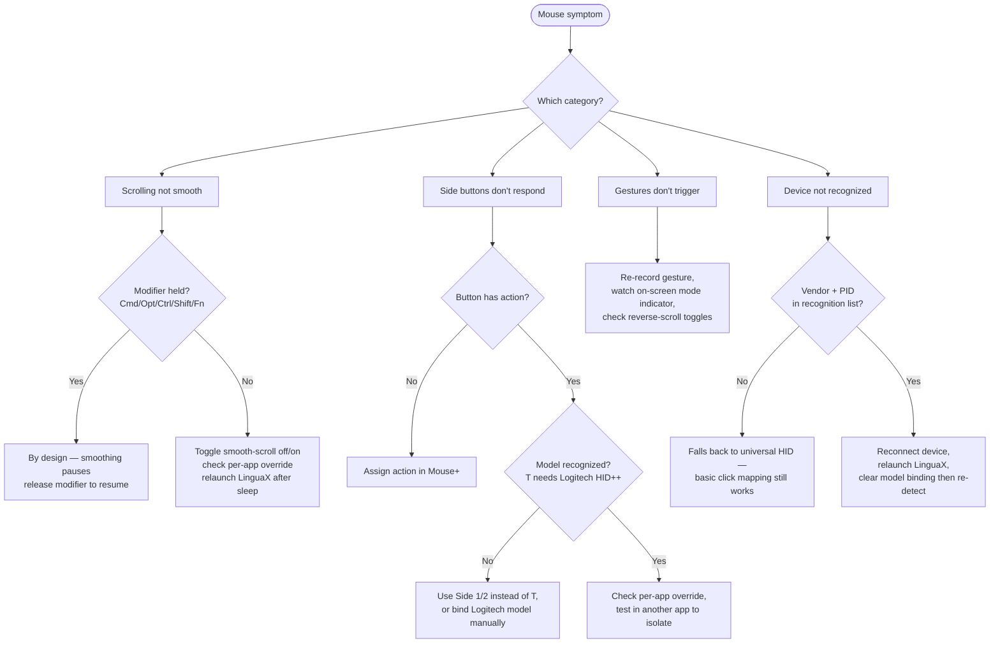

# Mouse Issues

Mouse+ enhancement is the core of LinguaX. This page groups the most common mouse problems by symptom. For each one, follow the order: **symptom → checks → fix**.

If a symptom looks permission-related, start with [Permissions on macOS](./permissions-on-macos.md). If another mouse utility is running at the same time, see [Conflicts with Other Tools](./conflicts-with-other-tools.md) first.

## Scrolling Is Not Smooth or Stops Working

Symptom: scrolling feels stepped instead of fluid, or smoothing stops after a while or after sleep.

Checks:

- Smooth scrolling is enabled globally, and the per-app **Smooth Scroll** toggle is on for the affected app.
- The affected app does not have a per-app override that turns smoothing off.
- `Accessibility` and `Input Monitoring` permissions are granted (smooth scrolling needs the event tap).
- You are using a mouse wheel — trackpad scrolling is intentionally passed through unmodified.

Fix:

1. Toggle smooth scrolling off and on once.
2. Confirm the per-app **Smooth Scroll** toggle for the current app is not turning smoothing off. (Note: the Min Step / Speed Gain / Duration values and reverse-direction toggles are global; only the Smooth Scroll on/off switch is per-app.)
3. If it stopped after sleep/wake, relaunch LinguaX so the event tap and HID services re-initialize.
4. Retest in a plain app (for example Finder or TextEdit) to confirm the baseline works.
5. If smoothing pauses while you hold a modifier key (`⌘⌥⌃⇧` or Fn), that is by design — smoothing resumes when you release it.

## Side Buttons Do Not Respond

Symptom: pressing a side or thumb button does nothing, or only works in some apps.

Checks:

- The button is actually mapped to an action in button mapping.
- The mouse model is recognized (see device recognition below).
- No per-app gesture override is intercepting or clearing the mapping for the current app.

Fix:

1. Open button mapping and confirm the side button has an assigned action.
2. Check whether the current app has a per-app gesture override; if so, align or remove it.
3. For the thumb button (the `T` slot), confirm the device is recognized; thumb-button long-press relies on the Logitech HID++ path, so it needs a recognized Logitech model.
4. Test the same button in another app to isolate whether it is global or app-specific.

## Gestures Do Not Trigger

Symptom: swipe, long-press, or modifier-hold gestures fire inconsistently or not at all.

Checks:

- The gesture is mapped for that button.
- You are completing the gesture within the expected timing (long-press needs a hold; swipe needs a clear direction).
- Reverse-scroll settings are not flipping the expected swipe direction.

Fix:

1. Re-record or re-confirm the gesture mapping for the button.
2. For swipe gestures, perform a clear directional drag and watch the on-screen mode indicator.
3. For modifier-hold, LinguaX injects the **Fn (Globe)** modifier while the button is held and releases it when you let go (this is by design, e.g. push-to-talk dictation). Fn is the only modifier exposed for this action.
4. If horizontal gestures feel inverted, check per-axis reverse-scroll settings.

## Pointer Speed Is Wrong or Resets

Symptom: pointer feels too fast or too slow, or the speed resets after switching mice.

Checks:

- Pointer speed is set per device, so each mouse keeps its own profile.
- The intended device is the one currently active.

Fix:

1. Adjust pointer speed while the affected mouse is the active device; the change applies immediately without restart.
2. If you use multiple mice, confirm each device has its own intended speed profile.
3. If speed seems stuck, relaunch LinguaX so the low-level speed path re-applies.

## Device Not Recognized

Symptom: the mouse is not detected, or auto button mapping does not appear for a known model.

Checks:

- The mouse is connected (Bluetooth, receiver, or wired).
- For Logitech wireless devices, BLE HID++ recognition needs the device paired and awake.
- A previous "Clear model binding" may have reset recognition.

Fix:

1. Confirm the device appears in the device list; check battery/connection for Bluetooth mice.
2. Wake the mouse and let the device list refresh (it updates automatically on connect).
3. If recognition is stuck on the wrong model, use "Clear model binding" in device settings and reconnect.
4. See [Device Compatibility](../mouse-plus/device-compatibility.md) for supported models.

## Mappings Fail After Sleep/Wake

Symptom: buttons, gestures, or smooth scrolling stop working after the Mac wakes from sleep.

Checks:

- Bluetooth devices may need a moment to reconnect after wake.
- The event tap can time out during long sessions.

Fix:

1. Wait a few seconds after wake for Bluetooth devices to recover automatically.
2. If behavior does not return, relaunch LinguaX; this refreshes permissions and critical services.
3. Confirm `Accessibility` and `Input Monitoring` are still granted after the wake.

## Still Not Resolved?

If a single mouse problem persists, collect diagnostics and contact support.

## Related Docs

- [Permissions on macOS](./permissions-on-macos.md)
- [Conflicts with Other Tools](./conflicts-with-other-tools.md)
- [Logs and Diagnostics](./logs-and-diagnostics.md)
- [Mouse+ Overview](../mouse-plus/overview.md)
