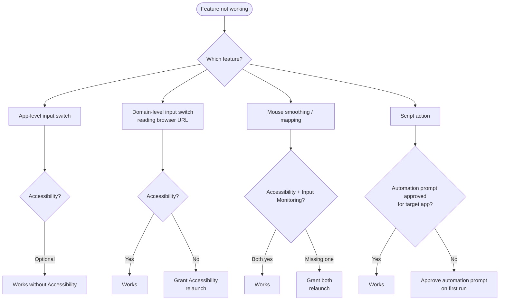

LinguaX depends on macOS permissions for accurate context detection and automation.

## Common Symptoms

- input source does not switch after app change
- domain rules are inconsistent in browsers
- shortcut script actions fail on first run

LinguaX uses exactly two macOS permissions:

## Required Permissions

- `Accessibility` (used for the mouse event tap, smooth scrolling, pointer speed, key simulation, and reading the front browser tab URL for website rules)
- `Input Monitoring` (used for HID device management)

> App-level input switching works without Accessibility; reading the browser URL for **website** (domain) rules requires Accessibility.

## Required Checks

1. Open LinguaX permission status.
2. Open macOS **System Settings** and verify requested permissions are enabled.
3. Relaunch LinguaX after permission changes.

## About Script Action Prompts

When script actions control apps (for example System Events or Finder), macOS may ask for Automation permission.

Approve these prompts to enable those actions.

## Recovery Flow

1. Quit LinguaX.
2. Reopen LinguaX.
3. Re-grant missing permissions.
4. Test one app rule.
5. Test one domain rule.
6. If using script actions, run one template script again.

## Post-Update Note

Recent versions include storage architecture upgrades. On first launch after upgrade, migration may take extra time before all features behave normally.

## Related Docs

- [First Run](../getting-started/first-run.md)
- [Mouse Issues](./mouse-issues.md)
- [Common Issues](./common-issues.md)
- [Shortcut and Hotkeys](/docs/concepts/shortcut-and-hotkeys)
