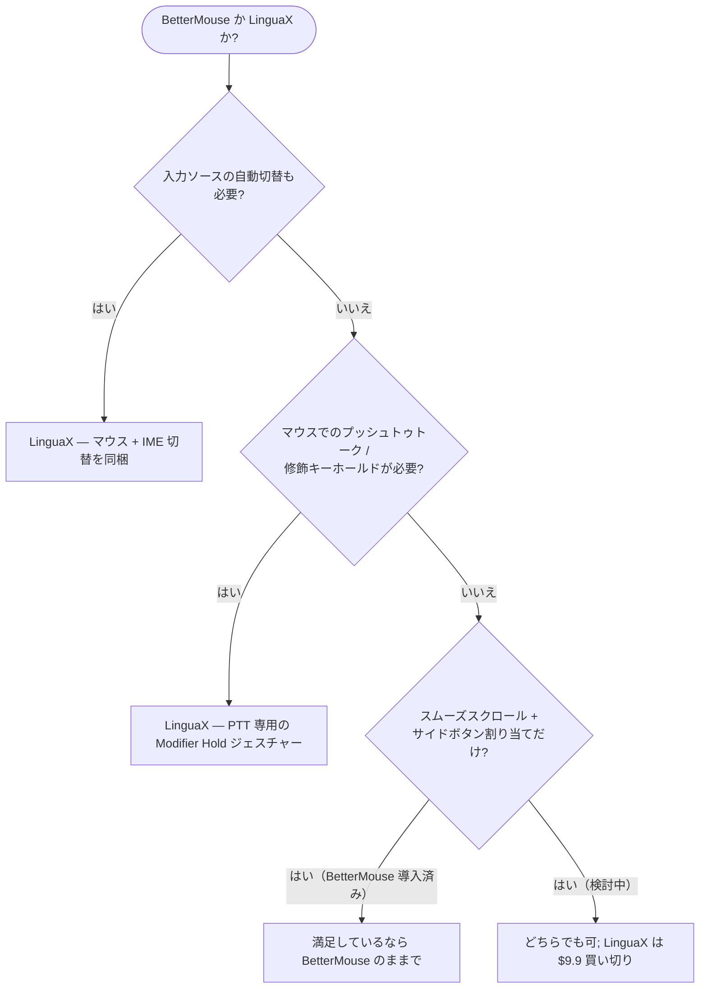

import Head from '@docusaurus/Head';

export const faqSchema = {
  '@context': 'https://schema.org',
  '@type': 'FAQPage',
  mainEntity: [
    {'@type': 'Question', name: 'Mac 向けに無料の BetterMouse 代替はある？', acceptedAnswer: {'@type': 'Answer', text: 'BetterMouse と機能を完全に並べた完全無料のものはありません。LinguaX は全機能を 30 日無料で試せ（アカウントもクレジットカードも不要）、その後は $9.9 の買い切りで 3 台まで使えます（サブスクなし）。完全無料のオープンソースでは Mac Mouse Fix、Mos、LinearMouse がありますが、それぞれカバー範囲は狭めです。'}},
    {'@type': 'Question', name: 'BetterMouse と LinguaX の価格は？', acceptedAnswer: {'@type': 'Answer', text: 'どちらも買い切り（サブスクなし）です。LinguaX は $9.9 の Lifetime で 3 台まで、30 日の無料トライアル付き。価格だけでなく、スムーズスクロールの調整、ジェスチャーの種類、アプリ別オーバーライド、スリープ/復帰の安定性といった日々の使い勝手で比較してください。'}},
    {'@type': 'Question', name: 'BetterMouse と LinguaX、軽いのはどちら？', acceptedAnswer: {'@type': 'Answer', text: 'どちらも Electron ではなくネイティブ macOS アプリです。LinguaX は約 10MB で、単一のメニューバーアプリとして動作し、アカウントもテレメトリもありません。'}},
    {'@type': 'Question', name: '代替アプリは MX Master、G502 などの Logicool マウスに対応している？', acceptedAnswer: {'@type': 'Answer', text: '対応しています。LinguaX は MX Master 2S/3/3S/4、MX Anywhere 2/2S/3/3S、G502 X、M720、M585 などを認識し、自動のサイドボタンデフォルトと、対応モデルでの BLE HID++ バッテリー表示を提供します。'}},
    {'@type': 'Question', name: '割り当てはスリープ/復帰後も維持される？', acceptedAnswer: {'@type': 'Answer', text: '維持されます。Bluetooth デバイスはスリープ後に自動で再接続し、重要な入力サービスはシステム復帰時にリフレッシュされるため、スクロールや割り当てたボタンは再起動なしで動き続けます。'}}
  ]
};

<Head>
  
</Head>

# BetterMouse の代替：Mac 向け

**BetterMouse の代替**を探しているなら——より軽いもの、より安いもの、無料で試せるもの、いずれにせよ——条件はシンプルです：サードパーティ製マウスに、スムーズスクロール、安定したサイドボタン割り当て、ジェスチャー。メーカー純正ソフトの重さなしで。LinguaX は同じ領域をネイティブ約 10MB のアプリでカバーし、**$9.9 買い切り**の前に 30 日の無料トライアルがあり、さらに一歩進んで**入力ソース自動化**まで同梱しています——1 つのインストールで、マウスユーティリティと言語切り替えツールの両方を置き換えられます。

## BetterMouse の代替に求められるもの

- どんなホイールマウスにも効く**スムーズスクロール**（Apple のトラックパッドだけでなく）
- **サイドボタンとジェスチャーの割り当て**——戻る/進む、Mission Control、アプリのショートカット
- **アプリ別の挙動**——ブラウザとエディタでスクロールや割り当てを変えられる
- バックグラウンドで居座らない**軽量なネイティブアプリ**

LinguaX はこれらすべてに対応します。幅広いモデル（MX Master、MX Anywhere、G502 X、M720、M585、および汎用マウス）を認識し、未認識のデバイスでも動作します。

## BetterMouse と LinguaX の比較

| | LinguaX | BetterMouse |
| --- | --- | --- |
| アプリサイズ | 約 10MB | 軽量ネイティブ |
| アーキテクチャ | ネイティブ macOS | ネイティブ macOS |
| スムーズスクロール | Min Step / Speed Gain / Duration、アプリ別 ON/OFF | 対応 |
| ボタン & ジェスチャー割り当て | クリック / ダブル / 長押し / スワイプ、アプリ別 | 対応 |
| スクロール反転 | 軸別（水平/垂直を独立） | グローバル型 |
| スリープ/復帰の安定性 | 復帰時に自動回復 | 対応 |
| 入力ソース自動化 | 内蔵 — アプリ/サイトごとに入力ソースを自動切替 | 非搭載 |
| バンドル価値 | マウス拡張**に加えて**入力自動化も 1 アプリで | マウスのみ |
| サポート | 人によるサポート | 人によるサポート |
| 価格 | $9.9 買い切り（3 台） | 買い切りライセンス |

## どちらを選ぶか — クイック診断

## 「1 つ買って 2 つ得る」違い

BetterMouse はマウスに特化したユーティリティです。LinguaX の主力もマウス機能ですが、**入力ソース自動化は単体の中核機能**であって、マウスエンジンに付け足したオマケではありません：前面のアプリや、開いている Web サイトのホストに応じて macOS の入力ソースを自動で切り替えられます。複数言語で入力する人——あるいは、考えなくても正しいアプリで正しいキーボード配列になってほしい人——にとって、それは別途買って別途動かす必要のない 2 本目のツールです。

つまり手に入るのは：

- 本当に軽量なネイティブのマウス拡張。
- プラス、アプリとブラウザの URL による入力ソースの自動切替。
- どちらもチケットキューではなく、人による直接サポート付き。

## はじめる

LinguaX は無料ダウンロードで **30 日トライアル**——アカウント不要、テレメトリなし。合えば **$9.9 の買い切り（3 台まで）**、サブスクリプションはありません。

**[LinguaX をダウンロード](/download)** して、30 日無料で試してみてください。

## よくある質問

### Mac 向けに無料の BetterMouse 代替はある？

BetterMouse と機能を完全に並べた完全無料のものはありません。LinguaX は全機能を **30 日無料**で試せ（アカウントもクレジットカードも不要）、その後は **$9.9 の買い切りで 3 台まで**使えます（サブスクなし）。無料が絶対条件なら、最接近のオープンソースは [Mac Mouse Fix](/docs/comparisons/mac-mouse-fix-alternative-macos)、Mos、LinearMouse です——それぞれの住み分けは [Mos vs LinearMouse vs Mac Mouse Fix](/docs/comparisons/mos-vs-linearmouse-vs-mac-mouse-fix) を参照してください。

### BetterMouse と LinguaX の価格は？

どちらも買い切り（サブスクなし）です。LinguaX は **$9.9 の Lifetime で 3 台まで**、30 日の無料トライアル付き。価格だけでなく、スムーズスクロールの調整、ジェスチャーの種類、アプリ別オーバーライド、スリープ/復帰の安定性といった日々の使い勝手で比較してください——実際にお金を払うのは体験です。

### BetterMouse と LinguaX、軽いのはどちら？

どちらも Electron ではなくネイティブ macOS アプリです。LinguaX は約 **10MB** で、単一のメニューバーアプリとして動作し、アカウントもテレメトリもありません。

### 代替アプリは MX Master、G502 などの Logicool マウスに対応している？

対応しています。LinguaX は MX Master 2S/3/3S、MX Anywhere 2/2S/3/3S、G502 X、M720、M585 などを認識し、自動のサイドボタンデフォルトと、対応モデルでの BLE HID++ バッテリー表示を提供します。[デバイス互換性](/docs/mouse-plus/device-compatibility)と[マウスのサイドボタンを割り当てる方法](/docs/mouse-plus/recipes/map-mouse-side-buttons-macos)も参照してください。

### 割り当てはスリープ/復帰後も維持される？

維持されます。Bluetooth デバイスはスリープ後に自動で再接続し、重要な入力サービスはシステム復帰時にリフレッシュされるため、スクロールや割り当てたボタンは再起動なしで動き続けます。

## 関連ガイド

- [Mouse+ — macOS マウス拡張](/docs/mouse-plus/overview)
- [スムーズスクロール](/docs/mouse-plus/fundamentals/smooth-scrolling)
- [ボタン & サイドボタンの割り当て](/docs/mouse-plus/fundamentals/button-mapping)
- [Mac Mouse Fix の代替](/docs/comparisons/mac-mouse-fix-alternative-macos)
- [軽量な Logicool Options+ の代替](/docs/comparisons/logi-options-plus-alternative-macos)
- [SteerMouse の代替](/docs/comparisons/steermouse-alternative-mac)
- [USB Overdrive の代替](/docs/comparisons/usb-overdrive-alternative-mac)
- [BetterTouchTool の代替（マウス用途）](/docs/comparisons/bettertouchtool-alternative-for-mouse-mac)
