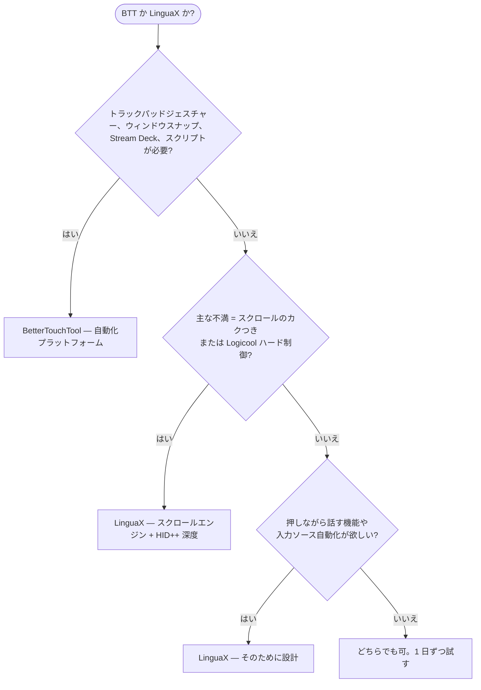

**BetterTouchTool の代替**を探しているなら、正直な答えは「何に使うか」次第です。BetterTouchTool は macOS の全部入り自動化プラットフォーム——ジェスチャー、キーボード、Touch Bar、Stream Deck、ウィンドウ管理、スクリプト。これらを半分でも使っているなら、代替はありません。でも、目的が**「サードパーティ製マウスを Mac で気持ちよく使いたい」だけ**なら、LinguaX が専門ツールとして適しています：本物のスムーズスクロールエンジン、Logicool マウスのハードウェア深度制御、入力ソース自動切替。プラットフォームを学ぶ必要はありません。

## BetterTouchTool の強み

BetterTouchTool は macOS で最も高機能な自動化アプリの一つです：

- トラックパッドと Magic Mouse のジェスチャー、マウスボタンとホイール修飾キー
- ウィンドウスナッピングと管理、キーボードショートカットと Hyper Key、フローティングメニュー
- ネイティブな Stream Deck 対応と 40 以上のマクロキーボードデバイス（Logitech、Loupedeck、Razer など）
- Spotlight 風ランチャー、クリップボードマネージャー、スクリーンショットツール、Touch Bar カスタマイズ
- 本格的なスクリプト：JavaScript、AppleScript、`btt://` URL、内蔵 Web サーバー、CLI
- 45 日の無料トライアル、アカウント不要。Standard 版 $15（2 年分のアップデート付き）、Lifetime 版 $25。Setapp 経由でも利用可能

これらは推測ではなく、[BetterTouchTool 公式サイト](https://folivora.ai/)の公開情報です。1 ライセンスで個人のすべての Mac をカバーします。

## LinguaX の違い

LinguaX は BTT のマウス部分——ボタンマッピング、アプリ別設定、スクロール方向——と重なり、まさにそこをより深くカバーしつつ、プラットフォームのオーバーヘッドを省いています：

- **本物のスムーズスクロールエンジン**：BTT は通常マウスのスクロール方向を反転できますが、ノッチ単位のホイールステップを減衰カーブに置き換えることはしません。LinguaX はそれを行います（Min Step / Speed Gain / Duration の 3 パラメータ）、アプリ別 ON/OFF 付き。
- **Logicool マウスのハードウェア深度対応**：対応モデル（MX Master シリーズなど）で HID++ により直接、ハードウェア DPI、SmartShift、バッテリー残量を操作——Logicool Options+ 不要。
- **入力ソース自動切替**：アプリや Web サイトのドメインごとに macOS の入力ソースを自動切替——BTT には相当機能がありません。
- **プッシュトゥトーク専用設計**：BTT でもマウスボタンを音声入力のホットキーに割り当てられますが、LinguaX の Modifier Hold は押しながら話すために設計されています——サイドボタンを押す、話す、離す。
- **特化**：マウス拡張と入力自動化のための小さなネイティブアプリ。何百もの設定ページを持つプラットフォームではありません。

価格比較は正直に、しかしニュアンス付きで：LinguaX は $9.9 買い切り、3 台の Mac まで、永続アップデート。BTT Standard は $15 で 2 年分のアップデート、Lifetime は $25——個人のすべての Mac をカバー。BTT の広さを本当に使うなら、あの価格はむしろ破格です。

## BetterTouchTool と LinguaX の比較（マウス視点）

| ニーズ | BetterTouchTool | LinguaX |
| --- | --- | --- |
| 位置づけ | 全部入り自動化プラットフォーム | マウス＋入力ソースに特化したツール |
| マウスボタン割り当て | 対応 | 対応、クリック / ダブルクリック / 長押し / 方向ドラッグのジェスチャー |
| トラックパッド / Magic Mouse ジェスチャー | 対応、コアの強み | サードパーティ製マウスが対象 |
| スムーズスクロール（減衰カーブ） | スクロール方向の反転 | 対応、3 パラメータ調整、アプリ別 ON/OFF |
| Logicool マウスの DPI / SmartShift / バッテリー | 主眼外 | 対応、HID++ で直接接続（サポートモデル） |
| マウスボタンでプッシュトゥトーク | ホットキー割り当てで実現 | 専用設計の押しながら話す（Modifier Hold） |
| 入力ソースのアプリ/サイト別切替 | 非対応 | 対応 |
| ウィンドウスナップ / Stream Deck / Touch Bar | 対応 | 非対応 |
| 学習コスト | プラットフォーム級 | ボタンを選んでアクションを割り当てるだけ |
| 価格モデル | 45 日トライアル；$15 Standard / $25 Lifetime、個人の全 Mac；Setapp も | 30 日トライアル；$9.9 買い切り、3 台の Mac |

## クイック診断

## BetterTouchTool を選ぶべきケース

- トラックパッド / Magic Mouse ジェスチャー、ウィンドウスナップ、Stream Deck、スクリプト自動化が欲しい
- 複雑なカスタムワークフローを組むのが好きで、すべてを 1 プラットフォームで管理したい
- すでに Setapp を使っている
- 1 ライセンスで個人のすべての Mac をカバーしたい

## LinguaX を選ぶべきケース

- 目的はサードパーティ製マウスを快適にすることだけ——プラットフォームは要らない
- ホイールのカクつきが最大の不満——本物のスムーズカーブが欲しい
- Logicool マウスを使っていて、Logicool Options+ なしで DPI、SmartShift、バッテリー表示が欲しい
- 複数言語で入力していて、入力ソースをアプリやドメインに追従させたい
- 自動化システムの設定ではなく、5 分で終わらせたい

## 実際のマウスで試す

両アプリとも無料トライアル（BTT 45 日、LinguaX 30 日）があるので、実機で 1 日比較するのが一番確実です：

1. 両方のアプリで同じサイドボタンを割り当てる。
2. ブラウザと長文ドキュメントでスクロールを比較——機能差が最も出る部分です。
3. Logicool マウスを使っているなら、DPI / バッテリー制御が自分に重要か確認。
4. 複数言語で入力するなら、LinguaX で入力ソース自動化を試す。

## FAQ

**LinguaX は BetterTouchTool の完全な代替になりますか？**
なりません——そもそも目指していません。LinguaX は BTT のマウス部分をより深い実装で置き換え（スクロールエンジン、Logicool ハードウェア制御、押しながら話す）、入力ソース自動化を追加します。ジェスチャー、ウィンドウ管理、Stream Deck、スクリプトには BetterTouchTool が唯一の答えです。

**スムーズスクロールが優れているのはどちら？**
明確に LinguaX です。BTT が提供するのは通常マウスのスクロール方向反転。LinguaX は段階式のホイール信号を連続した減衰カーブに置き換え、アプリごとに切り替えられます。スクロールの感触が不満なら、この差がすべてです。

**Logicool マウスに適しているのはどちら？**
ハードウェアレベルの機能——DPI、SmartShift、バッテリー表示——なら LinguaX（対応モデルに HID++ で直接アクセス）。マウスボタンから複雑なマクロを実行するなら、BTT の自動化の深さは他の追随を許しません。

**マウス機能だけに使うなら BTT は買う価値がある？**
正直に言うと、たぶんありません。BTT の価格はその広さに対するものです。ジェスチャー、Stream Deck、スクリプトに触れないなら、特化ツールのほうが安く、設定もはるかに簡単です。

**どちらから試すべき？**
不満に合わせて選んでください。「Mac を自動化したい」→ BTT。「マウスを快適にしたい」→ LinguaX。

## はじめる

LinguaX は無料ダウンロードで **30 日トライアル**——アカウント不要、テレメトリなし。ワークフローに合えば **$9.9 の買い切り Lifetime（3 台の Mac まで）**、サブスクリプションはありません。

**[LinguaX をダウンロード](/download)** して、実際のマウス環境で試してみてください。

## 関連ガイド

- [Mouse+ — macOS マウス拡張](/docs/mouse-plus/overview)
- [スムーズスクロール](/docs/mouse-plus/fundamentals/smooth-scrolling)
- [ボタンマッピング](/docs/mouse-plus/fundamentals/button-mapping)
- [SteerMouse の代替](/docs/comparisons/steermouse-alternative-mac)
- [USB Overdrive の代替](/docs/comparisons/usb-overdrive-alternative-mac)
