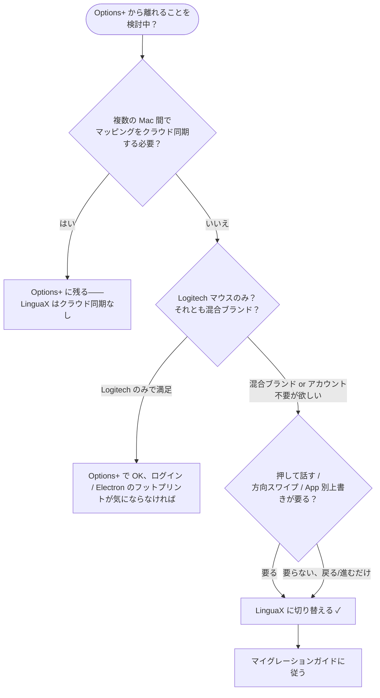

import Head from '@docusaurus/Head';

export const faqSchema = {
  '@context': 'https://schema.org',
  '@type': 'FAQPage',
  mainEntity: [
    {'@type': 'Question', name: 'アカウント登録不要の Logi Options+ 代替はありますか？', acceptedAnswer: {'@type': 'Answer', text: 'あります。LinguaX はアカウント不要・テレメトリなし——スムーズスクロール、ボタン / ジェスチャマッピングなどのコア機能は起動した瞬間から使えます。アカウント強制は Logi Options+ を離れる主な理由の一つ、代替品でそれを持ち込むべきではありません。'}},
    {'@type': 'Question', name: 'ロジクール以外のマウスでも使えますか？', acceptedAnswer: {'@type': 'Answer', text: '任意の USB / Bluetooth マウスがドライバ不要で動作します。Logitech モデル（MX Master 2S/3/3S/4、MX Anywhere 2/2S/3/3S、G502 X、M720、M585 など）はさらに強い認識とサイドボタン自動デフォルトマッピングが追加されます。'}},
    {'@type': 'Question', name: 'スリープ / 復帰と Bluetooth 再接続後もマッピングは効きますか？', acceptedAnswer: {'@type': 'Answer', text: 'はい。Bluetooth マウスはスリープ後自動再接続され、LinguaX は復帰時に権限と主要サービスをリフレッシュします。これはまさに「一日テストプロトコル」のステップ 4 が検証する失敗モードです。'}},
    {'@type': 'Question', name: 'BetterMouse / Mos / LinearMouse との違いは？', acceptedAnswer: {'@type': 'Answer', text: '各ツールは焦点が異なります——スムーズスクロールだけ、ボタン再マッピングだけ、など。LinguaX は一つのネイティブ app でスムーズスクロール + ボタン / ジェスチャマッピング + App 別上書き + 入力ソース自動切り替えを同時に行う唯一の選択肢で、複数ツールの event tap 衝突を避けられます。'}},
    {'@type': 'Question', name: 'MX Master 3S / 4 は Logi Options+ なしで設定できますか？', acceptedAnswer: {'@type': 'Answer', text: 'できます。LinguaX は BLE HID++ を通じてすべてのボタンとジェスチャマッピングを完全サポート、Logi Options+ のインストールは不要です。'}},
    {'@type': 'Question', name: 'G Pro X Superlight を G HUB なしで Mac 上で使えますか？', acceptedAnswer: {'@type': 'Answer', text: 'はい。LinguaX は汎用 HID エンジンを通じて macOS 上でその 2 つのサイドボタンをマッピング、G HUB もドライバも不要です。'}},
    {'@type': 'Question', name: '価格は？', acceptedAnswer: {'@type': 'Answer', text: 'LinguaX は買い切り $9.9、3 台まで利用可能、30 日間のフル機能無料トライアルつき。サブスクリプションなし、アカウント登録不要です。'}}
  ]
};

<Head>
  
</Head>

# Logi Options+ の Mac 代替：軽量・アカウント不要・任意ブランドマウス対応

**Logi Options+ の Mac 代替**を探しているなら、多くはこの 3 つのうちのどれかが理由でしょう：数百 MB のバックグラウンド常駐が重い、ボタン 1 つマッピングする前にアカウントログインを要求される、または Logitech ハードウェアしか対応しない。LinguaX はネイティブで軽量な Mac マウス強化ツールで、あなたが実際に毎日使う部分——**スムーズスクロールとサイドボタンマッピング**——だけを行い、**任意ブランド**のマウスに対応します。

## なぜ Logi Options+ から離れる人が多いか

- **重い。** Logi Options+ は Electron アプリで、日々やっているのはボタンマッピングとスクロールだけなのに、数百 MB のバックグラウンド常駐を残します。
- **アカウントを要求する。** 多くのワークフローがログインゲートと「頼んでもいないオンライン同期」の後ろに閉じ込められます。
- **Logitech しか認識しない。** 混合ブランドの手元、または非 Logitech マウス 1 本しかない場合、まったく役に立ちません。
- **スリープ / 復帰 or macOS アップデート後に効かなくなる。** スクロールやボタンが応答しなくなり、手動で切り替えたり再接続する必要が出る。

安定したスクロール + いくつかのボタンマッピングだけが欲しいなら、代償が大きすぎます。

## LinguaX がどう解決するか

LinguaX は **mouse-first** で macOS ネイティブに構築されています：

- **~10MB、ネイティブ——Electron ではない。** ボタン 1 つ再マッピングするためにブラウザランタイム全体を起動しません。
- **アカウント不要、テレメトリなし。** ローカル設定、起動即動作、どこにもログインする必要なし。
- **任意ブランドのマウスに対応。** 幅広いモデルを認識（Logitech MX Master、MX Anywhere、G502 X、M720、M585 と汎用マウスを含む）、認識されないデバイスでも動作します。
- **細かい制御が可能なスムーズスクロール**——Min Step、Speed Gain、Duration、加えて **App 別 ON/OFF トグル**。マウスホイールにだけ作用、トラックパッドには手を出しません。
- **サイドボタンとジェスチャマッピング**——クリック、ダブルクリック、長押し、方向スワイプ——App 別上書き対応。
- **スリープ / 復帰後も信頼性あり。** Bluetooth デバイスは復帰時に自動再接続、主要サービスはシステム復帰時にリフレッシュ。

## LinguaX vs Logi Options+

| | LinguaX | Logi Options+ |
| --- | --- | --- |
| App サイズ | ~10MB | 数百 MB |
| アーキテクチャ | ネイティブ macOS | Electron |
| アカウント要否 | 不要 | しばしば必要 |
| マウスブランド対応 | 任意ブランド（幅広い認識） | Logitech のみ |
| スムーズスクロール | Min Step / Speed Gain / Duration、App 別 ON/OFF | 限定的 |
| スリープ / 復帰の信頼性 | 復帰時自動回復 | 再接続が必要になる場合あり |
| テレメトリ | なし | オンラインアカウント / 同期あり |
| 価格 | $9.9 買い切り（3 台） | 無料、Logitech ロック |

## Logi Options+ を置き換えるべき？クイック判断

:::tip Options+ を残してハードウェア設定を管理したい？
LinguaX にボタンマッピングを任せる一方で、Options+ にデバイス級 DPI / SmartShift / バックライト管理を残したい場合、Options+ をアンインストールする必要はありません。Options+ の**入力モニタリング（Input Monitoring）**権限を取り消せば OK——詳細は[マウスツール衝突のトラブルシューティング](/docs/troubleshooting/conflicts-with-other-tools)。
:::

## 一日テストプロトコル

Logi Options+ 代替が日常使用に耐えるか判定する一番早い方法は、意図的に設計した完全な 1 日を通すこと。この 4 点をテストすれば分かります：

1. **長時間のブラウザ読み込み。** 長文をいくつかスクロール。判定基準：滑らかか、振動やオーバーシュートがあるか？スクロールスライダー（Min Step、Speed Gain、Duration）を調整、3 つのスライダーが実際に異なる効果を持つか確認。
2. **エディタ + ターミナル切り替え。** コードエディタとターミナルの間で実際に作業。判定基準：エディタで精密、ブラウザで滑らか、それぞれ独立できるか？App ごとに独自の動作なら、App 別制御が本当に機能している証拠。
3. **2 つのサイドボタンアクション。** 高頻度なもの（戻る/進む）とジェスチャ付きのもの（長押し → Mission Control、またはスワイプ → Space 切り替え）を割り当て。判定基準：通常使用 1 時間の間、両方が確実に発火するか（App 切り替え直後を含む）？
4. **1 回のスリープ / 復帰サイクル。** Mac をスリープ、復帰、そのまますぐスクロール + 割り当てたボタンをクリック。判定基準：すべてが再起動なしで動作するか？Bluetooth マウスは手動再接続なしで復元するか？

4 点すべてクリアすれば、日常使用に問題ありません。**ステップ 4 は多くのベンダースイートと軽量ユーティリティが密かに失敗するところです。**

## Get started

LinguaX は無料ダウンロード、**30 日間のトライアル**つき——アカウント不要、テレメトリなし。合えば**買い切り $9.9、3 台まで利用可能**（サブスクリプションなし）。

**[LinguaX をダウンロード](/download)** して 30 日間無料で試す。

## よくある質問

### アカウント登録不要の Logi Options+ 代替はありますか？

あります。LinguaX はアカウント不要・テレメトリなし——スムーズスクロール、ボタン / ジェスチャマッピングなどのコア機能は起動した瞬間から使えます。アカウント強制は Logi Options+ を離れる主な理由の一つ、代替品でそれを持ち込むべきではありません。

### ロジクール以外のマウスでも使えますか？

任意の USB / Bluetooth マウスがドライバ不要で動作します。Logitech モデル（MX Master 2S/3/3S/4、MX Anywhere 2/2S/3/3S、G502 X、M720、M585 など）はさらに強い認識とサイドボタン自動デフォルトマッピングが追加されます。詳細は[デバイス互換性](/docs/mouse-plus/device-compatibility)。

### スリープ / 復帰と Bluetooth 再接続後もマッピングは効きますか？

はい。Bluetooth マウスはスリープ後自動再接続され、LinguaX は復帰時に権限と主要サービスをリフレッシュします。これはまさに「一日テストプロトコル」のステップ 4 が検証する失敗モードです。

### BetterMouse、Mos、LinearMouse との違いは？

各ツールは焦点が異なります——スムーズスクロールだけ、ボタン再マッピングだけ、など。LinguaX は一つのネイティブ app でスムーズスクロール + ボタン / ジェスチャマッピング + App 別上書き + 入力ソース自動切り替えを同時に行う唯一の選択肢で、複数ツールの event tap 衝突を避けられます。詳細は [Mac マウス増強ツール比較（英語）](/docs/comparisons/mos-vs-linearmouse-vs-mac-mouse-fix)。

### MX Master 3S / 4 は Logi Options+ なしで設定できますか？

できます。LinguaX は BLE HID++ を通じてすべてのボタンとジェスチャマッピングを完全サポート、Logi Options+ のインストールは不要です。関連モデルページ：[MX Master 4](/docs/mouse-plus/models/mx-master-4)、[MX Master 3](/docs/mouse-plus/models/mx-master-3)、[MX Anywhere 3S](/docs/mouse-plus/models/mx-anywhere-3s)、[MX Anywhere 3](/docs/mouse-plus/models/mx-anywhere-3)、[Logi Lift](/docs/mouse-plus/models/logitech-lift)、[MX Ergo](/docs/mouse-plus/models/mx-ergo)。

### G Pro X Superlight を G HUB なしで Mac 上で使えますか？

はい。LinguaX は汎用 HID エンジンを通じて macOS 上でその 2 つのサイドボタンをマッピング、G HUB もドライバも不要です。関連モデルページ：[G Pro X Superlight](/docs/mouse-plus/models/logitech-g-pro-x-superlight)、[G Pro X Superlight 2](/docs/mouse-plus/models/logitech-g-pro-x-superlight-2)。

### 価格は？

LinguaX は**買い切り $9.9**、3 台まで利用可能、**30 日間のフル機能無料トライアル**つき——サブスクリプションなし、アカウント登録不要。

## 関連ドキュメント

- [Mac の押して話す音声入力（マウスサイドボタン）](/ja/docs/push-to-talk/push-to-talk-voice-typing-mac)
- [マウスボタンで macOS ディクテーションを起動する](/ja/docs/mouse-plus/recipes/macos-dictation-mouse-button)
- [Mac マウスのスクロールがカクつく？第三者マウスをスムーズにする方法](/ja/docs/mouse-plus/recipes/fix-choppy-mouse-scrolling-macos)
- [Mac マウスのサイドボタンを割り当てる方法](/ja/docs/mouse-plus/recipes/map-mouse-side-buttons-macos)
- [Mouse+ 概要（英語）](/docs/mouse-plus/overview)
- [マウスツール衝突のトラブルシューティング（英語）](/docs/troubleshooting/conflicts-with-other-tools)
