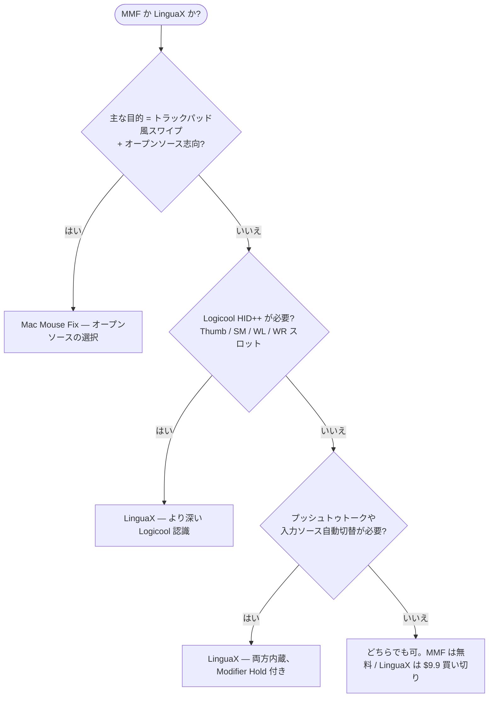

**Mac Mouse Fix の代替**を探しているなら、まず正直な答えから：Mac Mouse Fix は優秀な macOS マウスユーティリティです。手頃な価格でオープンソース、通常のマウスにトラックパッド風ジェスチャーを持ち込む点は特に強みです。一方、マウス拡張に**加えて**アプリ別の挙動、プッシュトゥトーク音声入力、Logicool デバイス制御、入力ソース自動化まで 1 つのネイティブアプリで欲しいなら、LinguaX が適しています。

## Mac Mouse Fix の強み

Mac Mouse Fix は、サードパーティ製マウスを Apple のトラックパッドに近づけることに注力しています：

- Mission Control、App Exposé、デスクトップ間移動、Smart Zoom、戻る/進むといったトラックパッド風ジェスチャー
- 複数の滑らかさレベルを選べるスムーズスクロール
- 独立したマウスのスクロール方向
- マウスアクションとキーボードショートカットの実行
- 30 日の無料トライアルと手頃な買い切り価格
- GitHub で公開されるオープンソース

これらは推測ではなく、[Mac Mouse Fix 公式サイト](https://macmousefix.com/)と [GitHub リポジトリ](https://github.com/noah-nuebling/mac-mouse-fix)の公開情報です。

## LinguaX の違い

LinguaX は基本部分——スムーズスクロール、ボタンマッピング、ジェスチャー、アプリ別の挙動——で重なりますが、より広い日常ワークフローを前提に設計されています：

- **Mouse+ 拡張**：スムーズスクロール、サイドボタン割り当て、クリック / ダブルクリック / 長押し / 方向ドラッグのジェスチャー、ポインタ速度、アプリスコープのオーバーライド
- **プッシュトゥトーク音声入力**：マウスのサイドボタンを Fn / Globe の長押しに割り当てたり、音声アプリのショートカットをトリガー
- **Logicool 固有の制御**：対応デバイスでハードウェア DPI、SmartShift、バッテリー表示を Logicool Options+ なしで
- **入力ソース自動化**：アプリや Web サイトのドメインで macOS の入力ソースを切替
- **1 つのネイティブアプリ**でマウス挙動と入力自動化——複数のユーティリティを積み重ねる必要なし

通常の 5 ボタンマウスにトラックパッド風ジェスチャーだけ欲しいなら、Mac Mouse Fix で十分かもしれません。Logicool ハードウェア制御、音声入力、アプリ別プロファイル、多言語入力まで含むなら、LinguaX のほうが広くカバーします。

## Mac Mouse Fix と LinguaX の比較

| ニーズ | Mac Mouse Fix | LinguaX |
| --- | --- | --- |
| マウスボタンからのトラックパッド風ジェスチャー | 主力機能 | マウスジェスチャーとアクションで対応 |
| スムーズスクロール | 対応 | 対応、Min Step / Speed Gain / Duration 調整 |
| マウスのスクロール方向をトラックパッドと分離 | 対応 | 対応、垂直/水平の軸別選択 |
| マウスボタンからキーボードショートカット | 対応 | 対応 |
| アプリ別のマウス挙動 | 対応 | 対応、アプリスコープのオーバーライド |
| Logicool DPI / SmartShift 制御 | 主眼外 | 対応（サポートモデル） |
| マウスのバッテリー表示 | 主眼外 | 対応（BLE / Logicool 連携で対応する場合） |
| サイドボタンでのプッシュトゥトーク | 主眼外 | 対応、Fn / Globe の Modifier Hold またはショートカット割り当て |
| 入力ソースのアプリ/サイト別切替 | 非対応 | 対応 |
| オープンソース | はい | いいえ |
| 価格モデル | 30 日トライアル、手頃な買い切り | 30 日トライアル、$9.9 買い切り Lifetime（3 台の Mac） |

## クイック診断

## Mac Mouse Fix を選ぶべきケース

- 主な目的がマウスボタンからのトラックパッド風ジェスチャー
- オープンソースソフトウェアを好む
- 最も安い特化型マウスユーティリティが欲しい
- Mac Mouse Fix でマウスのボタンが正しく認識されている
- 入力ソース自動化、プッシュトゥトーク、Logicool ハードウェア制御は不要

## LinguaX を選ぶべきケース

- マウス拡張と入力ソース自動化を 1 アプリで済ませたい
- Logicool マウスを使っていて、対応モデルでアプリ内 DPI、SmartShift、バッテリー表示が欲しい
- サイドボタンをプッシュトゥトークに割り当てたい
- 作業コンテキストごとにアプリ別のマウス挙動が必要
- 複数言語で入力していて、入力ソースをアプリやブラウザのドメインに追従させたい

## デバイス互換性の注意

Mac Mouse Fix は、Logitech Options のような専用ドライバーソフト向けに設計されたマウスの一部ボタンを認識できない場合があると明記しており、Apple Magic Mouse も現在未対応です。LinguaX も、すべてのマウスの全高度機能を約束するものではありません：基本的なスムーズスクロールとショートカット割り当ては広く動作しますが、DPI、SmartShift、バッテリーといったハードウェア機能は対応デバイスパス次第です。

確実な比較方法は、実際のマウスで 1 日試すこと：

1. 両方のアプリで同じサイドボタンを割り当てる。
2. ブラウザ、エディタ、変わったスクロールをするアプリの 3 つでスムーズスクロールを試す。
3. Mac をスリープ→復帰させて、割り当てが維持されるか確認。
4. 音声入力や複数の入力ソースを使うなら、そのフローも試す。

## FAQ

**LinguaX は Mac Mouse Fix の完全な代替になりますか？**
スムーズスクロール、サイドボタン割り当て、キーボードショートカット、アプリ別の挙動という一般的な用途では代替可能です。Mac Mouse Fix 固有のトラックパッドジェスチャーモデルやオープンソースであることを重視するなら、Mac Mouse Fix が適しています。

**Logicool マウスに適しているのはどちら？**
DPI、SmartShift、バッテリー表示といったハードウェア機能が欲しいなら LinguaX。Mac Mouse Fix も優れたマウスユーティリティですが、Logicool ハードウェア制御は主眼外です。

**プッシュトゥトークに適しているのはどちら？**
LinguaX。Fn / Globe の Modifier Hold を内蔵しており、サイドボタンを対応する音声入力ワークフローの押しながら話すトリガーにできます。通常のキーボードショートカット割り当てにも対応しています。

**どちらから試すべき？**
主な不満に合わせて選んでください。「マウスでトラックパッド風ジェスチャーを使いたい」なら Mac Mouse Fix。「マウス拡張に音声と入力自動化も 1 アプリで」なら LinguaX から。

## はじめる

LinguaX は無料ダウンロードで **30 日トライアル**——アカウント不要、テレメトリなし。ワークフローに合えば **$9.9 の買い切り Lifetime（3 台の Mac まで）**、サブスクリプションはありません。

**[LinguaX をダウンロード](/download)** して、実際のマウス環境で試してみてください。

## 関連ガイド

- [Mouse+ — macOS マウス拡張](/docs/mouse-plus/overview)
- [ボタンマッピング](/docs/mouse-plus/fundamentals/button-mapping)
- [ジェスチャーマッピング](/docs/mouse-plus/fundamentals/gesture-mapping)
- [マウスのサイドボタンを割り当てる方法](/docs/mouse-plus/recipes/map-mouse-side-buttons-macos)
- [BetterMouse の代替](/docs/comparisons/bettermouse-alternative-mac)
- [Mos vs LinearMouse vs Mac Mouse Fix](/docs/comparisons/mos-vs-linearmouse-vs-mac-mouse-fix)
- [マウスボタンでプッシュトゥトーク音声入力](/docs/push-to-talk/push-to-talk-voice-typing-mac)
- [SteerMouse の代替](/docs/comparisons/steermouse-alternative-mac)
- [USB Overdrive の代替](/docs/comparisons/usb-overdrive-alternative-mac)
- [BetterTouchTool の代替（マウス用途）](/docs/comparisons/bettertouchtool-alternative-for-mouse-mac)
