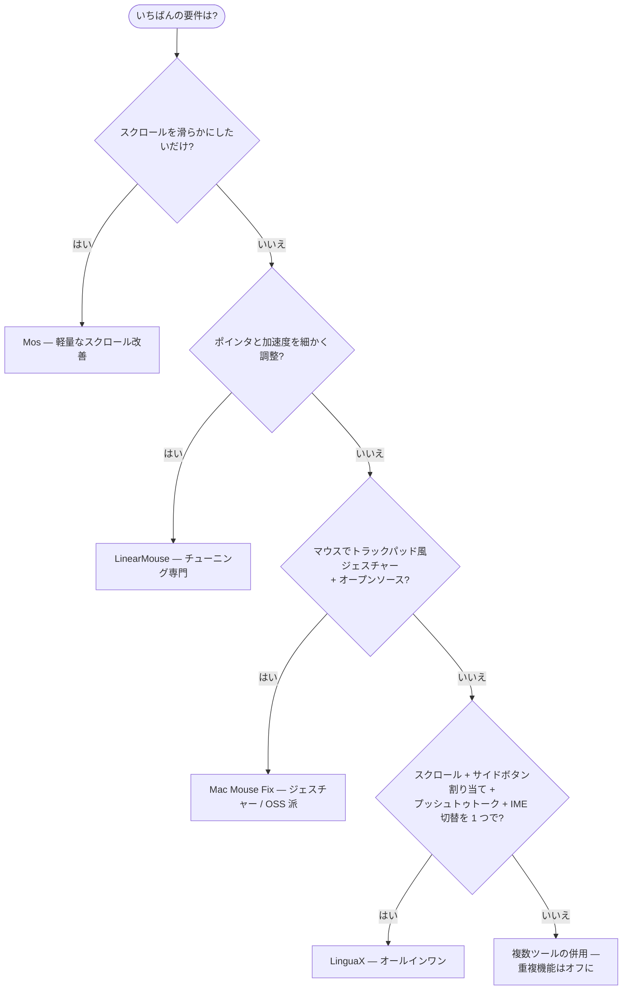

import Head from '@docusaurus/Head';

export const faqSchema = {
  '@context': 'https://schema.org',
  '@type': 'FAQPage',
  mainEntity: [
    {'@type': 'Question', name: 'Mos は無料でスムーズスクロールも優秀。なぜ LinguaX に乗り換えるの？', acceptedAnswer: {'@type': 'Answer', text: 'スクロールだけが目的なら乗り換えなくて構いません — Mos で十分です。ジェスチャー、ハードウェア DPI、バッテリー表示、アプリ別の挙動、マウスサイドボタンでのプッシュトゥトークや IME 切替まで欲しい場合に LinguaX を選んでください。Mos にはそれらがありません。'}},
    {'@type': 'Question', name: 'Mos + LinearMouse + Mac Mouse Fix を同時に入れると競合する？', acceptedAnswer: {'@type': 'Answer', text: 'おそらく競合します。3 つともマウスイベントを横取りするため、同じスクロールティックが三重に処理されたり途中で落ちたりして、カクつきやクリック抜けとして現れます。マウス拡張は 1 つに絞るか、LinguaX で置き換えてください。'}},
    {'@type': 'Question', name: 'LinguaX は Logicool MX Master 3S / 4 を Logicool Options+ なしで使える？', acceptedAnswer: {'@type': 'Answer', text: '使えます。BLE HID++ 経由で完全なジェスチャーとボタン割り当てが可能で、Logicool Options+ は不要です。'}},
    {'@type': 'Question', name: 'Logicool 以外のマウスでも使える？', acceptedAnswer: {'@type': 'Answer', text: '使えます。任意の USB / Bluetooth マウスにドライバ不要で対応。一般的な Logicool モデル（MX Master、G502 X、M720、M585 など）には最適化されたデフォルト割り当ても付きます。'}},
    {'@type': 'Question', name: 'LinguaX の入力ソース自動切替は実際に何をするの？', acceptedAnswer: {'@type': 'Answer', text: 'アプリや Web サイトのドメインごとに、指定した入力ソース / キーボード配列へ自動で切り替えます — 例えば Xcode では英語、チャットアプリでは中国語、特定の Google ドキュメントでは特定の配列、といった具合です。ルールはアプリの入力ソース設定で行い、セッションをまたいで保持されます。'}}
  ]
};

<Head>
  
</Head>

# Mos vs LinearMouse vs Mac Mouse Fix vs LinguaX

macOS には優れたマウスユーティリティがいくつもあり、機能が分かりにくい形で重なっています。**Mos** は定番の無料スムーズスクローラー。**LinearMouse** はポインタ加速度とデバイス別設定に特化。**Mac Mouse Fix** はジェスチャーとキーの再割り当てを追加します。厄介なのは、多くの人が結局これらを 2〜3 個同時に動かしてしまうことです——スクロール用に 1 つ、加速度用に 1 つ、ジェスチャー用に 1 つ。これはまさに競合を引き起こす構成です。このページでは 4 つを正直に比較し、**LinguaX** が 1 アプリとしてどこに位置するかを示します。

## 各ツールの概要

- **Mos** — 無料、オープンソース。定番のスムーズスクローラー。最近の 4.x 系（2026）ではマウスボタン割り当てと Logicool HID++ ボタン処理も追加。ジェスチャー、DPI 制御、入力ソース切替は依然なし。
- **LinearMouse** — 無料、オープンソース。ポインタ速度/加速度とデバイス別チューニングに特化し、ボタン再割り当ても一部可能。スクロール平滑化やジェスチャーは守備範囲外。
- **Mac Mouse Fix** — 手頃な価格。ジェスチャーとボタン再割り当てに強く、スムーズスクロールも良好。優れたオールラウンダー。
- **LinguaX** — ネイティブ、約 10MB。1 アプリに 2 つの中核機能：マウス拡張（スムーズスクロール、ボタン/ジェスチャー割り当て、ポインタ速度、アプリ別オーバーライド）**と**入力ソースの自動切替。

## 比較表

| | Mos | LinearMouse | Mac Mouse Fix | LinguaX |
| --- | --- | --- | --- | --- |
| スムーズスクロール | 対応（中核） | 限定的 | 対応 | 対応 — Min Step / Speed Gain / Duration |
| スクロール反転 | 対応 | 対応 | 対応 | 対応 — 軸別 |
| ポインタ速度 / 加速度 | 非対応 | 対応（中核） | 限定的 | 対応 — デバイス別に保持 |
| ボタン / サイドボタン割り当て | 対応（4.x） | 一部 | 対応 | 対応 |
| Logicool HID++ ボタン | 対応（4.x） | 非対応 | 非対応 | 対応 |
| ジェスチャー（スワイプ、長押し） | 非対応 | 非対応 | 対応 | 対応 |
| DPI 調整（ハードウェア） | 非対応 | 非対応 | 非対応 | 対応 — Logicool HID++ |
| バッテリー表示 | 非対応 | 非対応 | 非対応 | 対応 — BLE / Logicool HID++ |
| アプリ別オーバーライド | 限定的 | 一部 | 対応 | 対応 |
| モデル認識 | Logicool のみ（HID++） | 一部 | 一部 | 幅広い（MX Master、G502 X、M720、M585…） |
| スリープ/復帰の自動回復 | まちまち | まちまち | 対応 | 対応 |
| 入力ソース自動化 | 非対応 | 非対応 | 非対応 | 対応（中核機能） |
| 複数ツールの積み重ねを置き換え | 非対応 | 非対応 | ほぼ可 | 対応 — 1 アプリ |
| 価格 | 無料 | 無料 | 手頃な買い切り | $9.9 買い切り（3 台） |

## ツール選びの分岐

## 本当の決め手：1 つで済ませるか、3 つ使うか

スムーズスクロールだけが必要なら、**Mos** は良い無料の選択です。加速度調整だけなら、**LinearMouse** が優秀で無料です。問題は、平滑化**と**加速度**と**ジェスチャー**と**アプリ別の挙動**の*すべて*が必要になった時です——Mos + LinearMouse + 再割り当てツールの積み重ねは、同じ入力を奪い合う 3 つのイベントタップを意味し、カクつきやクリック抜けの典型的な原因になります。

**LinguaX** はそのスロットを 1 アプリで担うために作られています：

- スクロール、速度、ボタン、ジェスチャーのための単一のイベントパイプライン——ツール間競合なし。
- 幅広いモデル認識による正確なデバイス別セットアップ。
- 無料ツールがグローバル設定のみの部分で、アプリ別・軸別の制御。
- そして他にはまったくない 2 つ目の中核機能：アプリと Web サイトによる入力ソースの自動切替。

正直なまとめ：無料のスクロールと基本的なボタン割り当てだけで足りるなら、Mos や LinearMouse をそのまま使ってください。ジェスチャー、ハードウェア DPI、バッテリー表示、幅広いデバイス別制御を 1 つのネイティブアプリで——さらに他にない第 2 の中核機能として入力ソース自動切替も——欲しいなら、LinguaX を選んでください。

## よくある質問

### Mos は無料でスムーズスクロールも優秀。なぜ LinguaX に乗り換えるの？

スクロールだけが目的なら乗り換えなくて構いません——Mos で十分です。ジェスチャー、ハードウェア DPI、バッテリー表示、アプリ別の挙動、マウスサイドボタンでのプッシュトゥトークや IME 切替まで欲しい場合に LinguaX を選んでください。Mos にはそれらがありません。

### Mos + LinearMouse + Mac Mouse Fix を同時に入れると競合する？

おそらく競合します。3 つともマウスイベントを横取りするため、同じスクロールティックが三重に処理されたり途中で落ちたりして、カクつきやクリック抜けとして現れます。マウス拡張は 1 つに絞るか、LinguaX で置き換えてください。

### LinguaX は Logicool MX Master 3S / 4 を Logicool Options+ なしで使える？

使えます。BLE HID++ 経由で完全なジェスチャーとボタン割り当てが可能で、Logicool Options+ は不要です。モデル別のセットアップは [MX Master 4](/docs/mouse-plus/models/mx-master-4)、[MX Master 3S](/docs/mouse-plus/models/mx-master-3s)、[MX Anywhere 3S](/docs/mouse-plus/models/mx-anywhere-3s) を参照してください。

### Logicool 以外のマウスでも使える？

使えます。任意の USB / Bluetooth マウスにドライバ不要で対応。一般的な Logicool モデル（MX Master、G502 X、M720、M585 など）には最適化されたデフォルト割り当てが付き、他ブランドは汎用認識で動作します。

### LinguaX の入力ソース自動切替は実際に何をするの？

アプリや Web サイトのドメインごとに、指定した入力ソース / キーボード配列へ自動で切り替えます——例えば Xcode では英語、WeChat や Slack のチャットでは中国語、特定の Google ドキュメントでは特定の配列、といった具合です。ルールはアプリの入力ソース設定で行い、セッションをまたいで保持されます。

## はじめる

LinguaX は無料ダウンロードで **30 日トライアル**——アカウント不要、テレメトリなし。合えば **$9.9 の買い切り（3 台まで）**、サブスクリプションはありません。

**[LinguaX をダウンロード](/download)** して、オールインワンのセットアップを 30 日無料で試してみてください。

## 関連ガイド

- [Mouse+ — macOS マウス拡張](/docs/mouse-plus/overview)
- [スムーズスクロール](/docs/mouse-plus/fundamentals/smooth-scrolling)
- [ポインタ速度と加速度](/docs/mouse-plus/fundamentals/pointer-speed)
- [マウスのスクロールがカクつく場合の直し方](/docs/mouse-plus/recipes/fix-choppy-mouse-scrolling-macos)
- [Mac Mouse Fix の代替](/docs/comparisons/mac-mouse-fix-alternative-macos)
- [BetterMouse の代替](/docs/comparisons/bettermouse-alternative-mac)
- [Logicool Options+ の代替](/docs/comparisons/logi-options-plus-alternative-macos)
- [SteerMouse の代替](/docs/comparisons/steermouse-alternative-mac)
- [USB Overdrive の代替](/docs/comparisons/usb-overdrive-alternative-mac)
- [BetterTouchTool の代替（マウス用途）](/docs/comparisons/bettertouchtool-alternative-for-mouse-mac)
