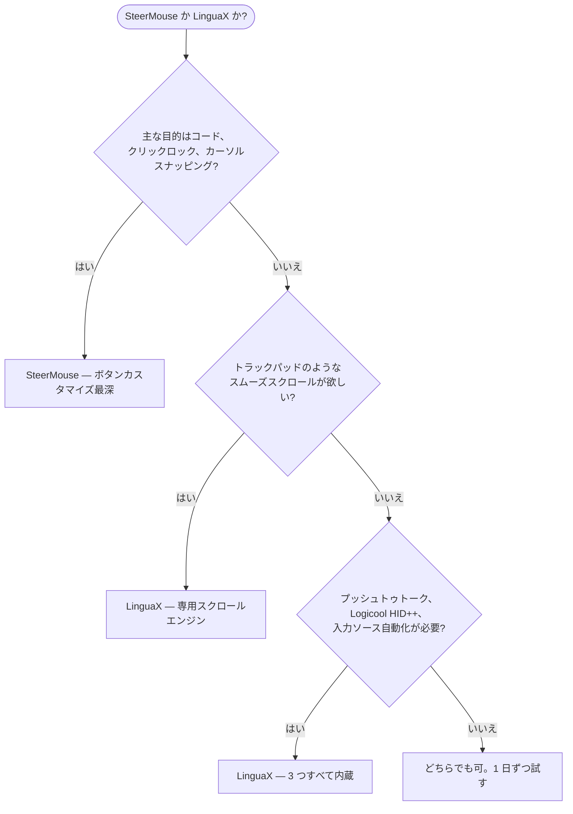

**SteerMouse の代替**を探しているなら、まず正直な答えから：SteerMouse は macOS で最も成熟したマウスユーティリティの一つです。日本の開発元 Plentycom が 2005 年から保守を続けており、ボタンカスタマイズの深さはトップクラス。一方で、ボタンマッピングだけでなく**本物のスムーズスクロールエンジン、プッシュトゥトーク音声入力、Logicool ハードウェア制御、入力ソース自動切替**まで欲しい場合は、LinguaX がより合っています——しかも低価格です。

## SteerMouse の強み

SteerMouse は USB / Bluetooth マウスのドライバーレベルの深いカスタマイズに特化しています：

- 1 ボタンに最大 24 種類の機能を割り当て可能：キーボードショートカット、クリック（ダブルクリック、クリックロック）、ズーム、アプリケーションスイッチャー、Mission Control、システム・ミュージック制御、ファイルや URL を開く
- コード（chording）——ボタンと修飾キー、またはボタン同士の組み合わせ
- macOS のスライダーを超えるカーソル調整：トラッキング速度に加えて独立した感度コントロール、カーソルスナッピング
- スクロール調整（加速度と感度）とオートスクロール
- アプリケーションごとの個別設定
- 他のユーザーが共有した設定をランキングで見られる「Recommended Settings」
- メジャーバージョン内は買い切り——サブスクなし

これらは推測ではなく、[SteerMouse 公式サイト](https://plentycom.jp/en/steermouse/)に記載された公開機能です。SteerMouse は Apple Magic Mouse と Magic Trackpad をサポートしておらず、一部の特殊ボタンには非対応の場合があります——まさに LinguaX が対象とするデバイス領域（サードパーティ製マウス）です。

## LinguaX の違い

LinguaX はボタンマッピング、ショートカット、アプリ別設定で SteerMouse と重なりますが、より広い日常ワークフローをカバーする設計です：

- **本物のスムーズスクロールエンジン**：SteerMouse が調整するのはネイティブスクロールイベントの加速度と感度。LinguaX はカクカクしたノッチ単位のホイールステップを、減衰のある連続カーブ（Min Step / Speed Gain / Duration の 3 パラメータ）に置き換え、アプリごとの ON/OFF も可能です。
- **プッシュトゥトーク音声入力**：サイドボタンを押している間、macOS 音声入力、Wispr Flow、superwhisper をトリガー（Fn/Globe 長押しまたはショートカット割り当て）。
- **Logicool ハードウェア制御**：対応モデルでハードウェア DPI、SmartShift、バッテリー残量を Logicool Options+ なしで操作。
- **入力ソース自動切替**：アプリや Web サイトのドメインごとに macOS の入力ソースを自動切替——SteerMouse のスコープ外の機能です。
- **価格とアップグレード**：SteerMouse 5 は $19.99 で、メジャーバージョンアップは有料（v4 からは $12.99）。LinguaX は $9.9 の買い切り Lifetime で 3 台の Mac まで利用でき、以降のアップデートは無料です。

求めているのが究極のボタンカスタマイズ深度——コード、クリックロック、カーソルスナッピング——なら、SteerMouse がまさに適したツールです。ワークフローにスムーズスクロール、音声入力、Logicool ハードウェア機能、多言語入力まで含むなら、LinguaX のほうが広くカバーします。

## SteerMouse と LinguaX の比較

| ニーズ | SteerMouse | LinguaX |
| --- | --- | --- |
| ボタンカスタマイズの深さ | 1 ボタン最大 24 機能 | クリック / ダブルクリック / 長押し / 方向ドラッグのジェスチャー |
| コード（ボタン同士の組み合わせ） | 対応 | 主眼外 |
| カーソル速度/感度調整 | 対応、カーソルスナッピングも | 対応、デバイスごとにポインタ速度を記憶 |
| スムーズスクロール（減衰カーブ） | スクロール加速度/感度の調整 | 対応、3 パラメータ調整、アプリ別 ON/OFF |
| マウスのスクロール方向をトラックパッドと分離 | スクロール設定で実現 | 対応、垂直/水平の軸別スイッチ |
| アプリ別設定 | 対応 | 対応、アプリスコープのオーバーライド |
| Logicool DPI / SmartShift / バッテリー | 主眼外 | 対応（サポートモデル） |
| プッシュトゥトーク音声入力 | 非対応 | 対応 |
| 入力ソースのアプリ/サイト別切替 | 非対応 | 対応 |
| Magic Mouse / Trackpad サポート | 非対応 | サードパーティ製マウスが対象 |
| 価格モデル | 30 日トライアル、$19.99/メジャーバージョン（アップグレード有料） | 30 日トライアル、$9.9 買い切り、3 台の Mac |

## クイック診断

## SteerMouse を選ぶべきケース

- コード（ボタン+ボタン、ボタン+修飾キーの組み合わせ）を多用する
- クリックロック、カーソルスナッピング、1 ボタン最大 24 機能が必要
- 20 年の保守実績を重視する
- スムーズスクロール、プッシュトゥトーク、入力ソース自動化は不要

## LinguaX を選ぶべきケース

- ホイールのカクつきが最大の不満——速いノッチではなく本物のスムーズカーブが欲しい
- Logicool マウスを使っていて、Logicool Options+ なしで DPI、SmartShift、バッテリー表示が欲しい
- サイドボタンを音声入力アプリのプッシュトゥトークに使いたい
- 複数言語で入力していて、入力ソースをアプリやドメインに追従させたい
- メジャーアップグレードの課金なしで、買い切り後もずっと無料アップデートが欲しい

## 実際のマウスで試す

両アプリとも 30 日の無料トライアルがあるので、実機で 1 日試すのが一番確実です：

1. 両方のアプリで同じサイドボタンを割り当てる。
2. ブラウザと長文ドキュメントでスクロールを比較——設計思想の違いが最も出る部分です。
3. Mac をスリープ→復帰させて、割り当てが維持されるか確認。
4. 音声入力や複数の入力ソースを使うなら、LinguaX でそのフローも試す。

## FAQ

**LinguaX は SteerMouse の完全な代替になりますか？**
ボタンマッピング、ショートカット、アプリ別設定、スクロール調整という一般的な用途では代替可能です。SteerMouse のコード、クリックロック、カーソルスナッピングに依存している場合は、それらを提供するのは SteerMouse だけです。

**スムーズスクロールが優れているのはどちら？**
LinguaX です。SteerMouse はスクロールの加速度と感度を調整し、ネイティブな段階スクロールの「速さの感覚」を変えます。LinguaX はステップを連続した減衰カーブに置き換え、トラックパッドに近い感触です。「スクロールがカクカクする」が不満なら、この差がすべてです。

**Logicool マウスに適しているのはどちら？**
DPI、SmartShift、バッテリー表示といったハードウェア機能が欲しいなら LinguaX。SteerMouse は汎用 HID レベルで Logicool マウスに対応し、ボタンカスタマイズも優秀ですが、Logicool 固有のハードウェア制御は対象外です。

**SteerMouse はまだ保守されていますか？**
されています。現在はバージョン 5 系で、ライセンスはメジャーバージョン内買い切り、メジャー間アップグレードは有料です。2005 年から継続的にメンテナンスされています。

**どちらから試すべき？**
主な不満に合わせて選んでください。「複雑なボタンコンボが必要」なら SteerMouse、「スクロールがひどい。マウス拡張・音声入力・入力ソース自動化を 1 アプリで」なら LinguaX から。

## はじめる

LinguaX は無料ダウンロードで **30 日トライアル**——アカウント不要、テレメトリなし。ワークフローに合えば **$9.9 の買い切り Lifetime（3 台の Mac まで）**、サブスクリプションはありません。

**[LinguaX をダウンロード](/download)** して、実際のマウス環境で試してみてください。

## 関連ガイド

- [Mouse+ — macOS マウス拡張](/docs/mouse-plus/overview)
- [スムーズスクロール](/docs/mouse-plus/fundamentals/smooth-scrolling)
- [ボタンマッピング](/docs/mouse-plus/fundamentals/button-mapping)
- [Mos vs LinearMouse vs Mac Mouse Fix](/docs/comparisons/mos-vs-linearmouse-vs-mac-mouse-fix)
- [Logicool Options+ の代替](/docs/comparisons/logi-options-plus-alternative-macos)
- [USB Overdrive の代替](/docs/comparisons/usb-overdrive-alternative-mac)
