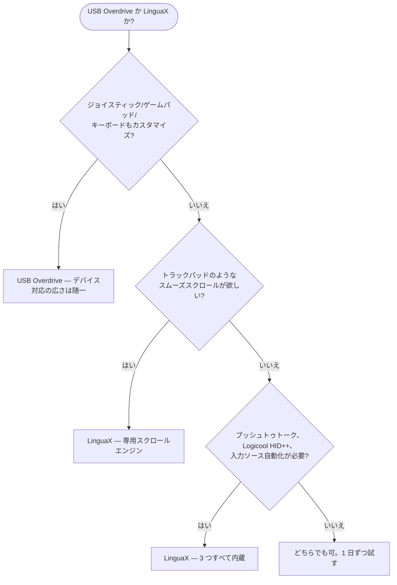

**USB Overdrive の代替**を探しているなら、まず正直な答えから：USB Overdrive は macOS の老舗ユーティリティです。Mac OS 9 の時代から続いており、デバイス対応の広さは他の追随を許しません——マウス、キーボード、トラックボール、ジョイスティック、ゲームパッド、ほぼ全メーカー対応。一方で、注目しているのが**マウスだけ**で、さらに**本物のスムーズスクロールエンジン、プッシュトゥトーク音声入力、Logicool ハードウェア制御、入力ソース自動切替**が欲しいなら、LinguaX がより合っています——価格は半額です。

## USB Overdrive の強み

USB Overdrive は汎用的なドライバーレベルの入力デバイスカスタマイズに特化しています：

- USB / Bluetooth のマウス、キーボード、トラックボール、ジョイスティック、ゲームパッドにほぼ全メーカーで対応——ゲームコントローラー対応はこのカテゴリでは珍しい強み
- デバイスごと、アプリごとのボタン・軸の割り当て
- マウス加速度とスクロール速度のカスタマイズ
- 軸ごとのスクロール反転、修飾キー押下時の軸入れ替え（バージョン 5.3 で追加）
- 長い macOS 互換実績——5.3.1 は macOS 12 Monterey から macOS 26 Tahoe まで対応し、旧バージョンは数十年前まで遡る
- シェアウェア方式：トライアルは**期限切れなし**。$20 の登録料で消えるのは、ログイン時と設定を開いた時の 10 秒のリマインダー

これらは推測ではなく、[USB Overdrive 公式サイト](https://www.usboverdrive.com/)に記載された公開情報です。LinguaX と同様、Apple 純正のマウス・トラックパッド・キーボードはあえて対象外——どちらのアプリもサードパーティ製ハードウェアのために存在します。

## LinguaX の違い

LinguaX はマウスのボタンマッピング、アプリ別設定で USB Overdrive と重なりますが、より広い日常ワークフローをカバーする設計です：

- **本物のスムーズスクロールエンジン**：USB Overdrive が調整するのはネイティブな段階スクロールの速度と加速度。LinguaX はカクカクしたノッチ単位のホイールステップを、減衰のある連続カーブ（Min Step / Speed Gain / Duration の 3 パラメータ）に置き換え、アプリごとの ON/OFF も可能です。
- **プッシュトゥトーク音声入力**：サイドボタンを押している間、macOS 音声入力、Wispr Flow、superwhisper をトリガー。
- **Logicool ハードウェア制御**：対応モデルでハードウェア DPI、SmartShift、バッテリー残量を Logicool Options+ なしで操作。
- **入力ソース自動切替**：アプリや Web サイトのドメインごとに macOS の入力ソースを自動切替——USB Overdrive のスコープ外の機能です。
- **価格とトライアル形式**：USB Overdrive は $20 でトライアル無期限（リマインダー付き）。LinguaX はすっきりした 30 日の全機能トライアルの後、$9.9 の買い切り Lifetime で 3 台の Mac まで利用でき、以降のアップデートは無料です。

マウスに加えてジョイスティック、ゲームパッド、キーボードもカスタマイズしたいなら、USB Overdrive のデバイス対応の広さは LinguaX が競う領域ではありません。マウスが中心で、スムーズスクロール、音声入力、Logicool ハードウェア機能、多言語入力まで必要なら、LinguaX のほうが広くカバーします。

## USB Overdrive と LinguaX の比較

| ニーズ | USB Overdrive | LinguaX |
| --- | --- | --- |
| マウス、キーボード、トラックボール | 対応 | マウス（任意の USB/Bluetooth ブランド） |
| ジョイスティック / ゲームパッド | 対応 | 非対応 |
| ボタンカスタマイズ | デバイスごと・アプリごとの割り当て | クリック / ダブルクリック / 長押し / 方向ドラッグのジェスチャー、アプリスコープ |
| スムーズスクロール（減衰カーブ） | スクロール速度/加速度の調整 | 対応、3 パラメータ調整、アプリ別 ON/OFF |
| マウスのスクロール方向をトラックパッドと分離 | 軸ごとの反転（5.3+） | 対応、垂直/水平の軸別スイッチ |
| アプリ別設定 | 対応 | 対応、アプリスコープのオーバーライド |
| Logicool DPI / SmartShift / バッテリー | 主眼外 | 対応（サポートモデル） |
| プッシュトゥトーク音声入力 | 非対応 | 対応 |
| 入力ソースのアプリ/サイト別切替 | 非対応 | 対応 |
| Apple マウス/トラックパッド/キーボード | 非対応（意図的） | サードパーティ製マウスが対象 |
| 価格モデル | $20 シェアウェア、無期限トライアル（リマインダー付き） | 30 日トライアル、$9.9 買い切り、3 台の Mac |

## クイック診断

## USB Overdrive を選ぶべきケース

- カスタマイズしたいのがマウスだけではない——ジョイスティック、ゲームパッド、トラックボール、キーボードもまとめて管理したい
- 期限なしのシェアウェア方式が好みで、リマインダーは気にならない
- クラシック Mac OS 時代まで遡る互換実績を重視する
- スムーズスクロール、プッシュトゥトーク、入力ソース自動化は不要

## LinguaX を選ぶべきケース

- ホイールのカクつきが最大の不満——速いノッチではなく本物のスムーズカーブが欲しい
- Logicool マウスを使っていて、Logicool Options+ なしで DPI、SmartShift、バッテリー表示が欲しい
- サイドボタンを音声入力アプリのプッシュトゥトークに使いたい
- 複数言語で入力していて、入力ソースをアプリやドメインに追従させたい
- すっきりした 30 日トライアルと永続無料アップデートを半額で欲しい

## 実際のマウスで試す

両アプリとも無料で試せるので、実機で 1 日比較するのが一番確実です：

1. 両方のアプリで同じサイドボタンを割り当てる。
2. ブラウザと長文ドキュメントでスクロールを比較——設計思想の違いが最も出る部分です。
3. Mac をスリープ→復帰させて、割り当てが維持されるか確認。
4. 音声入力や複数の入力ソースを使うなら、LinguaX でそのフローも試す。

## FAQ

**LinguaX は USB Overdrive の完全な代替になりますか？**
マウスに関してはほぼ代替可能です——ボタンマッピング、アプリ別設定、スクロール挙動はすべてカバーし、多くの面でより深いです。キーボード、トラックボール、ジョイスティック、ゲームパッドについては違います：USB Overdrive のデバイス対応の広さは随一で、LinguaX はその領域を代替しようとしていません。

**スムーズスクロールが優れているのはどちら？**
LinguaX です。USB Overdrive はスクロールの速度と加速度を調整し、ネイティブな段階スクロールの「速さの感覚」を変えます。LinguaX はステップを連続した減衰カーブに置き換え、トラックパッドに近い感触です。「スクロールがカクカクする」が不満なら、この差がすべてです。

**Logicool マウスに適しているのはどちら？**
DPI、SmartShift、バッテリー表示といったハードウェア機能が欲しいなら LinguaX。USB Overdrive は汎用 HID レベルで Logicool マウスを扱えますが、Logicool 固有のハードウェア制御は対象外です。

**USB Overdrive はまだ保守されていますか？**
されています。5.3.1 は最新の macOS 26 Tahoe まで対応し、5.3 で軸ごとのスクロール反転も追加されました。クラシック Mac OS 時代から継続的にメンテナンスされています。

**どちらから試すべき？**
主な不満に合わせて選んでください。「複数種類の入力デバイスをまとめて管理したい」なら USB Overdrive、「スクロールがひどい。マウス拡張・音声入力・入力ソース自動化を 1 アプリで」なら LinguaX から。

## はじめる

LinguaX は無料ダウンロードで **30 日トライアル**——アカウント不要、テレメトリなし。ワークフローに合えば **$9.9 の買い切り Lifetime（3 台の Mac まで）**、サブスクリプションはありません。

**[LinguaX をダウンロード](/download)** して、実際のマウス環境で試してみてください。

## 関連ガイド

- [Mouse+ — macOS マウス拡張](/docs/mouse-plus/overview)
- [スムーズスクロール](/docs/mouse-plus/fundamentals/smooth-scrolling)
- [ボタンマッピング](/docs/mouse-plus/fundamentals/button-mapping)
- [SteerMouse の代替](/docs/comparisons/steermouse-alternative-mac)
- [Logicool Options+ の代替](/docs/comparisons/logi-options-plus-alternative-macos)
- [BetterTouchTool の代替（マウス用途）](/docs/comparisons/bettertouchtool-alternative-for-mouse-mac)
