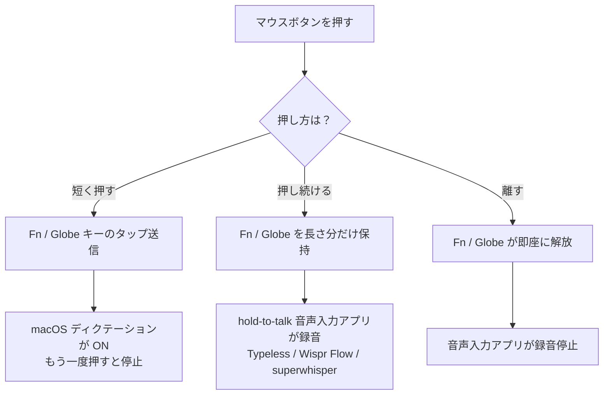

import ThemedImage from '@theme/ThemedImage';
import useBaseUrl from '@docusaurus/useBaseUrl';
import Head from '@docusaurus/Head';

export const faqSchema = {
  '@context': 'https://schema.org',
  '@type': 'FAQPage',
  mainEntity: [
    {'@type': 'Question', name: 'macOS ディクテーション以外の音声入力アプリでも動きますか？', acceptedAnswer: {'@type': 'Answer', text: 'はい。Fn / Globe をトリガーに使うツール（macOS ディクテーション、Wispr Flow、superwhisper、Typeless など）はすべてそのまま動きます。独自ホットキーを使うツールでも、LinguaX の通常のキーボードショートカット割り当てで同じ「押している間だけ有効」動作を実現できます。'}},
    {'@type': 'Question', name: 'ロジクール以外のマウスでも使えますか？', acceptedAnswer: {'@type': 'Answer', text: 'はい。USB / Bluetooth 接続の任意のマウスで、空いているサイドボタンがあれば動作します。認識される Logitech モデル（MX Master 2S / 3 / 3S / 4、MX Anywhere、G502 X、M720、M585 など）ではデフォルトマッピングが最適化されますが、押して話す機能はロジクールに依存しません。'}},
    {'@type': 'Question', name: 'Mac のスリープ / 復帰後もマッピングは効きますか？', acceptedAnswer: {'@type': 'Answer', text: 'はい。Bluetooth マウスは自動で再接続され、LinguaX は復帰時に入力サービスをリフレッシュするので、マッピングは維持されます。アプリの再起動は不要です。'}},
    {'@type': 'Question', name: 'トグルではなく、本当の押して話す（hold-to-talk）が欲しいのですが？', acceptedAnswer: {'@type': 'Answer', text: 'hold-to-talk 対応の音声入力アプリを使ってください（Typeless、Wispr Flow、superwhisper）。標準ディクテーションはトグル式のため、押している間だけ録音する動作にはなりません。'}},
    {'@type': 'Question', name: 'LinguaX は無料ですか？', acceptedAnswer: {'@type': 'Answer', text: '30 日間のフル機能無料トライアル、アカウント登録不要。以降は買い切り $9.9、3 台まで利用可能。サブスクリプションではありません。'}}
  ]
};

<Head>
  
</Head>

# マウスボタンで macOS ディクテーションを起動する

macOS の**ディクテーション（音声入力）**は **Fn（Globe / 地球）キー**でトリガーされますが、作業の途中でそのキーに手を伸ばすのは動線が悪い。**LinguaX** を使えば、**マウスのサイドボタン**を Fn キーに割り当てられるので、親指ひとつで音声入力を起動できます。同じボタンで、hold-to-talk 型の音声入力アプリ（Wispr Flow、superwhisper、Typeless）でも「押している間だけ話す」が使えます。

## マウスボタン → ディクテーションの仕組み

LinguaX の**修飾キー押下（Modifier Hold）**ジェスチャは、マウスボタンを **Fn（Globe）キー**として振る舞わせます：

- **短く押す** → Fn キーのタップが送信される → macOS ディクテーションはこれを聞いています。
- **押し続ける** → Fn キーが押下されたまま → hold-to-talk 音声入力アプリはこれで録音します。

つまり、ひとつのマウスボタンで、標準ディクテーションと外部の音声入力ツール、両方がカバーできます。

<ThemedImage
  alt={"LinguaX Mouse+ サイドボタン設定：ジェスチャ = Modifier Hold、アクション = Fn。macOS システム設定 > キーボード > 音声入力 のショートカットを Fn / Globe にすると連携する"}
  sources={{
    light: useBaseUrl('/img/linguax-push-to-voice-fn-mapping.png'),
    dark: useBaseUrl('/img/linguax-push-to-voice-fn-mapping-dark.png'),
  }}
  width="420"
/>

## マウスボタンを設定する

1. LinguaX を起動し、**Mouse+** 設定を開く。
2. クリックやスクロールに使っていない**サイドボタン**を選ぶ。
3. ジェスチャに**修飾キー押下（Modifier Hold）**を選び、修飾キーを **Fn** にする。
4. 保存。

> Modifier Hold はそのボタンを占有します。保存すると、以前そのボタンに設定していた他のジェスチャは置き換わります。

## macOS ディクテーションを設定する

1. **システム設定 → キーボード → 音声入力**を開き、音声入力を ON にする。
2. **ショートカット**を Globe（🌐）を含むいずれかに設定する。
3. 任意のテキストフィールドをクリックし、割り当てたマウスボタンを押すとディクテーションが起動。もう一度押すと停止。

> **標準ディクテーションはトグル式**（押すと開始、もう一度押すと停止）。macOS のバージョンによって選べるショートカットは異なりますが、Globe / Fn を含むオプションを選んでください。**押している間だけ録音**（本来の push-to-talk）が欲しい場合は、次の hold-to-talk アプリの節を参照。

## hold-to-talk アプリで使いたい場合

押している間だけ録音したい場合は、hold-to-talk ホットキーに対応した音声入力アプリを使います（Typeless、Wispr Flow、superwhisper など）。アプリ側のホットキーを **Fn / Globe** にし、マウスボタンを話している間だけ押し続けます。詳細は [Mac の押して話す音声入力（マウスサイドボタン）](/docs/push-to-talk/push-to-talk-voice-typing-mac) を参照。

Fn / Globe 以外の独自ショートカットを使うツールでは、[Wispr Flow と superwhisper のショートカット設定](/docs/push-to-talk/wispr-flow-superwhisper-hotkey-mac) を参照し、そのアプリのショートカットをマウスボタンに割り当ててください。

## よくあるミス

- **クリックにも使うボタン**を割り当ててしまう → 空いているサイドボタンを選ぶ。
- **アクセシビリティ**権限を LinguaX に付与し忘れている → 修飾キーを押下し続けられません。
- 標準ディクテーションに hold-to-talk を期待する → 標準はトグル式。押している間だけが欲しいなら hold-to-talk アプリを使う。
- 別のユーティリティ（Logi Options+、Karabiner-Elements など）が同じボタンに割り当てられたまま → 片方のイベントが必ず取りこぼされます。

## トラブルシューティング

- LinguaX にアクセシビリティ権限が付与されているか確認。
- ディクテーションのショートカットが Globe / Fn を含むオプションに設定されているか確認。
- まずはプレーンなテキストフィールド（メモ、テキストエディット、ブラウザのアドレスバー等）でテスト。
- 過去に別のジェスチャがそのボタンに割り当てられていた場合、Modifier Hold で保存し直す。

## よくある質問

### macOS ディクテーション以外の音声入力アプリでも動きますか？

はい。Fn / Globe をトリガーに使うツール（macOS ディクテーション、Wispr Flow、superwhisper、Typeless など）はすべてそのまま動きます。独自ホットキーを使うツールでも、LinguaX の通常のキーボードショートカット割り当てで同じ「押している間だけ有効」動作を実現できます。

### ロジクール以外のマウスでも使えますか？

はい。USB / Bluetooth 接続の任意のマウスで、空いているサイドボタンがあれば動作します。認識される Logitech モデル（MX Master 2S / 3 / 3S / 4、MX Anywhere、G502 X、M720、M585 など）ではデフォルトマッピングが最適化されますが、押して話す機能はロジクールに依存しません。

### Mac のスリープ / 復帰後もマッピングは効きますか？

はい。Bluetooth マウスは自動で再接続され、LinguaX は復帰時に入力サービスをリフレッシュするので、マッピングは維持されます。アプリの再起動は不要です。

### トグルではなく、本当の「押して話す（hold-to-talk）」が欲しいのですが？

hold-to-talk 対応の音声入力アプリを使ってください（Typeless、Wispr Flow、superwhisper）。標準ディクテーションはトグル式のため、押している間だけ録音する動作にはなりません。→ [Mac の押して話す音声入力（マウスサイドボタン）](/docs/push-to-talk/push-to-talk-voice-typing-mac)

### LinguaX は無料ですか？

30 日間のフル機能無料トライアル、アカウント登録不要。以降は**買い切り $9.9、3 台まで利用可能**。サブスクリプションではありません。

## Get started

**[LinguaX をダウンロード](/download)** して、マウスから音声入力を 30 日間無料で試す。

## 関連ドキュメント

- [Mac の押して話す音声入力：マウスのサイドボタンに Fn を割り当てる](/docs/push-to-talk/push-to-talk-voice-typing-mac)
- [マウスのサイドボタンを Mac で割り当てる方法](/docs/mouse-plus/recipes/map-mouse-side-buttons-macos)
- [Mac マウスのスクロールがカクつく？第三者マウスをスムーズにする方法](/docs/mouse-plus/recipes/fix-choppy-mouse-scrolling-macos)
- [ボタンマッピングの基礎（英語）](/docs/mouse-plus/fundamentals/button-mapping)
- [Mac の Push-to-Talk アプリまとめ（英語）](/docs/push-to-talk/best-push-to-talk-app-mac)
- [Wispr Flow と superwhisper のショートカット設定（英語）](/docs/push-to-talk/wispr-flow-superwhisper-hotkey-mac)
- [マウスのサイドボタンを Mac で割り当てる方法（英語）](/docs/mouse-plus/recipes/map-mouse-side-buttons-macos)
- [Mouse+ 概要（英語）](/docs/mouse-plus/overview)
