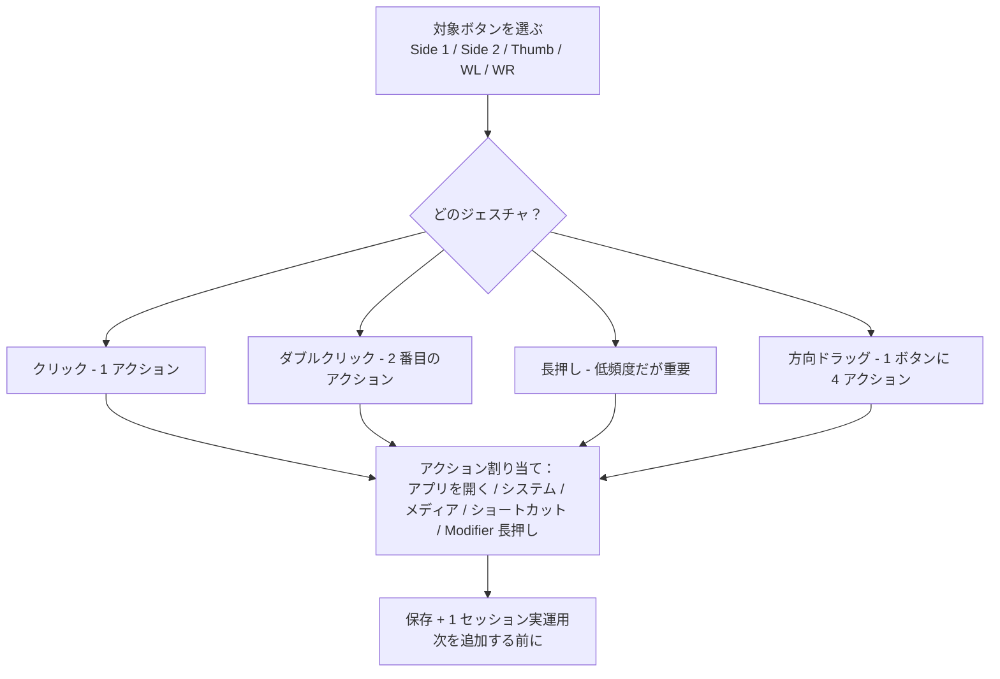

import ThemedImage from '@theme/ThemedImage';
import useBaseUrl from '@docusaurus/useBaseUrl';

# Mac マウスのサイドボタンを割り当てる方法：任意ブランド対応（ドライバ・アカウント不要）

マウスを Mac につなぐと、**サイドボタン（親指ボタン、Side 1/2/3/4）が何もしない**、または固定動作しかせず変更できないことに気づきます——macOS のシステム設定にはそもそもこれらのボタン用の設定項目がないからです。この記事は、**Mac でマウスサイドボタンを割り当てる**完全な方法で、**任意ブランドのマウス**（ロジクールの MX Master、G502 X、M720、M585、およびロジクール以外のマウス）に対応します。ドライバ不要、アカウント登録不要。LinguaX はネイティブ macOS ユーティリティ（約 10MB）で、サイドボタン・親指ボタン・ホイールチルトをブラウザの戻る/進む、Mission Control、メディアキー、任意のショートカット、さらに押して話す（音声入力）にも割り当てられ、App 別に独立設定できます。

## LinguaX で割り当てられるボタン

- **Side（サイドボタン 1–4）** と **Thumb（親指ボタン）** ——認識されたモデルでは自動で表示。
- **ホイールチルト左右（WL / WR）** ——デバイスが対応する場合、デフォルトで水平スクロールをトリガー。「クリック」ジェスチャのみ割り当て可能。
- 各ボタンで使える**ジェスチャ**：クリック、ダブルクリック、**長押し**、および**方向ドラッグ / スワイプ**（上/下/左/右）。
- 割り当て可能なアクション：**システムプリセット**（Mission Control、Switch Space など）、**メディア制御**、**キーボードショートカット**、**Modifier 長押し**、**アプリを開く**。

LinguaX は一般的なモデル（MX Master シリーズ、MX Anywhere、G502 X、M720、M585 など）を自動認識し、合理的なデフォルトマッピングを適用します。認識されないマウスでも動作します（手動で 1 ボタンずつ設定）。**注意**：**親指ボタンの長押し**は HID++ 経路で接続されるロジクール機種のみで利用可能。クリック / ダブルクリック / 方向ドラッグ ジェスチャはより広く動作します。

## 設定手順

1. LinguaX をインストールし、初回起動時に**アクセシビリティ**権限を付与。
2. **Mouse+** を開き、割り当てたいボタンを選択。
3. **ジェスチャ**（まずクリックから）を選び、アクションを割り当てる。
4. 保存後、1 セッション使い切ってから次のマッピングを追加。

<ThemedImage
  alt={"LinguaX マウス設定：S1（サイドボタン 1）を選択して「クリック」アクションを割り当てる"}
  sources={{
    light: useBaseUrl('/img/linguax-mouse-settings.png'),
    dark: useBaseUrl('/img/linguax-mouse-settings-dark.png'),
  }}
  width="420"
/>

## 割り当て順序の推奨

1. まず**本当に高頻度なアクション**を 1 つ選ぶ（ブラウザの戻る、Mission Control、または特定 App のショートカット）。
2. 1 つのサイドボタンだけに割り当て、1 セッションで慣らす。
3. 最初のマッピングが完全に自然に感じられてから、次を追加。

サイドボタンの**方向ドラッグ**は強力：1 ボタンに 4 方向のアクションを持てて、ドラッグ中はどの方向を指しているか画面上でリアルタイム表示されます。

## マッピングを安定させる

- 1 つのボタンにアクションを詰め込みすぎない（3 ジェスチャを超えると混乱しやすい）
- 複数ツールで同じボタンに重複割り当てをしない（打ち合いになる）
- **App 別上書き**は本当に異なる動作が必要な App だけ、他はグローバルで統一

**接続された各マウスは独立したボタン状態を保持**します。2 つ目のマウスは 1 つ目のマッピングを継承せず、衝突もしません。

## 良い最初のマッピング

- ブラウザの**戻る / 進む**
- **Mission Control** または**切り替え Space**
- よく使う**ランチャー / コマンドパレット**を開く
- エディタや設計ツールでの**高頻度な繰り返しショートカット**

## トラブルシューティング

- **アクセシビリティ**権限が付与されているか確認
- 他のユーティリティが同じボタンに重複割り当てしていないか確認
- 先に**1 ボタン + 1 ジェスチャ**だけでテスト、動くのを確認してから追加

## よくある質問

### 任意ブランドのマウスでサイドボタンを割り当てられますか？

はい。任意の **USB または Bluetooth マウス**で動作、ドライバ不要。認識される Logitech モデル（MX Master 2S/3/3S、MX Anywhere シリーズ、G502 X、M720、M585 など）ではデフォルトマッピングが最適化されます。認識されないマウスでも 1 ボタンずつ手動割り当て可能。

### なぜ Mac ではマウスサイドボタンがデフォルトで何もしないのですか？

macOS のシステム設定には「左右クリック + ホイール」を超えるボタン設定項目がありません。ベンダーの公式 App（Logi Options+、Razer Synapse）がこれを埋めますが、通常は**アカウント登録**または**重いバックグラウンド常駐**が必要。LinguaX のようなネイティブツールはシステム入力層でマッピングを行うため、どちらも必要ありません。

### MX Master シリーズを使うのに Logi Options+ は必須ですか？

不要です。LinguaX は BLE HID++ を通じて MX Master 2S/3/3S/4 と直接通信し、**親指ボタン、長押し、方向ドラッグ**を含むすべてのボタンとジェスチャを割り当てられます。詳細：[MX Master 3S を Logi Options+ なしで設定（英語）](/docs/comparisons/mx-master-3s-mac-setup-without-logi-options)。

### Mac でマウスボタンの長押しはできますか？

**サイドボタン長押し**はほとんどのマウスで可能。**親指ボタン長押し**は HID++ 経路で接続されるロジクール機種のみ。クリック、ダブルクリック、方向ドラッグはより広く動作します。

### スリープ / 復帰後もマッピングは効きますか？

はい。Bluetooth マウスは自動再接続され、重要な入力サービスは復帰時にリフレッシュされるので、マッピングはアプリ再起動なしで継続動作します。

## Get started

30 日間のフル機能無料トライアル、アカウント登録不要。合えば**買い切り $9.9、3 台まで利用可能**、サブスクリプションなし。

**[LinguaX をダウンロード](/download)** して、サイドボタン割り当てを 30 日無料で試す。

## モデル別サイドボタン設定

特定モデルを設定中ですか？下記モデル別ガイドはこのレシピの延長で、それぞれ実際のボタン配置と LinguaX でのマッピング方法を示しています：

- [MX Master 4](/docs/mouse-plus/models/mx-master-4) —— S1 / S2 / T / SM / WL / WR **加えて**新規追加の Actions Ring（`AR`）
- [MX Master 3S](/docs/mouse-plus/models/mx-master-3s) と [MX Master 3](/docs/mouse-plus/models/mx-master-3) —— 完全 7 スロット配置、サムホイール含む
- [MX Anywhere 3S](/docs/mouse-plus/models/mx-anywhere-3s) / [MX Anywhere 3](/docs/mouse-plus/models/mx-anywhere-3) —— 携帯サイズ、S1 / S2 中心
- [Logitech G Pro X Superlight 2](/docs/mouse-plus/models/logitech-g-pro-x-superlight-2) / [G Pro X Superlight](/docs/mouse-plus/models/logitech-g-pro-x-superlight) —— ゲーミングマウス、Mac で 2 サイドボタン
- [Logi Lift](/docs/mouse-plus/models/logitech-lift) —— 縦型エルゴノミクス配置
- [MX Ergo](/docs/mouse-plus/models/mx-ergo) —— トラックボール、S1 / S2 再割り当て可能

## 関連ドキュメント

- [Mac の押して話す音声入力（マウスサイドボタン）](/docs/push-to-talk/push-to-talk-voice-typing-mac)
- [マウスボタンで macOS ディクテーションを起動する](/docs/mouse-plus/recipes/macos-dictation-mouse-button)
- [Mac マウスのスクロールがカクつく？第三者マウスをスムーズにする方法](/docs/mouse-plus/recipes/fix-choppy-mouse-scrolling-macos)
- [Mouse+ 概要（英語）](/docs/mouse-plus/overview)
- [ボタンマッピング詳細（英語）](/docs/mouse-plus/fundamentals/button-mapping)
- [ジェスチャマッピング詳細（英語）](/docs/mouse-plus/fundamentals/gesture-mapping)
