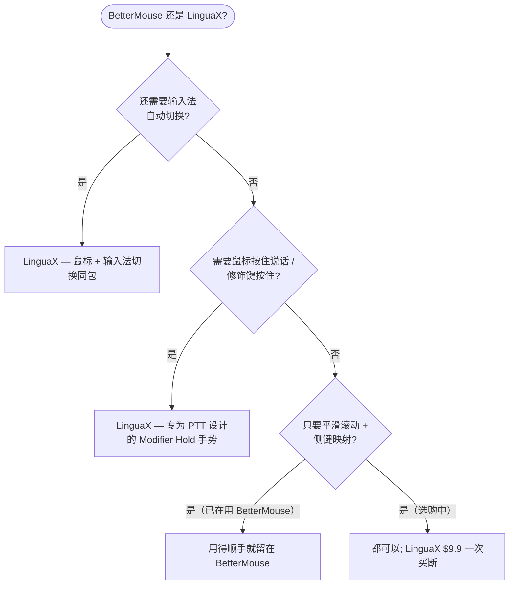

import Head from '@docusaurus/Head';

export const faqSchema = {
  '@context': 'https://schema.org',
  '@type': 'FAQPage',
  mainEntity: [
    {'@type': 'Question', name: 'Mac 上有免费的 BetterMouse 替代品吗？', acceptedAnswer: {'@type': 'Answer', text: '没有完全免费且功能与 BetterMouse 逐一对齐的产品。LinguaX 提供 30 天全功能免费试用——无需账号或信用卡——之后 $9.9 一次买断，可激活 3 台设备（无订阅）。完全免费的开源选择有 Mac Mouse Fix、Mos、LinearMouse，但各自覆盖的范围更窄。'}},
    {'@type': 'Question', name: 'BetterMouse 和 LinguaX 的价格对比？', acceptedAnswer: {'@type': 'Answer', text: '两者都是买断制（无订阅）。LinguaX $9.9 永久版可激活 3 台设备，含 30 天免费试用。建议比较功能——平滑滚动调节、手势种类、按应用覆盖、睡眠/唤醒稳定性——而不是只看价格，因为你每天付费买的是体验。'}},
    {'@type': 'Question', name: 'BetterMouse 和 LinguaX 哪个更轻量？', acceptedAnswer: {'@type': 'Answer', text: '两者都是原生 macOS 应用而非 Electron。LinguaX 约 10MB，以单一菜单栏应用运行，无账号、无遥测。'}},
    {'@type': 'Question', name: '替代品支持 MX Master、G502 等罗技鼠标吗？', acceptedAnswer: {'@type': 'Answer', text: '支持。LinguaX 可识别 MX Master 2S/3/3S/4、MX Anywhere 2/2S/3/3S、G502 X、M720、M585 等型号，提供自动侧键默认映射，受支持型号还可通过 BLE HID++ 显示电量。'}},
    {'@type': 'Question', name: '映射在睡眠/唤醒后还在吗？', acceptedAnswer: {'@type': 'Answer', text: '在。蓝牙设备在睡眠后自动重连，关键输入服务在系统唤醒时刷新，滚动和映射的按键无需重启应用即可继续工作。'}}
  ]
};

<Head>
  
</Head>

# BetterMouse 替代品：Mac 版

如果你在找 **macOS 上的 BetterMouse 替代品**——无论是想要更轻、更便宜，还是带免费试用的——筛选条件其实很简单：给第三方鼠标用上平滑滚动、可靠的侧键映射和手势，而不要厂商软件那种臃肿。LinguaX 用原生约 10MB 的应用覆盖同样的需求，**$9.9 一次买断**之前有 30 天免费试用，并且更进一步内置了**输入法自动化**——一次安装同时替代鼠标工具和语言切换器。

## 人们对 BetterMouse 替代品的期待

- 适用于任何滚轮鼠标的**平滑滚动**（不只是 Apple 触控板）
- **侧键与手势映射**——前进/后退、Mission Control、应用快捷键
- **按应用区分的行为**——浏览器和编辑器可以有不同的滚动和映射
- **轻量原生的体积**，不在后台空转

LinguaX 全部满足。它可识别众多型号（MX Master、MX Anywhere、G502 X、M720、M585 以及通用鼠标），未识别的设备也能用。

## BetterMouse 与 LinguaX 对比

| | LinguaX | BetterMouse |
| --- | --- | --- |
| 应用体积 | 约 10MB | 轻量原生 |
| 架构 | 原生 macOS | 原生 macOS |
| 平滑滚动 | Min Step / Speed Gain / Duration，按应用开关 | 支持 |
| 按键与手势映射 | 点击 / 双击 / 长按 / 滑动，按应用区分 | 支持 |
| 滚动反转 | 分轴（水平/垂直独立） | 全局式 |
| 睡眠/唤醒可靠性 | 唤醒时自动恢复 | 支持 |
| 输入法自动化 | 内置——按应用/网站自动切换输入法 | 不含 |
| 捆绑价值 | 鼠标增强**加**输入自动化一个应用搞定 | 仅鼠标 |
| 支持 | 真人支持 | 真人支持 |
| 价格 | $9.9 一次买断（3 台设备） | 买断制许可 |

## 选哪个 — 快速决策

## 「买一得二」的差异

BetterMouse 是专注的鼠标工具。LinguaX 的主打也是鼠标功能，但**输入法自动化本身就是另一项核心能力**，不是绑在鼠标引擎上的附属品：它可以根据前台应用、甚至你所在的网站域名自动切换 macOS 输入法。对任何用多种语言输入的人——或者只是想让正确的应用自动用对键盘布局的人——来说，这相当于不必另外购买、另外运行的第二个工具。

所以你得到的是：

- 一个真正轻量的原生鼠标增强器。
- 加上按应用和浏览器 URL 的输入法自动切换。
- 两者都有真人直接支持，而不是工单排队。

## 开始使用

LinguaX 免费下载，**30 天全功能试用**——无需账号、零遥测。如果合适，**$9.9 一次买断，可激活 3 台设备**（无订阅）。

**[下载 LinguaX](/download)**，免费试用 30 天。

## 常见问题

### Mac 上有免费的 BetterMouse 替代品吗？

没有完全免费且功能逐一对齐的产品。LinguaX 提供 **30 天免费试用**——无需账号或信用卡——之后 **$9.9 一次买断，可激活 3 台设备**（无订阅）。如果免费是硬性要求，最接近的开源选择是 [Mac Mouse Fix](/docs/comparisons/mac-mouse-fix-alternative-macos)、Mos 和 LinearMouse——它们的取舍见 [Mos vs LinearMouse vs Mac Mouse Fix](/docs/comparisons/mos-vs-linearmouse-vs-mac-mouse-fix)。

### BetterMouse 和 LinguaX 的价格对比？

两者都是买断制（无订阅）。LinguaX 是 **$9.9 永久版，可激活 3 台设备**，含 30 天免费试用。建议比较功能——平滑滚动调节、手势种类、按应用覆盖、睡眠/唤醒稳定性——而不是只看价格，因为你付费买的是日常体验。

### BetterMouse 和 LinguaX 哪个更轻量？

两者都是原生 macOS 应用而非 Electron。LinguaX 约 **10MB**，以单一菜单栏应用运行，无账号、无遥测。

### 替代品支持 MX Master、G502 等罗技鼠标吗？

支持。LinguaX 可识别 MX Master 2S/3/3S、MX Anywhere 2/2S/3/3S、G502 X、M720、M585 等型号，提供自动侧键默认映射，受支持型号还可通过 BLE HID++ 显示电量。另见[设备兼容性](/docs/mouse-plus/device-compatibility)和 [Mac 鼠标侧键映射方法](/docs/mouse-plus/recipes/map-mouse-side-buttons-macos)。

### 映射在睡眠/唤醒后还在吗？

在。蓝牙设备在睡眠后自动重连，关键输入服务在系统唤醒时刷新，滚动和映射的按键无需重启应用即可继续工作。

## 相关指南

- [Mouse+ — macOS 鼠标增强](/docs/mouse-plus/overview)
- [平滑滚动](/docs/mouse-plus/fundamentals/smooth-scrolling)
- [按键与侧键映射](/docs/mouse-plus/fundamentals/button-mapping)
- [Mac Mouse Fix 替代品](/docs/comparisons/mac-mouse-fix-alternative-macos)
- [轻量 Logi Options+ 替代品](/docs/comparisons/logi-options-plus-alternative-macos)
- [SteerMouse 替代品](/docs/comparisons/steermouse-alternative-mac)
- [USB Overdrive 替代品](/docs/comparisons/usb-overdrive-alternative-mac)
- [BetterTouchTool 替代品（鼠标场景）](/docs/comparisons/bettertouchtool-alternative-for-mouse-mac)
